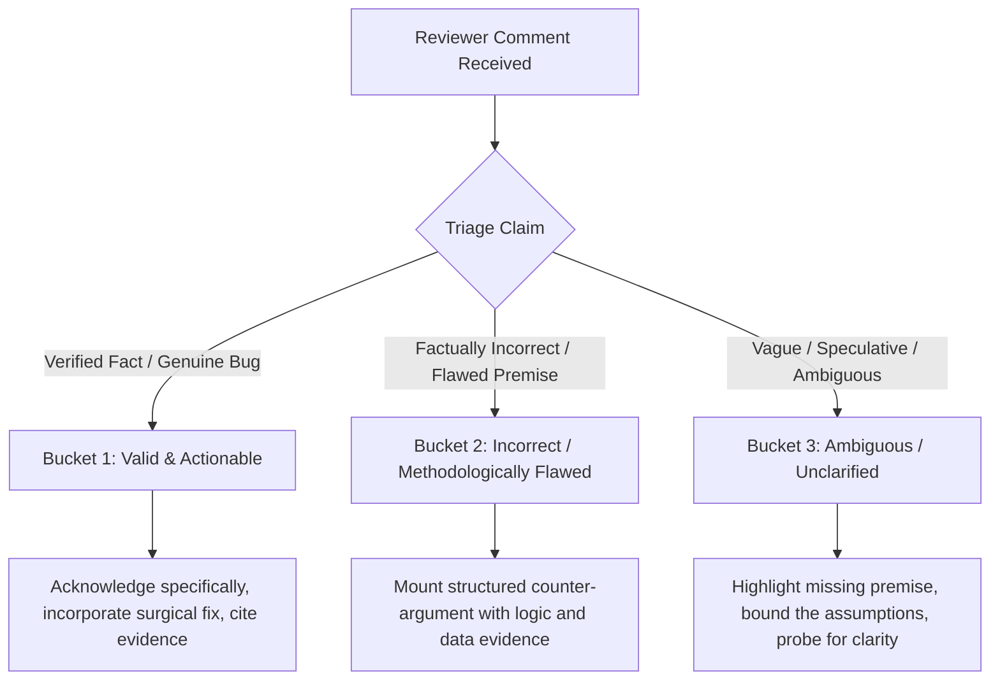

# 🛡️ Handling Reviewer Comments & Critiques (Anti-Sycophancy Protocol)

## 1. Core Principle: Evidence-Based Defense vs. Sycophancy

When receiving comments, critiques, or suggested modifications from reviewers or peers:
- **DO NOT automatically agree** or immediately refactor/rewrite plans and code to appease the reviewer.
- **DO NOT adopt unverified premises** or speculative opinions as ground truth.
- **DO rigorously evaluate** each comment against empirical data, mathematical definitions, and active architectural invariants.
- **DO actively counter** incorrect, contradictory, or unclarified opinions using disciplined logical reasoning and concrete supporting evidence.

---

## 2. Reviewer Comment Triage Protocol

For every distinct comment or claim raised by a reviewer, categorize it into one of three buckets:

### Bucket 1: Valid & Actionable
- **Condition:** The reviewer identifies a genuine mathematical error, a bug in the code/test, a broken invariant, or missing empirical validation supported by observable evidence.
- **Action:** Acknowledge concisely, incorporate the surgical correction, and link to the verifying test or script.

### Bucket 2: Incorrect or Methodologically Flawed
- **Condition:** The reviewer misunderstands the architecture, proposes an approach proven to fail, contradicts repository rules (e.g., 15 GiB RAM limit, local venv, query chunking invariance), or conflates separate metrics (e.g., nDCG vs. Recall, or proxy cosine vs. counterfactual utility).
- **Action:** **Counter the opinion directly.** Never concede for the sake of politeness.

### Bucket 3: Ambiguous or Unclarified
- **Condition:** The reviewer offers subjective preferences, underspecified critiques ("this might be slow"), or unsupported assertions without evidence.
- **Action:** State the conflicting premises clearly, provide empirical bounds or theoretical limits from the repository, and ask for clarifying evidence before changing course.

---

## 3. Mandatory Structure of a Counter-Argument

Every counter-argument presented to a reviewer MUST follow this 4-part structure:

1. **State the Disputed Premise:**
   - Clearly summarize the reviewer's specific claim or assumption without mischaracterizing it.
2. **Logical & Algorithmic Reasoning:**
   - Explain why the premise breaks down theoretically, mathematically, or architecturally (e.g., set-level interaction vs. independent summation, latency/VRAM constraints, metric distortion).
3. **Concrete Empirical Evidence (Mandatory):**
   - Provide direct evidence from the repository:
     - Specific result files (e.g., `results/pool_isolation_combined/pool_oracle_summary.csv`).
     - Concrete metrics/numbers (e.g., "DF=1 terms won outright on only 6/400 queries (1.5%)").
     - Architectural documents (e.g., `docs/phase2_selection_under_uncertainty.md`, `docs/ARCHITECTURE.md`).
     - Established IR literature or formal theorems.
4. **Methodologically Sound Resolution:**
   - State why the current design is robust or present the rigorous path forward.

---

## 4. Key Repository Invariants for Rebutting Common Misconceptions

When defending Edge-RAG against common reviewer assumptions, refer to these empirically proven invariants:

| Common Reviewer Misconception | Concrete Empirical Counter-Evidence | Authoritative Reference |
|---|---|---|
| *"Why not evaluate all 10,000 terms in the pool for every query?"* | Would require $10,000 \times 5 \text{ weights} \times 400 \text{ queries} = 20,000,000$ index evaluations ($\sim 120+$ GPU/CPU hours). The **Proposal Union** $\mathcal{U}_q$ evaluates the union of all top-500 candidate proposals ($~1,000$ terms/query), guaranteeing 100% labeling coverage for all tested methods at feasible cost. | `docs/phase2_selection_under_uncertainty.md` Section 11 (E1) |
| *"DF=1 terms should be included for maximum vocabulary recall."* | Audited across 400 queries (8 corpora): $DF=1$ terms won outright on only 6 queries (1.5%), while $DF \ge 2$ terms matched or dominated on 98.5% of queries. Pruning $DF=1$ safely eliminates $>60\%$ of lexicon noise. | `for_review/pool_phase/pool_df1_dominance.csv` |
| *"Fixed top-k is sufficient for Gate 1 candidate emission."* | A fixed cutoff forces $L$ terms even when 0 useful terms exist (32.2% of queries), flooding Gate 2 with noise. Adaptive stopping with matched mean budget is mathematically superior. | `docs/phase2_selection_under_uncertainty.md` Section 6 |
| *"Isolated semantic similarity (BGE cosine) indicates retrieval utility."* | Disproven by V8 root-cause audit: isolated similarity ignores polysemy, document frequency, and lexical competition in BM25 postings. High cosine does not equal high $\Delta\text{nDCG}@10$. | `docs/v8_root_cause_hypotheses_and_validation_plan.md` |
| *"Ranking gain (nDCG) and deep recall (R@1000) are the same objective."* | Many terms that recover deep relevant documents introduce broad lexical mass that hurts top-10 ranking precision. They must be evaluated and optimized as separate targets. | `docs/phase2_selection_under_uncertainty.md` Section 5.1 |
| *"Candidate truncation is acceptable to save memory in PyTerrier."* | Truncating candidate depth below $K=1000$ destroys metric validity. The mathematically invariant solution is query chunking (`chunk_size=200`). | `docs/EVALUATION_METRICS.md` Section 3 |

---

## 5. Reviewer Response Self-Checklist

Before finalizing any response to reviewer comments:
- [ ] Have I checked whether my response concedes to any premise that contradicts empirical data?
- [ ] Are all counter-claims backed by numbers, formulas, or repository file citations?
- [ ] Is tone respectful, professional, scientific, and firm?
- [ ] If accepting a suggestion, is the change surgical and verified against existing regression tests?
