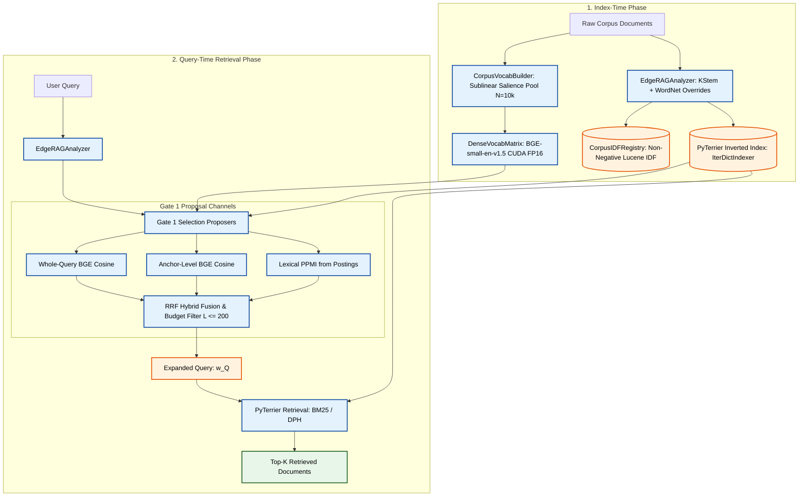

# Context-Reranked Vocabulary Expansion (CRVE) Architecture

This document specifies the canonical system architecture for **CRVE** (`CRVE/src/crve/`), a high-speed, 1st-stage lexical-semantic retriever. CRVE bridges the vocabulary mismatch problem in domain-specific retrieval by coupling **Corpus-Grounded Dense Vocabulary Probing** with **Uncertainty-Aware Gate 1 Candidate Selection** and **PyTerrier-Native Inverted Indexing**.

---

## 1. System Overview & 1st-Stage Retrieval Paradigm

CRVE operates strictly at the **1st-stage retrieval** tier, replacing or augmenting traditional lexical ranking (BM25, DPH) and pseudo-relevance feedback (RM3, Bo1) without incurring the latency, index-size explosion, or memory overhead of heavy neural bi-encoders or generative LLM query expanders.



---

## 2. Core Four-Component Architecture

### Component 1: Corpus Vocabulary Extraction & Shared IDF (`src/crve/indexer/`)

1. **`EdgeRAGAnalyzer` (`src/crve/indexer/analyzer.py`):**
   - **Linguistic Pre-Stemming Overrides:** Enforces exact WordNet irregular suppletion mappings (*went $\to$ go*, *children $\to$ child*, *better $\to$ good*) prior to stemming.
   - **Technical Compound Protection:** Preserves versioned identifiers, models, and hardware tags (*e.g.*, `qwen2.5-7b`, `fp16`, `nav2_bringup`) from destructive morphological degradation.
   - **Krovetz Stemming (KStem):** Inflectional morphological reduction ensuring exact $1:1$ stem parity between corpus indexing and query analysis.

2. **`CorpusIDFRegistry` (`src/crve/indexer/corpus_idf_registry.py`):**
   - Computes and caches unified non-negative Lucene IDF tables:
     $$\text{IDF}(t) = \ln\left(1.0 + \frac{N - n(t) + 0.5}{n(t) + 0.5}\right)$$
   - Pre-indexes compound boundary prefix maps for $O(1)$ query-time bailout lookups.

3. **`CorpusVocabBuilder` (`src/crve/indexer/corpus_vocab_builder.py`):**
   - **Canonical Surface-Form Mapping:** Maps analyzed stems back to their highest-frequency surface form in the corpus (*e.g.*, stem `robot` $\to$ surface `robotics`), ensuring neural embeddings evaluate natural words rather than truncated stem artifacts.
   - **Sublinear Salience Scoring:** Extracts vocabulary candidate pools using:
     $$\text{Salience}(t) = \text{IDF}(t) \times \ln(1 + \text{Doc\_Freq}(t))$$

4. **`DenseVocabMatrix` (`src/crve/indexer/dense_vocab_matrix.py`):**
   - Pre-computes batched CUDA FP16 dense representations of canonical surface forms using `BAAI/bge-small-en-v1.5`.
   - Supports Farthest-Point Sampling (FPS) for semantic coverage hubs and direct matrix GEMM for low-latency similarity evaluation ($<0.3\text{s}$ TTI).

---

### Component 2: Gate 1 Selection Under Uncertainty (`src/crve/selection/`)

Gate 1 is the critical selection mechanism that decides which expansion terms to propose into the query under a deployable budget $L \le 200$.

1. **Candidate Proposal Channels (`src/crve/selection/gate1_proposers.py`):**
   - **WholeQueryBGEProposer ($S_{\text{WQ}}$):** Encodes the complete user query into a single dense vector and computes cosine similarity against candidate pool terms in $P_q = P \setminus \text{AnalyzedCanonicalTerms}(q)$.
   - **AnchorBGEProposer ($S_{\text{ABGE}}$):** Breaks the query into syntactic anchors with Penn Treebank POS priors and specificity filtering ($\text{max\_df\_ratio} \le 0.12, \text{specificity} \ge 0.65$), scoring candidates by maximum anchor cosine match.
   - **LexicalPPMIProposer ($S_{\text{PPMI}}$):** Evaluates document co-occurrence between query terms and candidate terms in PyTerrier inverted posting lists using Positive Pointwise Mutual Information:
     $$\text{PPMI}(q, t) = \max\left(0, \log_2 \frac{P(q, t)}{P(q)P(t)}\right)$$
   - **RRFHybridProposer:** Fuses proposals across multiple channels using Reciprocal Rank Fusion ($k=60$) with deterministic tie-breaking and unique refill:
     $$\text{RRF}(t) = \sum_{c \in \mathcal{C}} \frac{1}{k + \text{rank}_c(t)}$$

2. **Gate 1 Evaluation & Metrics (`src/crve/selection/gate1_metrics.py`):**
   - Rigorous telemetry including candidate pool recall ($R@K$), precision ($P@K$), nDCG, fidelity to oracle expansion terms, and transition dynamics.

---

### Component 3: PyTerrier Baseline & Evaluation Harness (`src/evaluation/baselines/`)

PyTerrier serves as the core indexing and retrieval engine for both CRVE and competing baselines:

1. **Memory-Safe Architecture for 15 GiB RAM:**
   - Disk-backed Terrier inverted indexing using `IterDictIndexer`.
   - Bounded JVM heap (`pt.java.set_memory_limit(3072)`).
   - Ingestion via streaming generator (`BenchmarkLoader.stream_corpus()`) preventing large corpora (5M+ documents) from loading into RAM.
   - Mathematical query chunking (`chunk_size=200`) to eliminate JNI and memory overhead without candidate truncation.

2. **Canonical 8-Baseline Matrix:**
   - **Classical Baselines:**
     1. `BM25_Default` (Standard BM25, $k_1=1.2, b=0.75$)
     2. `BM25_RM3_Terrier_Default` (BM25 + RM3 Pseudo-Relevance Feedback)
     3. `BM25_Bo1_Terrier_Default` (BM25 + Bose-Einstein 1 Query Expansion)
     4. `DPH` (Divergence From Randomness Divergence-Poisson-Hypergeometric)
     5. `DPH_Bo1_Terrier_Default` (DPH + Bo1)
     6. `DPH_RM3_Terrier_Default` (DPH + RM3)
   - **Neural Baselines:**
     7. `Dense_BGE` (Bi-encoder dense retrieval with `BAAI/bge-small-en-v1.5` on CUDA FP16)
     8. `SPLADE_v3` (Learned sparse representation with `naver/splade-v3`)

3. **Metric Parity & Standards:**
   - Evaluated using official `ir_measures` with both linear gains and standard BEIR Table 2 exponential gains (`BEIR_EXP_GAINS` = $2^{\text{rel}} - 1$).

---

### Component 4: CRVE Orchestrator (`src/crve/orchestrator.py`)

The `CRVEOrchestrator` integrates the entire 1st-stage pipeline:
1. Coordinates corpus indexing with `EdgeRAGAnalyzer` and `CorpusIDFRegistry`.
2. Builds the vocabulary candidate pool via `CorpusVocabBuilder` and dense embeddings via `DenseVocabMatrix`.
3. Sets up Gate 1 candidate proposers (`RRFHybridProposer` / single channels).
4. Produces expanded query representations with calibrated weights for execution against the PyTerrier retrieval engine.

---

## 3. Directory Layout (`CRVE/`)

```
CRVE/
├── configs/
│   ├── crve.yaml                   # Single source of truth for CRVE hyperparameters
│   ├── hardware_profiles.yaml      # Hardware memory and device budgets
│   └── pyterrier_qe.yaml           # PyTerrier QE grid search and parameter specs
├── docs/
│   ├── ARCHITECTURE.md             # Canonical CRVE 1st-stage retrieval specification (this file)
│   ├── DATASET_PREP.md             # Dataset download & preprocessing guide
│   ├── EVALUATION_METRICS.md       # Metric definitions and parity verification
│   ├── phase2_selection_under_uncertainty.md # Selection under uncertainty foundation
│   ├── corpus_informed_query_expansion_plan.md
│   ├── crve_design_refinement_notes.md
│   └── theoretical_foundations_anchored_expansion.md
├── scripts/
│   ├── run_pyterrier_baselines.py  # 6 classical baselines runner across 25 datasets
│   ├── run_pyterrier_qe_baselines.py # PyTerrier QE baselines runner
│   ├── run_gate1_oracle_evaluation.py # Gate 1 selection empirical runner
│   ├── run_pool_oracle_isolation.py   # Pool oracle isolation experiment
│   ├── compile_gate1_research_tables.py # Gate 1 research table compiler
│   ├── compile_pool_oracle_tables.py   # Pool oracle table compiler
│   └── results_scripts_mapping.md  # Mapping linking result files to scripts
├── src/
│   ├── crve/
│   │   ├── indexer/
│   │   │   ├── analyzer.py         # EdgeRAGAnalyzer (KStem + WordNet overrides)
│   │   │   ├── corpus_idf_registry.py # CorpusIDFRegistry (Lucene IDF)
│   │   │   ├── corpus_vocab_builder.py# CorpusVocabBuilder (Sublinear salience pool)
│   │   │   └── dense_vocab_matrix.py  # DenseVocabMatrix (BGE-small FP16)
│   │   ├── selection/
│   │   │   ├── gate1_proposers.py  # Gate 1 candidate proposers (WQ, ABGE, PPMI, RRF)
│   │   │   ├── gate1_metrics.py    # Gate 1 evaluation metrics & telemetry
│   │   │   └── pathway_gate1_selection.md # Tier 2 Gate 1 specification
│   │   └── orchestrator.py         # CRVEOrchestrator (End-to-end 1st-stage runner)
│   ├── evaluation/
│   │   ├── baselines/
│   │   │   ├── pyterrier_harness.py# PyTerrier baseline harness & index manager
│   │   │   ├── pyterrier_qe.py     # PyTerrier QE operator & BGE sidecar
│   │   │   ├── dense_rag.py        # Dense BGE-small-en-v1.5 baseline
│   │   │   └── splade.py           # SPLADE-v3 baseline
│   │   ├── benchmark_loader.py     # BEIR / BRIGHT streaming data loader
│   │   ├── pool_generators.py      # Candidate pool generation utilities
│   │   └── metrics.py              # Parity-verified IR metrics calculation
│   └── utils/
│       └── helpers.py              # Shared utilities
└── tests/
    ├── test_gate1_selection.py     # Gate 1 proposer & metric tests
    ├── test_pool_compiler.py       # Pool compiler tests
    ├── test_pool_oracle_isolation.py # Pool oracle tests
    ├── test_pyterrier_harness_v2.py# PyTerrier harness unit tests
    ├── test_pyterrier_metrics_parity.py # Parity with ir_measures
    ├── test_pyterrier_neural_baselines.py # Dense & SPLADE test suite
    ├── test_pyterrier_qe.py        # PyTerrier QE test suite
    └── test_splade_standard_parity.py # SPLADE parity test
```

---

## 4. Configuration Contract (`CRVE/configs/crve.yaml`)

```yaml
vocabulary:
  pool_size: 10000
  scoring_function: "sublinear_salience" # IDF * ln(1 + DF)
  min_df: 1
  canonical_mapping: true

dense_matrix:
  model_name: "BAAI/bge-small-en-v1.5"
  device: "cuda"
  fp16: true
  batch_size: 256
  coverage_hubs: 2500

gate1_selection:
  default_proposer: "rrf_core"
  deployable_budget_l: 200
  rrf_k: 60
  channels:
    whole_query:
      enabled: true
      top_k: 500
    anchor_bge_filtered:
      enabled: true
      top_k: 500
      max_df_ratio: 0.12
      min_specificity: 0.65
    anchor_bge_all:
      enabled: true
      top_k: 500
    lexical_ppmi:
      enabled: true
      top_k: 500
      min_joint_support: 2

evaluation:
  harness: "pyterrier"
  jvm_memory_mb: 3072
  indexing_max_memory_bytes: 1073741824
  query_chunk_size: 200
  metrics:
    - "nDCG@10"
    - "R@100"
    - "R@200"
    - "R@500"
    - "R@1000"
    - "MRR@10"
```
