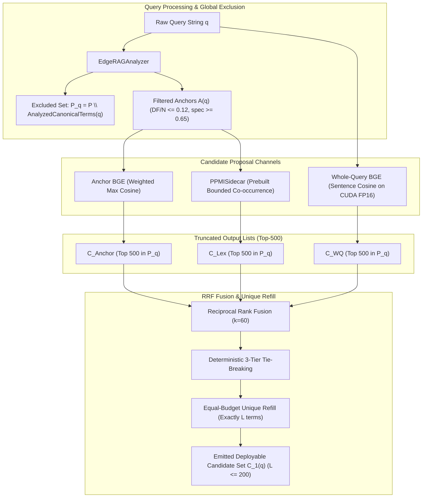

# Pathway Specification: Gate 1 Candidate Selection Under Uncertainty (`pathway_gate1_selection.md`)

## 1. Overview
Gate 1 implements the high-recall, low-latency candidate proposal stage of CRVE Phase 2. Its sole objective is to retain potentially useful expansion terms from the eligible pool $\mathcal{P}$, passing a candidate set $C_1(q)$ ($L \le 200$) downstream to the proposed Gate 2 without deciding final lexical weights. The frozen pool uses DF >= 2, CF >= 3 and $|\mathcal{P}|=\min(10{,}000,|V_{\mathrm{eligible}}|)$; see [ARCHITECTURE.md](../../../docs/ARCHITECTURE.md) for stage status and source-of-truth order. This page describes the frozen Phase 2.1a Gate 1 pathway; the generic orchestrator may still expose an earlier live-PPMI variant.

Gate 1 operates strictly under the edge hardware profile (WSL2 Linux, 15 GiB RAM ceiling) and evaluates four distinct proposal channels:
1. **$S_{\text{WQ}}$ — Whole-Query BGE Proposer**: Encodes raw query string with `BAAI/bge-small-en-v1.5` on CUDA FP16, evaluating cosine similarity against precomputed canonical pool surface forms.
2. **$S_{\text{Anchor}}$ — Anchor-to-Term BGE Proposer**: Extracts query anchors using `EdgeRAGAnalyzer`, applies high-DF filtering ($DF/N \le 0.12$) and specificity filtering ($\text{spec} \ge 0.65$), computing specificity-weighted max cosine similarity.
3. **$S_{\text{Lex}}$ — PPMISidecar Proposer**: Uses a bounded co-occurrence sidecar built from Terrier index evidence during preparation. It avoids query-time posting intersections in the frozen core RRF. LivePPMI computes directly from live postings and remains a higher-fidelity, high-latency diagnostic comparator; sidecar truncation can lose neighbors.
4. **$S_{\text{RRF}}$ — Hybrid Reciprocal Rank Fusion**: Fuses truncated top-500 candidate rankings with $k=60$, deterministic 3-tier tie-breaking, and equal-budget unique refill.

---

## 2. Architecture & Data Flow

---

## 3. Mathematical Formulations

### 3.1 Candidate Universe Invariants
- **Global Eligible Pool**:
  $$\mathcal{P}_q = \mathcal{P} \setminus \operatorname{AnalyzedCanonicalTerms}(q), \quad |\mathcal{P}| = \min(10,000, |V_{\text{eligible}}|)$$
- **Reference Evaluation Universe**:
  $$\mathcal{R}_q^{\text{core}} = (\mathcal{T}_{\text{Phase1},q} \cap \mathcal{P}_q) \cup C^{\text{WQ}}_{500}(q) \cup C^{\text{AnchorFiltered}}_{500}(q) \cup C^{\text{AnchorAll}}_{500}(q) \cup C^{\text{Lex}}_{500}(q)$$

### 3.2 Opportunity Metrics
- **Safe Ranking Gain**:
  $$g^{\text{rank}}_{q,t} = \max\left(0, \; \max_{\mu : \Delta R@1000(q,t,\mu) \ge -\tau} \Delta\text{nDCG}@10(q,t,\mu)\right), \quad \tau = 10^{-5}$$
- **Reference Ceiling**: $\hat{g}_q^* = \max_{t \in \mathcal{R}_q} g^{\text{rank}}_{q,t}$.
- **Material Ranking-Helpful Set**: $H_q^{\text{rank}}(\delta) = \{t \in \mathcal{R}_q : g^{\text{rank}}_{q,t} \ge \delta\}$.
- **Material Near-Best Set**: $H_q^{\text{near}}(\rho, \delta) = \{t \in \mathcal{R}_q : g^{\text{rank}}_{q,t} \ge \max(\delta, \rho \hat{g}_q^*)\}$.
- **Reference Best-Opportunity Retention (ReferenceBOR)**:
  $$\operatorname{ReferenceBOR}@L(q) = \begin{cases} \dfrac{\max_{t \in C_{1,L}(q)} g^{\text{rank}}_{q,t,+}}{\hat{g}_q^*}, & \hat{g}_q^* > \tau \\ \text{NA}, & \hat{g}_q^* \le \tau \end{cases}$$
- **Near-Best Opportunity Hit**:
  $$\operatorname{NearBestHit}@L(q; \rho, \delta) = \begin{cases} 1\left\{C_{1,L}(q) \cap H_q^{\text{near}}(\rho, \delta) \ne \varnothing\right\}, & \hat{g}_q^* \ge \delta \\ \text{NA}, & \hat{g}_q^* < \delta \end{cases}$$

### 3.3 Deep-Recall Opportunity
- **Recall-Helpful Set**:
  $$H^{\text{rec}}_{q,K} = \left\{t \in \mathcal{R}_q : \exists \mu, \operatorname{NetRelDocs}@K(q,t,\mu) \ge 1 \land \Delta\text{nDCG}@10(q,t,\mu) \ge -\epsilon\right\}$$
- **Proposer Recall Coverage**:
  $$\operatorname{RecallHit}@L,K(q) = \begin{cases} 1\left\{C_{1,L}(q) \cap H^{\text{rec}}_{q,K} \ne \varnothing\right\}, & r^*_{q,K} \ge 1 \\ \text{NA}, & r^*_{q,K} = 0 \end{cases}$$

---

## 4. Hardware Budgets & Execution Constraints
- **RAM Ceiling**: Strictly bounded under 15 GiB. Incremental query-by-query streaming writes for sparse document transition tables.
- **Latency Reporting**: Report query encoding, GPU matrix probing, sidecar lookup, and total Gate 1 time separately. Live posting-intersection timing belongs to the diagnostic comparator, not the core sidecar path; see the frozen review report for measured values.
- **Deployment Cap**: $L_{\text{deploy,max}} = 200$ terms.
