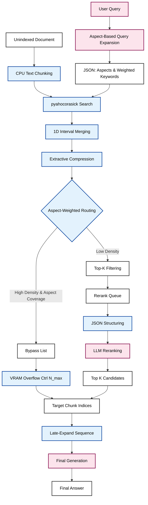

# Edge-RAG Architecture: Extractive-Compression Pipeline

This document serves as the engineering blueprint for the Edge-RAG pipeline (`src/pipeline/`). It outlines the system design required to fulfill the "ephemeral constraint"—processing novel, unindexed documents at runtime without dense vectorization, while strictly bounding the dynamic KV-cache ($V_{KV}$) of local LLMs to prevent Out-Of-Memory (OOM) failures on consumer hardware.

## 1. System Overview

This architecture replaces standard dense embedding and listwise reranking with a deterministic, CPU-bound string matching and geometric interval merging system. 

An **Adaptive Dual-Bypass Routing Engine** calculates text density to bypass the LLM evaluation phase for highly relevant chunks. This bounds the total sequence length passed to the LLM during generation, minimizing TTFT (Time to First Token).

### 1.1 Hardware & Memory Model
- **Single Model Instance:** To respect strict VRAM constraints, the system maintains a *single* LLM loaded persistently in memory. This identical model acts as the Query Expansion Agent, the Reranker, and the Final Generator via different prompt templates. We explicitly target 5 core models: Qwen3.5-2B/4B, Gemma-4-E2B/E4B, and ZAYA1-8B.
- **Warm-Boot Assumption:** Model loading time from disk is excluded from TTFT. The pipeline operates under a "warm" state assumption, meaning the LLM process (e.g., via `llama-server`) is continuously active.

## 2. Pipeline Data Flow



## 3. Component Specifications

The pipeline is modularized within `src/pipeline/`. **No `torch` imports are permitted in this directory except within `late_expansion.py` (for VRAM monitoring).**

### 3.1 `query_expansion.py` (Aspect-Based Extraction)
*Objective:* Map natural language queries to a structured JSON of weighted lexical anchors without incurring severe latency.

- **Mechanic:** Use **Few-Shot Prompting + Constrained JSON Decoding** via the backend server (e.g., `llama-server` grammar/schema enforcement). Chain-of-Thought (CoT) is prohibited to minimize latency.
- **Aspect & Keyword Weights:** The model breaks the query into relational "aspects", assigning an overall aspect weight. It generates individual synonyms (keywords) inside each aspect, assigning a specific weight ($w_k$) to each keyword based on precision.

*Expected Output Schema:*
```json
{
  "aspects": [
    {
      "name": "Drug X",
      "aspect_weight": 1.0,
      "keywords": [
        {"term": "Drug X", "weight": 1.0},
        {"term": "Chemical Inhibitor", "weight": 0.4}
      ]
    }
  ]
}
```

### 3.2 `lexical_search.py` (Interval Extraction)
*Objective:* Locate anchors and compress text chunks around hits.

- **Engine:** Must use the standard `pyahocorasick` library for exact $O(N)$ string matching.
- **Extraction & Merging:** Upon a hit, extract a symmetric window ($L$ tokens) around the anchor. Apply the **1D Continuous Interval Merging Algorithm** to collapse overlapping windows into continuous text spans. 
- **Tracking:** When an interval is extracted, log the specific keyword weight ($w_k$) that triggered it for downstream density scoring.

### 3.3 `routing.py` (Aspect-Weighted Density Routing)
*Objective:* Act as the Dual-Bypass engine to aggressively skip LLM evaluation for obvious true-positives.

- **Mechanic:** The router calculates the text density of the compressed intervals within a chunk using both aspect-level and keyword-level weights:
  1. **Weighted Density:** The contiguous ($\rho_{cont}$) and scattered ($\rho_{scat}$) densities are calculated by scaling the length of each matched interval by its originating keyword weight ($w_k$).
  2. **Weighted Aspect Coverage ($\alpha$):** Calculated as the sum of the weights of the aspects found in the chunk divided by the total sum of all query aspect weights: $\alpha(c_i) = \frac{\sum_{j \in H_i} w_j}{\sum_{j \in A} w_j}$.
  3. **Final Score:** $Score(c_i) = \alpha(c_i) \times (\rho_{cont}^{weighted}(c_i) + \rho_{scat}^{weighted}(c_i))$.
- **Routing Decision:**
  - If $Score(c_i)$ > Threshold ($\tau_{bypass}$), route directly to `Bypass_List`.
  - Otherwise, sort remaining chunks by $Score(c_i)$ and route only the **Top-K** highest-scoring chunks to the `Rerank_Queue`.

### 3.4 `llm_reranker.py` (JSON-Structured Listwise)
*Objective:* Rerank ambiguous chunks utilizing the LLM while avoiding sequence-break hallucinations.

- **JSON Evidence Wrapping:** The discontinuous intervals $M_i$ from the `Rerank_Queue` are mapped directly into a programmatic JSON schema before LLM ingestion:
  ```json
  {
    "chunk_id": "c_42",
    "evidence_samples": [
      "[String of interval m_1]",
      "[String of interval m_2]"
    ]
  }
  ```
- **Logit Relevance Scoring:** The instruction-tuned LLM processes the JSON payload as independent "evidence variables." The system prompts the LLM for a binary relevance classification and extracts the positive probability logit score for $c_i$. This reranks the Top-K queue while minimizing token evaluation costs compared to processing uncompressed chunks.

### 3.5 `late_expansion.py` (VRAM Control & Final Generation)
*Objective:* Restore context for generation and enforce absolute hardware limits.

- **Late-Expand:** Discard the lossy compressed intervals. Using the indices of the winning chunks (from both the `Bypass_List` and `Rerank_Queue`), fetch the *original, uncompressed* text chunks $c_i$.
- **VRAM Overflow Protection ($N_{max}$):** The system defines $N_{max}$ as the absolute maximum number of full-length chunks the KV cache can accommodate safely before OOM failure. If the total selected chunks exceed $N_{max}$, the list must be forcefully truncated based on the initial density scores.
- **Generation:** Pass the uncompressed sequence to the LLM to generate the final end-to-end answer.
