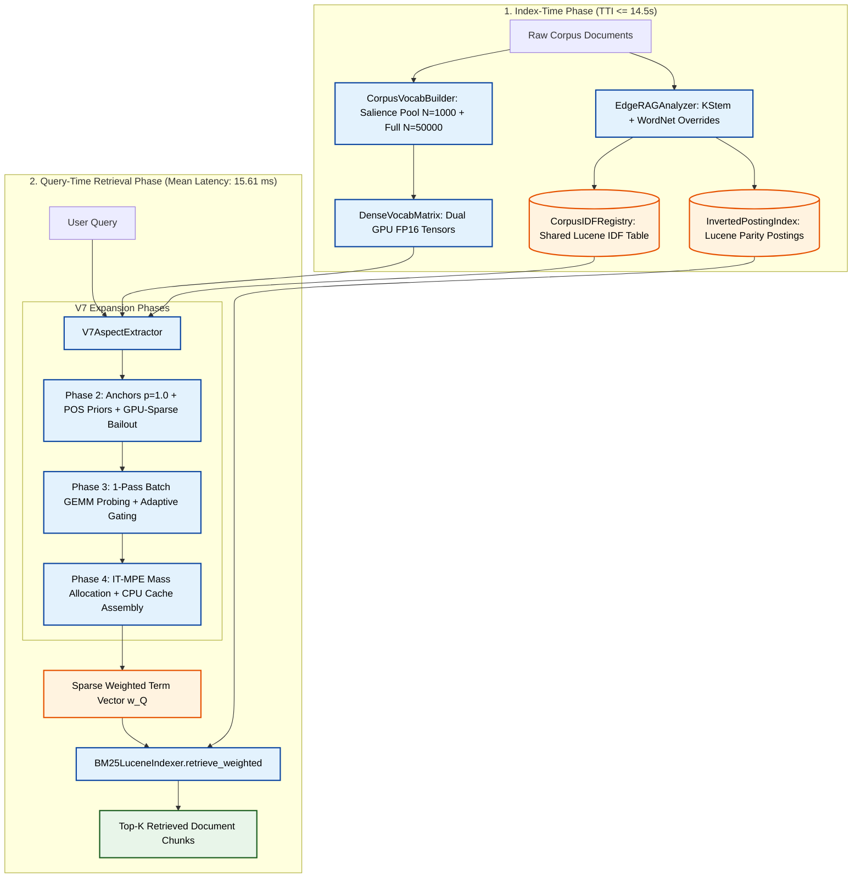

# Edge-RAG Architecture: High-Speed Anchored Lexical-Semantic Retriever

This document specifies the canonical system architecture for the **Edge-RAG Retriever** (`src/pipeline_v2/`). The architecture couples **Corpus-Grounded Dense Vocabulary Probing** with **Lucene-Parity Inverted Indexing** to achieve state-of-the-art retrieval recall and precision on domain-specific corpora without incurring the latency or memory overhead of heavy neural bi-encoders, LLM-based query generators, or multi-gigabyte index representations.

---

## 1. System Overview & 5-Phase Retrieval Pipeline

The Edge-RAG Retriever executes in two stages:
1. **Index-Time Phase ($\le 14.5\text{s}$ TTI):** Builds the inverted posting lists with non-negative Lucene IDF, maps analyzed stems to canonical surface forms, extracts the decoupled $N=1,000$ semantic probing pool via sublinear salience ranking ($\text{IDF} \times \ln(1 + \text{DF})$), and pre-embeds the top $N_{\text{full}}=50,000$ candidate terms into GPU FP16 memory.
2. **Query-Time Retrieval Phase ($\le 15.6\text{ms}$ on CPU/GPU):** Formulates all content tokens as anchors ($p=1.0$), weights by Penn Treebank POS priors, performs 1-pass GPU batch GEMM dense probing, executes GPU-Sparse Conservative Bailout for rare out-of-pool anchors ($\tau_{\text{sim}} \ge 0.80, \text{IDF} \ge 3.0$), executes Information-Theoretic Mass-Preserving Expansion (IT-MPE) with score-space damping in CPU NumPy cache, and scores inverted posting lists.



---

## 2. Component Specifications & Mathematical Formulations

### Phase 1: Stem-Parity Lexical Indexing (`src/pipeline_v2/indexer/`)

#### 1.1 `EdgeRAGAnalyzer` (`src/pipeline_v2/indexer/analyzer.py`)
- **Linguistic Pre-Stemming Overrides:** Enforces exact WordNet irregular suppletion mappings (*went $\to$ go*, *children $\to$ child*, *better $\to$ good*) prior to stemming.
- **Technical Compound Protection:** Preserves versioned identifiers, models, and hardware tags (*e.g.*, `qwen2.5-7b`, `fp16`, `nav2_bringup`, `rclcpp-debug`) from destructive stemming.
- **Krovetz Stemming (KStem):** Inflectional morphological reduction ensuring exact $1:1$ stem parity between indexing and query formulation.

#### 1.2 `CorpusIDFRegistry` (`src/pipeline_v2/indexer/corpus_idf_registry.py`)
- **Non-Negative Lucene IDF Formula:**
  $$\text{IDF}(t) = \ln\left(1.0 + \frac{N - n(t) + 0.5}{n(t) + 0.5}\right)$$
  where $N$ is total documents and $n(t)$ is document frequency.

#### 1.3 `CorpusVocabBuilder` (`src/pipeline_v2/indexer/corpus_vocab_builder.py`)
- **Canonical Surface-Form Mapping:** Maps analyzed stems back to their highest-frequency surface form in the corpus (*e.g.*, stem `robot` $\to$ surface `robotics`), ensuring BGE embeddings are evaluated on natural words rather than truncated stem artifacts.
- **Decoupled Candidate Extraction:** Extracts the top $N_{\text{full}}=50,000$ candidate terms sorted by sublinear salience:
  $$\text{Salience}(t) = \text{IDF}(t) \times \ln(1 + \text{Doc\_Freq}(t))$$
  Selects the top $N=1,000$ for the fast probing pool.

#### 1.4 `DenseVocabMatrix` (`src/pipeline_v2/indexer/dense_vocab_matrix.py`)
- **Dual GPU Tensor Architecture:**
  - `vocab_embeddings` $\in \mathbb{R}^{1000 \times 384}$ on CUDA FP16: Fast semantic probing pool ($<0.12\text{ ms}$).
  - `full_stem_tensor` $\in \mathbb{R}^{50000 \times 384}$ on CUDA FP16: Pre-embedded vocabulary for GPU-sparse bailout.

#### 1.5 `BM25LuceneIndexer` (`src/pipeline_v2/indexer/bm25_lucene_indexer.py`)
- **Posting Index (`InvertedPostingIndex`):** High-speed in-memory inverted posting engine supporting vectorized sparse retrieval:
  $$\text{Score}(D, \vec{w}_Q) = \sum_{t \in \vec{w}_Q} w_Q(t) \cdot \text{IDF}(t) \cdot \frac{\text{TF}(t, D) \cdot (k_1 + 1)}{\text{TF}(t, D) + k_1 \cdot \left(1 - b + b \cdot \frac{|D|}{\text{avgDL}}\right)}$$
  *(Standard calibration: $k_1 = 1.2, b = 0.75$)*.

---

### Phases 2–4: Dedicated V7 Aspect Extractor (`src/pipeline_v2/expansion/v7_aspect_extractor.py`)

#### Phase 2: Anchor Selection, POS Priors & GPU-Sparse Bailout
1. **Complete Anchor Formulation ($p = 1.0$):**
   Every analyzed content word in the query is retained as an anchor $a \in \mathcal{A}_Q$.
2. **Penn Treebank POS Prior Ratios ($W_0(a)$):**
   Assigns base anchor weights based on syntactic category:
   - **Nouns & Technical Entities:** $W_0(a) = 1.00$
   - **Verbs:** $W_0(a) = 0.75$
   - **Modifiers (Adjectives / Adverbs):** $W_0(a) = 0.60$
3. **GPU-Sparse Conservative Bailout:**
   For rare qualifying anchors ($\text{IDF}(a) \ge 3.0$, out-of-pool, length $\ge 3$):
   - 1-Pass CUDA GEMM against `full_stem_tensor`.
   - In-place GPU `index_fill_` zeroing of in-pool columns and self-anchor diagonal entries.
   - GPU-side row sum calculation for exact conditional probability denominator $p(c|a) = \frac{\text{Sim}(a, c)}{\sum_{c'} \text{Sim}(a, c')}$.
   - Sparse non-zero coordinate transfer to CPU ($<0.02\text{ ms}$ transfer, eliminating dense CPU memory allocations).
   - Damped score-space weight: $w(c \mid a) = W_0(a) \cdot \min(1.0, \frac{\text{IDF}(a)}{\text{IDF}(c)}) \cdot (\mu(Q) \cdot p(c \mid a))$.

#### Phase 3: 1-Pass Batch GEMM Probing & Adaptive Gating
1. **1-Pass PyTorch Batch GEMM:**
   Encodes all query anchors into batch tensor $\mathbf{E}_A \in \mathbb{R}^{|A| \times 384}$ in a single CUDA call and projects onto vocabulary hubs:
   $$\mathbf{S} = \mathbf{E}_A \cdot \mathbf{V}^\top \in \mathbb{R}^{|A| \times 1000}$$
   *(When $\beta < 1.0$, interpolates full query embedding: $\mathbf{S} = \beta \mathbf{S}_A + (1-\beta)\mathbf{S}_Q$)*.
2. **Adaptive Dynamic Gate:**
   $$\tau_{\text{sim}}(a) = \tau_{\text{base}} + \Delta\tau \cdot \left(\frac{\text{IDF}(a)}{\text{IDF}_{\text{max}}}\right)$$
   *(Default: $\tau_{\text{base}} = 0.55, \Delta\tau = 0.0$)*.

#### Phase 4: Information-Theoretic Mass-Preserving Expansion (IT-MPE)
1. **Query Expansion Budget:**
   $$\mu(Q) = \mu_{\text{ceil}} \cdot \left(1.0 - \eta \cdot \frac{\text{Max\_Query\_IDF}}{\text{Max\_Corpus\_IDF}}\right)$$
   *(Default: $\mu_{\text{ceil}} = 0.50, \eta = 0.0$)*.
2. **Conditional Mass Allocation & Score-Space Damping:**
   $$P(s \mid a) = \frac{\text{CosSim}(a, s)}{\sum_{s' \in \text{Top10}} \text{CosSim}(a, s')}$$
   $$w(s) = W_0(a) \cdot \min\left(1.0, \frac{\text{IDF}(a)}{\text{IDF}(s)}\right) \cdot \left(\mu(Q) \cdot P(s \mid a)\right)$$
3. **Lucene Boost-Summing on Collision:**
   When multiple distinct anchors expand to the same vocabulary term $t$:
   $$w_{\text{final}}(t) = \sum_{a \in Q} w(t \mid a)$$

---

## 3. Directory Layout & Module Decoupling

```
src/pipeline_v2/
├── indexer/
│   ├── analyzer.py                 # EdgeRAGAnalyzer (WordNet overrides + KStem)
│   ├── corpus_idf_registry.py      # CorpusIDFRegistry (Lucene IDF table)
│   ├── corpus_vocab_builder.py     # CorpusVocabBuilder (Salience Pool N=1k, Full N=50k)
│   ├── dense_vocab_matrix.py       # DenseVocabMatrix (Dual BGE-small GPU FP16 Tensors)
│   ├── bm25_lucene_indexer.py      # BM25LuceneIndexer (LuceneBM25 wrapper)
│   ├── posting_index.py            # InvertedPostingIndex (Vectorized inverted posting engine)
│   └── tokenizer.py                # EdgeRAGTokenizer (Lucene-parity tokenizer)
├── expansion/
│   ├── __init__.py                 # Exports V7AspectExtractor & legacy extractors
│   ├── v7_aspect_extractor.py      # Standalone V7 Engine (Phases 2-4 with GPU-Sparse Bailout)
│   ├── pathway_v7_anchored_retriever.md # Authoritative Tier 2 V7 Specification
│   ├── bm25_dense_aspect_extractor.py # Legacy Schemas (1, 5a, 5b, 6a, 6b) & V7 Delegator
│   └── pathway_*.md                # Tier 2 specifications per legacy pathway
├── routing/                        # Downstream BM25CascadeRouter (Future Extension)
├── reranker/                       # Downstream ListwiseLLMReranker (Future Extension)
├── expansion_late/                 # Downstream Late Context Expansion (Future Extension)
└── orchestrator.py                 # End-to-end Pipeline V2 Runner
```

---

## 4. Authoritative Empirical Benchmarks (10 Document-Level Corpora, 3,237 Queries)

*Evaluated across all 10 standard document-level benchmark datasets:*

### 4.1 Global Macro Comparison
| Model / Architecture | Strict@10 | DocRec@10 | Strict@50 | DocRec@50 | MRR@10 | Latency (Mean) | Setup TTI | Peak VRAM |
| :--- | :---: | :---: | :---: | :---: | :---: | :---: | :---: | :---: |
| **BM25 (Blank Baseline)** | 52.34% | 39.87% | 62.29% | 49.84% | 0.3888 | **1.64 ms** | **5.23 s** | **0.00 GB** |
| **BM25 (Analyzed Baseline)** | 59.80% | 47.02% | 71.95% | 58.41% | 0.4620 | **1.22 ms** | **10.12 s** | **0.00 GB** |
| **Dense (bge-small-en-v1.5)** | 64.62% | 48.92% | 76.59% | 62.19% | 0.4718 | 53.38 ms | 23.01 s | 2.07 GB |
| **Edge-RAG V7 (GPU-Sparse Bailout)** | **62.82%** | **49.35%** | **74.18%** | **60.54%** | **0.4731** | **15.61 ms** | **14.56 s** | **1.06 GB** |
| **SPLADE-v3 (DistilBERT)** | 66.40% | 50.68% | 77.47% | 63.04% | 0.4985 | 46.50 ms | 197.84 s | 5.00 GB |

---

## 5. Configuration Contract (`configs/pipeline_v2.yaml`)

```yaml
pipeline_v2:
  schema: "BM25Dense_V7"
  
  indexer:
    stemmer: "kstem"
    use_wordnet_override: true
    mode: "parity"
    vocab_selection: "salience"
    max_vocab_pool_size: 1000        # Phase 3 probing pool size
    full_vocab_size: 50000           # Phase 2 bailout full storage size

  v7_expansion:
    p: 1.00                          # Content token anchor coverage ratio (100% of analyzed tokens)
    tau_base: 0.55                   # Base semantic cosine threshold
    delta_tau: 0.00                  # Adaptive IDF threshold slope
    beta: 1.00                       # Probing similarity mixture (1.0 = 100% Anchor)
    mu_ceil: 0.50                    # Maximum query expansion budget ceiling
    eta: 0.00                        # Query specificity damping parameter
    mass_floor: 0.00                 # Mass floor epsilon fraction of w(a) (default: 0.0)
    pos_ratios:
      noun: 1.00                     # Noun & technical entity prior weight
      verb: 0.75                     # Action verb prior weight
      modifier: 0.60                 # Adjective/adverb modifier prior weight
    bailout_tau_sim: 0.80            # Conservative bailout similarity gate
    bailout_tau_idf: 3.0             # Conservative bailout anchor IDF gate
    bailout_out_of_pool_only: true
    min_len_rescue: 3
    bge_model_name: "BAAI/bge-small-en-v1.5"

  routing:
    tau_bypass: 0.75                 # Normalized BM25 score cutoff for direct answer bypass
    tau_discard: 0.15                # Normalized BM25 score cutoff for irrelevance discard

  vram:
    N_max: 10                        # Maximum target chunks passed to late expansion
```
