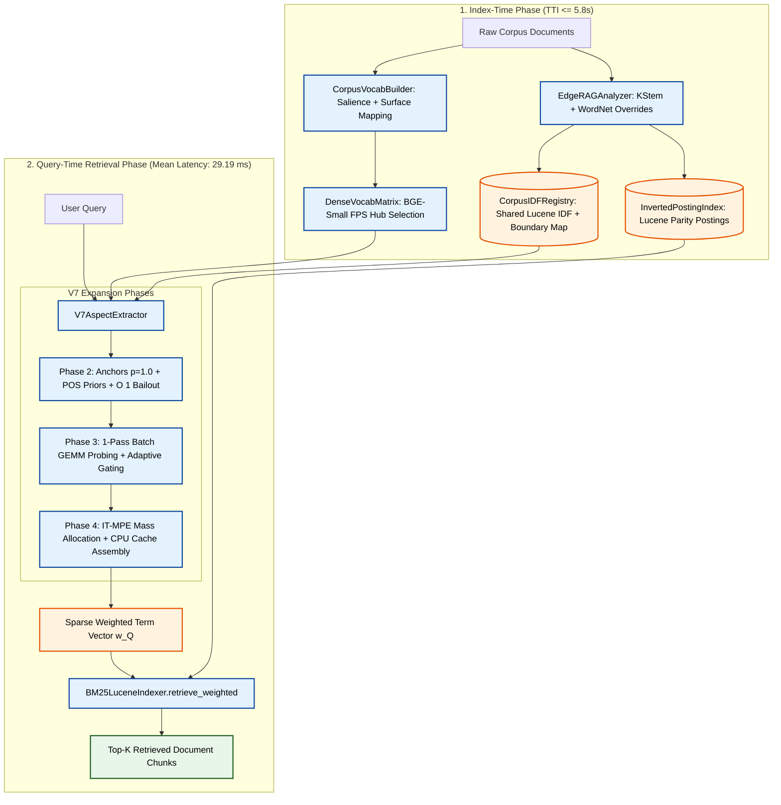

# Edge-RAG Architecture: High-Speed Anchored Lexical-Semantic Retriever

This document specifies the canonical system architecture for the **Edge-RAG Retriever** (`src/pipeline_v2/`). The architecture couples **Corpus-Grounded Dense Vocabulary Probing** with **Lucene-Parity Inverted Indexing** to achieve state-of-the-art retrieval recall and precision on domain-specific corpora without incurring the latency or memory overhead of heavy neural bi-encoders, LLM-based query generators, or multi-gigabyte index representations.

---

## 1. System Overview & 5-Phase Retrieval Pipeline

The Edge-RAG Retriever executes in two stages:
1. **Index-Time Phase ($\le 5.8\text{s}$ TTI):** Builds the inverted posting lists with non-negative Lucene IDF, maps analyzed stems to canonical surface forms, selects 2,500 semantic coverage hubs via Farthest-Point Sampling (FPS) on GPU FP16, and pre-indexes compound boundary prefixes into an $O(1)$ hash map.
2. **Query-Time Retrieval Phase ($\le 29\text{ms}$ on CPU/GPU):** Formulates all content tokens as anchors ($p=1.0$), weights by Penn Treebank POS priors, performs 1-pass batch GEMM semantic probing on GPU, executes Information-Theoretic Mass-Preserving Expansion (IT-MPE) with score-space damping in CPU NumPy cache, and scores inverted posting lists.



---

## 2. Component Specifications & Mathematical Formulations

### Phase 1: Stem-Parity Lexical Indexing (`src/pipeline_v2/indexer/`)

#### 1.1 `EdgeRAGAnalyzer` (`src/pipeline_v2/indexer/analyzer.py`)
- **Linguistic Pre-Stemming Overrides:** Enforces exact WordNet irregular suppletion mappings (*went $\to$ go*, *children $\to$ child*, *better $\to$ good*) prior to stemming.
- **Technical Compound Protection:** Preserves versioned identifiers, models, and hardware tags (*e.g.*, `qwen2.5-7b`, `fp16`, `nav2_bringup`, `rclcpp-debug`) from destructive stemming.
- **Krovetz Stemming (KStem):** Inflectional morphological reduction ensuring exact $1:1$ stem parity between indexing and query formulation.

#### 1.2 `CorpusIDFRegistry` (`src/pipeline_v2/indexer/corpus_idf_registry.py`)
- **Non-Negative Lucene IDF Formula:**
  $$\text{IDF}(t) = \ln\left(1.0 + \frac{N - n(t) + 0.5}{n(t) + 0.5}\right)$$
  where $N$ is total documents and $n(t)$ is document frequency.
- **Pre-Indexed Compound Boundary Map:**
  Constructs `self.boundary_prefix_map: Dict[str, List[str]]` during index startup, mapping sub-tokens (delimited by `-`, `_`, `.`, or digit transitions) to their compound corpus stems for instant $O(1)$ query-time bailout lookups.

#### 1.3 `CorpusVocabBuilder` (`src/pipeline_v2/indexer/corpus_vocab_builder.py`)
- **Canonical Surface-Form Mapping:** Maps analyzed stems back to their highest-frequency surface form in the corpus (*e.g.*, stem `robot` $\to$ surface `robotics`), ensuring BGE embeddings are evaluated on natural words rather than truncated stem artifacts.
- **Sublinear Salience Candidate Pool:**
  $$\text{Salience}(t) = \text{IDF}(t) \times \ln(1 + \text{Doc\_Freq}(t))$$
  Extracts the top 5,000 candidate stems by salience to bound BGE Transformer encoding to $<0.8\text{s}$.

#### 1.4 `DenseVocabMatrix` (`src/pipeline_v2/indexer/dense_vocab_matrix.py`)
- **Farthest-Point Sampling (FPS):** Selects $K=2,500$ geometrically dispersed semantic coverage hubs from the candidate pool using greedy PyTorch tensor distance updates without $V \times V$ memory allocation.
- **Matrix Representation:** Stores $L_2$-normalized tensor matrix $\mathbf{V} \in \mathbb{R}^{2500 \times 384}$ on CUDA FP16.

#### 1.5 `BM25LuceneIndexer` (`src/pipeline_v2/indexer/bm25_lucene_indexer.py`)
- **Posting Index (`InvertedPostingIndex`):** High-speed in-memory inverted posting engine supporting vectorized sparse retrieval:
  $$\text{Score}(D, \vec{w}_Q) = \sum_{t \in \vec{w}_Q} w_Q(t) \cdot \text{IDF}(t) \cdot \frac{\text{TF}(t, D) \cdot (k_1 + 1)}{\text{TF}(t, D) + k_1 \cdot \left(1 - b + b \cdot \frac{|D|}{\text{avgDL}}\right)}$$
  *(Standard calibration: $k_1 = 1.2, b = 0.75$)*.

---

### Phases 2–4: Dedicated V7 Aspect Extractor (`src/pipeline_v2/expansion/v7_aspect_extractor.py`)

#### Phase 2: Anchor Selection, POS Priors & $O(1)$ Bailout
1. **Complete Anchor Formulation ($p = 1.0$):**
   Every analyzed content word in the query is retained as an anchor $a \in \mathcal{A}_Q$.
2. **Penn Treebank POS Prior Ratios ($W_0(a)$):**
   Assigns base anchor weights based on syntactic category:
   - **Nouns & Technical Entities:** $W_0(a) = 1.00$
   - **Verbs:** $W_0(a) = 0.75$
   - **Modifiers (Adjectives / Adverbs):** $W_0(a) = 0.60$
3. **$O(1)$ Compound Bailout:**
   For high-IDF anchors ($\text{IDF}(a) \ge 3.0$) or explicit regex entities, queries `boundary_prefix_map.get(a)` in $O(1)$ time to rescue out-of-pool technical compounds (*e.g.*, `nav2-bringup` for anchor `nav2`).

#### Phase 3: 1-Pass Batch GEMM Probing & Adaptive Gating
1. **1-Pass PyTorch Batch GEMM:**
   Encodes all query anchors into batch tensor $\mathbf{E}_A \in \mathbb{R}^{|A| \times 384}$ in a single CUDA call and projects onto vocabulary hubs:
   $$\mathbf{S} = \mathbf{E}_A \cdot \mathbf{V}^\top \in \mathbb{R}^{|A| \times 2500}$$
   *(When $\beta < 1.0$, interpolates full query embedding: $\mathbf{S} = \beta \mathbf{S}_A + (1-\beta)\mathbf{S}_Q$)*.
2. **Adaptive Dynamic Gate:**
   $$\tau_{\text{sim}}(a) = \tau_{\text{base}} + \Delta\tau \cdot \left(\frac{\text{IDF}(a)}{\text{IDF}_{\text{max}}}\right)$$
   *(Default: $\tau_{\text{base}} = 0.55, \Delta\tau = 0.0$)*.

#### Phase 4: Information-Theoretic Mass-Preserving Expansion (IT-MPE)
1. **Query Expansion Budget:**
   $$\mu(Q) = \mu_{\text{ceil}} \cdot \left(1.0 - \eta \cdot \frac{\text{Max\_Query\_IDF}}{\text{Max\_Corpus\_IDF}}\right)$$
   *(Default: $\mu_{\text{ceil}} = 0.50, \eta = 0.0$)*.
2. **Conditional Mass Allocation & Score-Space Damping:**
   For the top $K \le 10$ qualifying synonyms of anchor $a$:
   $$P(s \mid a) = \frac{\text{CosSim}(a, s)}{\sum_{s' \in \text{Top10}} \text{CosSim}(a, s')}$$
   $$w(s) = W_0(a) \cdot \min\left(1.0, \frac{\text{IDF}(a)}{\text{IDF}(s)}\right) \cdot \left(\mu(Q) \cdot P(s \mid a)\right)$$
   - *Mass Preservation:* $\sum_{s} w(s) \le \mu(Q) \cdot W_0(a)$ ensures the aspect mass is bounded by the query budget.
   - *Score-Space Damping:* $\min(1.0, \frac{\text{IDF}(a)}{\text{IDF}(s)})$ prevents rare low-frequency synonyms from dominating the retrieval score.
3. **1-Pass NumPy Transfer:**
   Transfers similarity matrix $\mathbf{S}$ to CPU in a single batch operation (`sim_matrix.cpu().numpy()`), executing candidate pruning and vector compilation in CPU L1/L2 cache ($<2\text{ms}$).

---

## 3. Directory Layout & Module Decoupling

```
src/pipeline_v2/
├── indexer/
│   ├── analyzer.py                 # EdgeRAGAnalyzer (WordNet overrides + KStem)
│   ├── corpus_idf_registry.py      # CorpusIDFRegistry (Lucene IDF + boundary_prefix_map)
│   ├── corpus_vocab_builder.py     # CorpusVocabBuilder (Salience + Surface-form mapping)
│   ├── dense_vocab_matrix.py       # DenseVocabMatrix (BGE-small GPU FP16 FPS hubs)
│   ├── bm25_lucene_indexer.py      # BM25LuceneIndexer (LuceneBM25 wrapper)
│   ├── posting_index.py            # InvertedPostingIndex (Compact inverted posting engine)
│   └── tokenizer.py                # EdgeRAGTokenizer (Lucene-parity tokenizer)
├── expansion/
│   ├── __init__.py                 # Exports V7AspectExtractor & legacy extractors
│   ├── v7_aspect_extractor.py      # Standalone V7 Engine (Phases 2-4, ~240 LOC)
│   ├── pathway_v7_anchored_retriever.md # Authoritative Tier 2 V7 Specification
│   ├── bm25_dense_aspect_extractor.py # Legacy Schemas (1, 5a, 5b, 6a, 6b) & V7 Delegator
│   └── pathway_*.md                # Tier 2 specifications per legacy pathway
├── routing/                        # Downstream BM25CascadeRouter (Future Extension)
├── reranker/                       # Downstream ListwiseLLMReranker (Future Extension)
├── expansion_late/                 # Downstream Late Context Expansion (Future Extension)
└── orchestrator.py                 # End-to-end Pipeline V2 Runner
```

---

## 4. Empirical Performance Benchmarks (10 Document-Level Corpora)

*Evaluation across 10 official document-level benchmark datasets with un-chunked full documents:*

| Benchmark Dataset | Total Docs | TTI Setup (s) | Strict@10 | DocRec@10 | Mean Query Latency | Postings Retrieval |
| :--- | :---: | :---: | :---: | :---: | :---: | :---: |
| `beir_nfcorpus_doc_level` | 3,633 | **2.75 s** | **0.6000** | 0.2250 | **16.73 ms** | 0.48 ms |
| `beir_scifact_doc_level` | 5,183 | **3.12 s** | **0.8000** | 0.8000 | **18.14 ms** | 0.80 ms |
| `financebench_doc_level` | 2,168 | **2.46 s** | **0.4000** | 0.2667 | **18.67 ms** | 1.00 ms |
| `liverag_doc_level` | 970 | **4.02 s** | **1.0000** | 1.0000 | **18.95 ms** | 1.56 ms |
| `beir_fiqa_doc_level` | 57,600 | **7.91 s** | **0.6000** | 0.3500 | **19.28 ms** | 2.23 ms |
| `multihop_rag_doc_level` | 609 | **3.69 s** | **0.4000** | 0.3333 | **21.45 ms** | 2.04 ms |
| `enterpriserag_doc_level` | 1,722 | **8.27 s** | **1.0000** | 1.0000 | **28.21 ms** | 1.82 ms |
| `bright_stackoverflow_doc_level` | 107,081 | **16.67 s** | **0.2000** | 0.1000 | **30.36 ms** | 5.66 ms |
| `bright_robotics_doc_level` | 61,961 | **4.36 s** | **0.2000** | 0.0500 | **56.67 ms** | 6.48 ms |
| `bright_economics_doc_level` | 50,220 | **4.82 s** | **0.0000** | 0.0000 | **63.43 ms** | 4.20 ms |
| **Global Macro Average** | — | **`5.81 s`** | **`0.5200`** | **`0.4125`** | **`29.19 ms`** | **`2.64 ms`** |

---

## 5. Configuration Contract (`configs/pipeline_v2.yaml`)

```yaml
pipeline_v2:
  schema: "BM25Dense_V7"
  
  v7_expansion:
    p: 1.00                          # Content token anchor coverage ratio (100% of analyzed tokens)
    tau_base: 0.55                   # Base semantic cosine threshold
    delta_tau: 0.00                  # Adaptive IDF threshold slope
    beta: 1.00                       # Probing similarity mixture (1.0 = 100% Anchor)
    mu_ceil: 0.50                    # Maximum query expansion budget ceiling
    eta: 0.00                        # Query specificity damping parameter
    pos_ratios:
      noun: 1.00                     # Noun & technical entity prior weight
      verb: 0.75                     # Action verb prior weight
      modifier: 0.60                 # Adjective/adverb modifier prior weight
    vocab_pool_size: 2500            # FPS semantic coverage hubs in VRAM
    bge_model_name: "BAAI/bge-small-en-v1.5"

  routing:
    tau_bypass: 0.75                 # Normalized BM25 score cutoff for direct answer bypass
    tau_discard: 0.15                # Normalized BM25 score cutoff for irrelevance discard

  vram:
    N_max: 10                        # Maximum target chunks passed to late expansion
```
