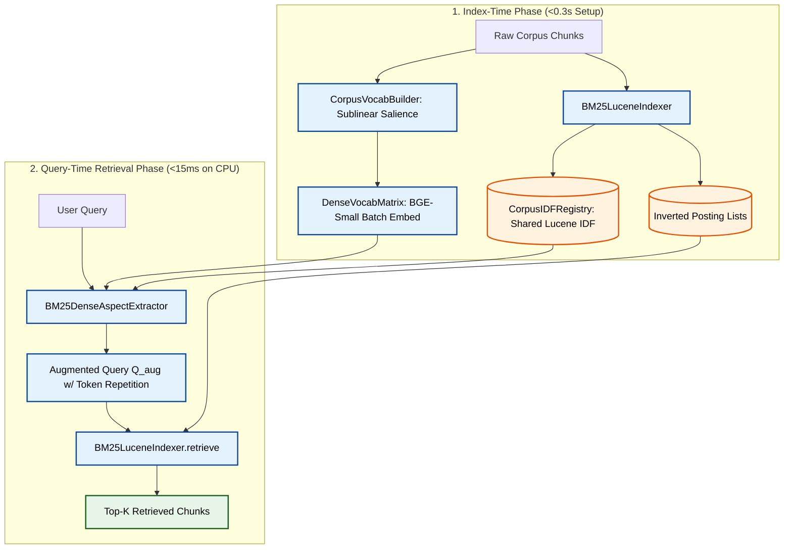

# Edge-RAG Architecture: High-Speed Anchored Lexical-Semantic Retriever

This document specifies the system architecture for the **Edge-RAG Retriever** (`src/pipeline_v2/`). The system couples **Corpus-Grounded Dense Vocabulary Probing** with **Lucene BM25 Inverted Indexing** to achieve high-recall, high-precision retrieval on unindexed text without incurring the latency or memory overhead of heavy neural bi-encoders or LLM-based query expansion.

---

## 1. Retrieval Pipeline Architecture & Data Flow

The Edge-RAG Retriever operates across two distinct execution phases:

1. **Index-Time Phase (<0.3s):** Constructs the inverted index, builds a shared non-negative Lucene IDF registry, extracts a high-salience candidate vocabulary pool (1,000 terms), and generates a pre-embedded vocabulary matrix on GPU using FP16.
2. **Query-Time Retrieval Phase (<15ms on CPU):** Extracts heuristic entities and aspect anchors from the user query, performs single-pass Dual BGE semantic probing against the vocabulary matrix, generates an augmented token list ($Q_{\text{aug}}$) with token repetition weighting, and scores inverted posting lists via Lucene BM25.



---

## 2. Index-Time Phase (`src/pipeline_v2/indexer/`)

### 2.1 `CorpusIDFRegistry` (`src/pipeline_v2/indexer/corpus_idf_registry.py`)
Provides a unified, zero-overhead Inverse Document Frequency (IDF) table shared across indexing, vocabulary selection, and query expansion.

- **Non-Negative Lucene Formula:**
  $$\text{IDF}(t) = \ln\left(1.0 + \frac{N - n(t) + 0.5}{n(t) + 0.5}\right)$$
  where $N$ is the total document count and $n(t)$ is the document frequency of term $t$.
- **Zero-Latency Inverted Index Integration:** Reuses the pre-computed document frequency dictionary (`nd`) directly from `LuceneBM25Baseline` to achieve 0ms IDF setup time.
- **Constituent Bigram Mean IDF:** For multi-word terms (bigrams), computes the mean IDF of the constituent tokens:
  $$\text{IDF}(w_1 \ w_2) = \frac{\text{IDF}(w_1) + \text{IDF}(w_2)}{2}$$

---

### 2.2 `CorpusVocabBuilder` (`src/pipeline_v2/indexer/corpus_vocab_builder.py`)
Extracts a clean, domain-specific candidate vocabulary pool $\mathcal{V}_{\text{clean}}$ (1,000 terms) from raw document text in under $0.05\text{s}$.

- **Frequency Ceilings & Floors:**
  - *Upper Frequency Ceiling:* $\text{Doc\_Freq}(t) \le 0.15 \times N_{\text{docs}}$ (filters common corpus-level generic stopwords like `"data"`, `"model"`, `"system"`).
  - *Lower Frequency Floor:* $\text{Doc\_Freq}(t) \ge 2$, $\text{IDF}(t) \ge 1.5$, $\text{Length}(t) \ge 3$.
- **Fast Bigram Sampling:** Samples up to 1,000 document chunks for rapid bigram co-occurrence counting.
- **Sublinear Salience Ranking:**
  $$\text{Salience}(t) = \text{IDF}(t) \times \ln(1 + \text{Doc\_Freq}(t))$$
  The top 1,000 terms sorted by salience form the candidate vocabulary pool.

---

### 2.3 `DenseVocabMatrix` (`src/pipeline_v2/indexer/dense_vocab_matrix.py`)
Manages GPU embedding and semantic probing representations for the vocabulary pool.

- **Single-Batch GPU Embedding:** Encodes the 1,000 clean vocabulary terms using `BAAI/bge-small-en-v1.5` in a single CUDA FP16 batch operation ($<0.3\text{s}$ TTI).
- **Normalized Embedding Matrix:** Stores normalized tensor matrix $\mathbf{V} \in \mathbb{R}^{N_{\text{vocab}} \times 384}$.
- **Query & Anchor Encoding:** Encodes queries and anchor lists into $L_2$-normalized vectors to enable fast cosine similarity computation via PyTorch matrix multiplication (`torch.mm`).

---

### 2.4 `BM25LuceneIndexer` (`src/pipeline_v2/indexer/bm25_lucene_indexer.py`)
Inverted posting list retrieval engine wrapping `LuceneBM25Baseline`.

- **Hyperparameters:** Calibrated with standard Lucene BM25 parameters ($k_1 = 1.2, b = 0.75$).
- **Scoring Function:**
  $$\text{Score}(D, Q) = \sum_{t \in Q} W_Q(t) \cdot \text{IDF}(t) \cdot \frac{\text{TF}(t, D) \cdot (k_1 + 1)}{\text{TF}(t, D) + k_1 \cdot \left(1 - b + b \cdot \frac{|D|}{\text{avgDL}}\right)}$$
- **Vectorized Weighted Retrieval:** Evaluates sparse weighted term dictionaries ($\{t: W_Q(t)\}$) directly over pre-computed NumPy inverted posting lists via `retrieve_weighted()`.

---

## 3. Query-Time Retrieval Phase (`src/pipeline_v2/expansion/`)

### 3.1 `BM25DenseAspectExtractor` (`src/pipeline_v2/expansion/bm25_dense_aspect_extractor.py`)
Translates raw natural language queries into grounded aspect groups with weighted keywords and compiles the sparse term weight dictionary $\vec{w}_Q$.

#### A. Regex Heuristic Entity Extraction
Extracts high-priority explicit technical entities via regex pattern matching before statistical filtering:
- **Technical Acronyms:** `\b[A-Z]{2,}\b` (e.g., `"EHR"`, `"RAG"`, `"KV"`)
- **Hyphenated / Versioned Identifiers:** `\b[A-Za-z0-9\.]+(?:-[A-Za-z0-9\.]+)+\b` (e.g., `"qwen2.5-3b"`, `"fp-16"`)
- **Exact Quoted Phrases:** `"([^"]+)"`

#### B. Aspect Anchor Selection & Centrality Scoring
For remaining query words (excluding English stopwords):
- **Standard Selection (Schemas 1–5):** Ranks candidate words by corpus IDF score and selects the top $N_{\text{aspects}} = \max(2, \lceil p \cdot |Q_{\text{clean}}| \rceil)$ terms.
- **Centrality Scoring (Schema 6):** Ranks candidate words by their semantic cohesion with the full query embedding:
  $$\text{Centrality\_Score}(w) = \text{IDF}(w) \times \text{CosSim}\left(\mathbf{e}_w, \mathbf{e}_{Q_{\text{full}}}\right)$$
- **Fix B Entity Validation:** Acronyms and heuristic expressions receive entity boosts ($W = r_{\max}$) when $\text{IDF}(w) \ge 1.0$ (allowing domain-essential acronyms such as `API`, `USD`, `SDK` up to 36.8% corpus prevalence while filtering universal conversational stopwords).
- **Deduplication:** Applies stem matching and high-similarity cosine deduplication ($\text{CosSim} \ge 0.90$) to eliminate morphological duplicates (e.g., `"upload"` vs `"uploads"`).

#### C. Dual BGE Semantic Probing
For each aspect anchor $A_k$, evaluates semantic similarity across the pre-embedded vocabulary matrix $\mathbf{V}$:
$$\text{Dual\_Sim}(A_k, v) = \beta \cdot \text{CosSim}(A_k, v) + (1 - \beta) \cdot \text{CosSim}(Q_{\text{full}}, v)$$

- **Parameters:** Default $\beta = 0.65$, threshold cutoff $\tau_{\text{sim}} = 0.55$.
- **Candidate Filtering:** Vocabulary terms passing $\text{Dual\_Sim} \ge \tau_{\text{sim}}$ are ranked by composite weight $\text{Weight} = \text{Dual\_Sim} \times (0.5 + 0.5 \cdot \frac{\text{IDF}(v)}{\text{IDF}_{\text{max}}})$.

#### D. Active Expansion Schemas
1. **`BM25Dense_AspectInject` (Schema 1 — Primary Baseline):** Uniform anchor weight ($W = 3.0$) + top $C_{\text{exp}} = 2$ synonyms per aspect anchor.
2. **`BM25Dense_FixedRepDynamicCapacity` (Schema 5a):** Fixed anchor weight ($W \in \{3.0, 4.0\}$) + dynamic synonym capacity:
   $$C_{\text{exp}}(A_k) = \text{clamp}\left(r_{\min} + (r_{\max} - r_{\min}) \cdot \frac{\text{IDF}(A_k)}{\text{Max\_Query\_IDF}} + c, \ 1, \ 5\right)$$
3. **`BM25Dense_DynamicAspectInject` (Schema 5b):** Dynamic anchor weight ($W_{\text{anchor}} \in [r_{\min}, r_{\max}]$) scaled by Max Query IDF + coupled synonym capacity ($C_{\text{exp}} = W_{\text{anchor}} + c$).
4. **`BM25Dense_CentralityFixedRep` (Schema 6a):** Centrality-ranked anchors + fixed anchor weight + zero-floor capacity ($C_{\text{exp}} = \max(0, R + c)$).
5. **`BM25Dense_CentralityDynamicInject` (Schema 6b):** Centrality-ranked anchors + dynamic anchor weight + zero-floor capacity.
6. **`BM25Dense_AspectWeighted` (Ablation):** Continuous relative IDF anchor weights ($w \in [0.5, 1.0]$).
7. **`BM25Dense_AspectFusion`:** Hierarchical Agglomerative Clustering (HAC) on anchor embeddings with joint score fusion.

#### E. Direct Weighted Term Vector Retrieval ($\vec{w}_Q$)
Compiles the extracted aspect keywords into a weighted sparse dictionary passed directly to `BM25LuceneIndexer.retrieve_weighted(term_weights, top_k)`:
1. **Core Anchors:** Assigned full multiplier $W_Q(A_k) \in [2.0, 5.0]$.
2. **Expansion Synonyms:** Assigned continuous $\text{final\_weight}(v) \in [0.45, 0.95]$, capped at $W_Q(v) \le 1.0$ across all aspects to prevent synonym inflation.

---

## 4. Pipeline Configuration (`configs/pipeline_v2.yaml`)

The pipeline loads all hyperparameters from `configs/pipeline_v2.yaml`:

```yaml
pipeline_v2:
  schema: "BM25Dense_AspectInject"  # Options: BM25Dense_AspectInject, BM25Dense_FixedRepDynamicCapacity, etc.
  
  expansion:
    p: 0.50                          # Aspect anchor selection ratio (50% of distinct query words)
    C_exp: 2                         # Base maximum expansion terms per aspect
    tau_sim: 0.55                    # Minimum Dual BGE Similarity cutoff
    beta: 0.65                       # Weight of Anchor vs Full Query similarity (65% Anchor, 35% Full Query)
    c: -1                            # Anchor-coupled synonym capacity offset (C_exp = R + c)
    r_min: 2                         # Minimum anchor repetition count
    r_max: 5                         # Maximum anchor repetition count (Heuristic entities & high-IDF)
    max_vocab_pool_size: 1000        # Candidate vocabulary pool size extracted from corpus
    bge_model_name: "BAAI/bge-small-en-v1.5"

  routing:
    tau_bypass: 0.75                 # Normalized BM25 score cutoff for direct answer bypass
    tau_discard: 0.15                # Normalized BM25 score cutoff for irrelevance discard

  vram:
    N_max: 10                        # Maximum target chunks passed to late expansion
```

---

## 5. Future Pipeline Extensions (Downstream Modules)

The downstream modules in `src/pipeline_v2/` provide post-retrieval processing and are maintained as secondary pipeline extensions:

### 5.1 BM25 Cascade Router (`src/pipeline_v2/routing/bm25_cascade_router.py`)
Performs 3-way triage on retrieved candidates based on normalized BM25 score and Aspect Coverage $\alpha$:
- **Bypass ($\text{Score} \ge \tau_{\text{bypass}}$):** Confident matches skip LLM evaluation.
- **Discard ($\text{Score} < \tau_{\text{discard}}$):** Irrelevant chunks are dropped.
- **Rerank ($\tau_{\text{discard}} \le \text{Score} < \tau_{\text{bypass}}$):** Ambiguous chunks are routed to the reranker queue.

### 5.2 Listwise LLM Reranker (`src/pipeline_v2/reranker/listwise_reranker.py`)
Performs single-pass listwise LLM evaluation using ~250-token sentence snippets extracted around anchor hits to reduce prompt token load by ~75%.

### 5.3 Late Expansion & Generation (`src/pipeline_v2/expansion_late/late_expansion.py`)
Restores full uncompressed chunk text from winner indices, enforces hardware VRAM safety budget ($N_{max} \le 10$), and prompts the local LLM to generate the final fact-grounded answer.
