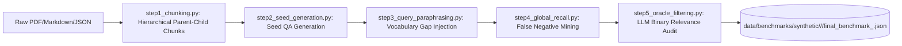
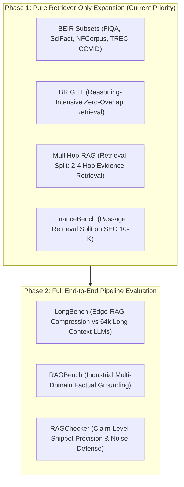

# 📚 Edge-RAG Benchmark Directory & Dataset Preparation Guide

This document is the **canonical catalog and preparation guide** for all Retrieval-Augmented Generation (RAG) and Information Retrieval (IR) benchmarks evaluated or considered for **Edge-RAG**. 

For every benchmark, this guide details its **metadata, corpus scale, task characteristics, acquisition methods, and preprocessing pipelines**, along with **explicit dual-track suitability reasoning**:
1. **Fit for Full Edge-RAG Pipeline:** Evaluates the complete end-to-end flow: Inverted Indexing $\to$ Query Expansion $\to$ Cascade Router $\to$ Listwise LLM Reranker $\to$ Late Context Expansion $\to$ Local LLM Generation.
2. **Fit for Edge-RAG Retriever-Only:** Evaluates purely the sub-0.3s GPU vocab probing and inverted posting list retrieval stage: `CorpusVocabBuilder` $\to$ `DenseVocabMatrix` $\to$ `BM25DenseAspectExtractor` $\to$ `BM25LuceneIndexer`.

---

## 🗺️ Benchmark Taxonomy & Classification Map

```mermaid
graph TD
    classDef diag fill:#f3e5f5,stroke:#7b1fa2,stroke-width:2px,color:#000000;
    classDef reason fill:#e8eaf6,stroke:#283593,stroke-width:2px,color:#000000;
    classDef domain fill:#e0f2f1,stroke:#00695c,stroke-width:2px,color:#000000;
    classDef temp fill:#fff3e0,stroke:#e65100,stroke-width:2px,color:#000000;
    classDef longc fill:#fbe9e7,stroke:#d84315,stroke-width:2px,color:#000000;
    classDef ir fill:#e1f5fe,stroke:#0277bd,stroke-width:2px,color:#000000;

    ROOT[RAG Benchmark Universe] --> C1[1. Diagnostic & Core Capabilities]:::diag
    ROOT --> C2[2. Multi-Hop & Complex Reasoning]:::reason
    ROOT --> C3[3. Enterprise & Domain-Specific]:::domain
    ROOT --> C4[4. Dynamic & Streaming Knowledge]:::temp
    ROOT --> C5[5. Long-Context vs Needle Retrieval]:::longc
    ROOT --> C6[6. Classical Academic IR & Meta-Suites]:::ir

    C1 --> B_RGB[RGB]
    C1 --> B_CRUD[CRUD-RAG]
    C1 --> B_RAGB[RAGBench]
    C1 --> B_RAGC[RAGChecker]
    C1 --> B_ARES[ARES]
    C1 --> B_FE[FaithEval / HaluEval]

    C2 --> B_MH[MultiHop-RAG]
    C2 --> B_BRIGHT[BRIGHT / BRIGHT+]
    C2 --> B_HOTPOT[HotpotQA]
    C2 --> B_MUSIQUE[MuSiQue / 2WikiMultiHop]

    C3 --> B_ERAG[EnterpriseRAG]
    C3 --> B_FBENCH[FinanceBench]
    C3 --> B_MED[MIRAGE / MedRAG]
    C3 --> B_LEGAL[LegalBench / CUAD]
    C3 --> B_CODE[RepoQA / SWE-bench]

    C4 --> B_LRAG[LiveRAG]
    C4 --> B_FRESH[FreshQA / RealTime QA]

    C5 --> B_LONGB[LongBench / L-Eval]
    C5 --> B_BABI[BABILong / NIAH]
    C5 --> B_LOCO[LoCo Benchmark]

    C6 --> B_BEIR[BEIR Suite: FiQA, SciFact, NFCorpus, TREC-COVID]
    C6 --> B_KILT[KILT Multi-Task]
    C6 --> B_MSM[MS MARCO / TREC DL]
    C6 --> B_FLASH[FlashRAG Standard Suite]
```



---

# 1. Diagnostic & Core Capability Benchmarks

---

## 1.1 RGB (Retrieval-Augmented Generation Benchmark)
* **Release Date:** November 2023 / ACL 2024
* **Authors / Institution:** Chen et al. (Renmin University of China, Alibaba Group)
* **Paper / Code:** [arXiv:2309.01431](https://arxiv.org/abs/2309.01431) | [GitHub](https://github.com/chen700564/RGB)
* **Corpus & Query Profile:**
  - **Domains:** Real-world English and Chinese news events (post-2023 to avoid LLM memorization).
  - **Scale:** 600 evaluation queries (300 English, 300 Chinese) paired with test collections of 5–10 candidate snippets per query.
  - **Context Noise Levels:** Synthetically injected noise ratios from $0\%$ to $80\%$.
* **Evaluation Tasks & Metrics:**
  - Evaluates 4 diagnostic dimensions: **Noise Robustness** (accuracy under distractor injection), **Negative Rejection** (rejecting unanswerable queries when ground-truth is withheld), **Information Integration** (combining distributed facts), and **Counterfactual Robustness** (handling poisoned/contradictory contexts).
  - **Metrics:** Generation Accuracy, Refusal Rate (Saying *"I don't know"*), Counterfactual Error Rate.

### Suitability & Reasoning
* **Fit for Full Edge-RAG Pipeline:** ⭐⭐⭐⭐ (Very High)
  - *Reasoning:* Edge-RAG targets small on-device LLMs ($2\text{B}–8\text{B}$, e.g., `Gemma-2-2B`, `Qwen-2.5-3B`, `Llama-3.2-3B`). Small models degrade severely when prompt context contains distractor passages. RGB rigorously tests whether Edge-RAG's late snippet extraction (~250-token windows around aspect anchors) and cascade routing prevent distractor noise from reaching the edge LLM generator.
* **Fit for Edge-RAG Retriever-Only:** ⭐ (Very Low / Poor Fit)
  - *Reasoning:* RGB is fundamentally a **Generator (LLM) diagnostic benchmark**, not an Information Retrieval benchmark. Queries do not search across a large candidate corpus inverted index; instead, the dataset provides pre-assembled 5–10 snippet context windows. It does not output standard IR rankings ($\text{NDCG@}10$, $\text{Recall@}k$, $\text{MRR}$).

### Data Acquisition & Preprocessing
```bash
# Clone official repository
git clone https://github.com/chen700564/RGB.git data/raw/rgb/
# Structure contains data/en/ and data/zh/ with json formatted query-passage-label instances.
```

---

## 1.2 CRUD-RAG
* **Release Date:** January 2024
* **Authors / Institution:** Lyu et al. (Harbin Institute of Technology, Huawei)
* **Paper / Code:** [arXiv:2401.17043](https://arxiv.org/abs/2401.17043) | [GitHub](https://github.com/IAAR-Shanghai/CRUD_RAG)
* **Corpus & Query Profile:**
  - **Domains:** Chinese news events, corporate logs, dynamic enterprise documents.
  - **Scale:** 30,000+ QA instances over millions of tokens.
  - **Modality:** Unstructured prose, event updates, structured event logs.
* **Evaluation Tasks & Metrics:**
  - Tests RAG systems across 4 database-inspired lifecycle operations:
    - **Create:** Text continuation, report generation based on retrieved source context.
    - **Read:** Single-hop and multi-hop fact retrieval.
    - **Update:** Revising an existing generated summary when updated event documents arrive.
    - **Delete:** Contradiction resolution and filtering out retracted or superseded facts.
  - **Metrics:** ROUGE-1/2/L, BLEU, Retrieval Recall, Hallucination Rate, Event Modification Accuracy.

### Suitability & Reasoning
* **Fit for Full Edge-RAG Pipeline:** ⭐⭐⭐ (Moderate)
  - *Reasoning:* Tests edge-device lifecycle scenarios (e.g., editing personal notes, updating calendar event briefings). However, heavy Chinese-language weighting requires multi-lingual LLM testing.
* **Fit for Edge-RAG Retriever-Only:** ⭐⭐ (Low)
  - *Reasoning:* Only the "Read" operation maps to pure retrieval evaluation. Create, Update, and Delete heavily measure generative editing and LLM memory overwrite capabilities.

---

## 1.3 RAGBench
* **Release Date:** May 2024
* **Authors / Institution:** Friel et al. (TruLens / Clarifai)
* **Paper / Code:** [arXiv:2405.07437](https://arxiv.org/abs/2405.07437) | [HuggingFace](https://huggingface.co/datasets/rungalileo/ragbench)
* **Corpus & Query Profile:**
  - **Domains:** 5 Industry Sectors: *Biomedical Research, Legal Contracts, Customer Support, Financial Reports, Technical Manuals*.
  - **Scale:** 100,000 explainable benchmark instances derived from enterprise datasets (HotpotQA, MS MARCO, CUAD, FinQA, PubMed).
* **Evaluation Tasks & Metrics:**
  - Explainable segment-level RAG evaluation.
  - **Metrics:** TruLens RAG Triad: **Context Relevance** (Retriever precision), **Groundedness / Faithfulness** (Generator truthfulness), and **Answer Relevance** (Query satisfaction).

### Suitability & Reasoning
* **Fit for Full Edge-RAG Pipeline:** ⭐⭐⭐⭐⭐ (Excellent)
  - *Reasoning:* Provides realistic industry-grade test cases where enterprise jargon, acronyms, and strict factual compliance are mandatory.
* **Fit for Edge-RAG Retriever-Only:** ⭐⭐⭐⭐ (High)
  - *Reasoning:* Context relevance annotations provide direct chunk-level binary relevance labels to compute precision, recall, and NDCG over domain corpora.

---

## 1.4 RAGChecker
* **Release Date:** August 2024
* **Authors / Institution:** Ru et al. (AWS AI Labs, New York University)
* **Paper / Code:** [arXiv:2408.08067](https://arxiv.org/abs/2408.08067) | [GitHub](https://github.com/amazon-science/RAGChecker)
* **Corpus & Query Profile:**
  - **Domains:** Multi-domain split across 6 areas (finance, clinical, legal, encyclopedia, sports, technology).
  - **Scale:** Fine-grained atomic claim breakdown over hundreds of multi-paragraph context documents.
* **Evaluation Tasks & Metrics:**
  - Decomposes generated responses and retrieved passages into atomic factual claims.
  - **Retriever Metrics:** Claim-Level Recall, Claim-Level Precision.
  - **Generator Metrics:** Context Utilization, Noise Sensitivity, Hallucination Rate.

### Suitability & Reasoning
* **Fit for Full Edge-RAG Pipeline:** ⭐⭐⭐⭐⭐ (Excellent)
  - *Reasoning:* Edge-RAG's listwise reranker feeds ~250-token sentence snippets extracted around anchor hits rather than whole documents. Claim-level precision proves whether these snippets retain complete factual claims without diluting context.
* **Fit for Edge-RAG Retriever-Only:** ⭐⭐⭐ (Moderate)
  - *Reasoning:* Highly effective for evaluating passage-to-claim mapping, but requires LLM-based claim decomposition rather than standard vector/posting-list evaluation.

---

## 1.5 ARES (Automated RAG Evaluation System)
* **Release Date:** November 2023 / NAACL 2024
* **Authors / Institution:** Saad-Falcon et al. (Stanford University, UC Berkeley)
* **Paper / Code:** [arXiv:2311.09476](https://arxiv.org/abs/2311.09476) | [GitHub](https://github.com/stanford-futuredata/ARES)
* **Corpus & Query Profile:**
  - **Domains:** Synthetic query generation across NQ, HotpotQA, and multi-domain corpora.
  - **Scale:** Flexible synthetic generator capable of producing thousands of calibrated test pairs.
* **Evaluation Tasks & Metrics:**
  - Uses Prediction-Powered Inference (PPI) to construct statistical confidence bounds for Context Relevance, Faithfulness, and Answer Relevance.

### Suitability & Reasoning
* **Fit for Full Edge-RAG Pipeline:** ⭐⭐⭐ (Moderate)
  - *Reasoning:* ARES is primarily an automated evaluation methodology/framework rather than a fixed evaluation dataset.
* **Fit for Edge-RAG Retriever-Only:** ⭐⭐ (Low)
  - *Reasoning:* Focuses on PPI calibration of LLM judges rather than standard retrieval indexing.

---

# 2. Multi-Hop & Complex Reasoning Benchmarks

---

## 2.1 MultiHop-RAG
* **Release Date:** January 2024
* **Authors / Institution:** Tang & Yang (Nanyang Technological University, Singapore)
* **Paper / Code:** [arXiv:2401.15391](https://arxiv.org/abs/2401.15391) | [GitHub](https://github.com/yixuantt/MultiHop-RAG)
* **Corpus & Query Profile:**
  - **Domains:** English news articles covering geopolitical, economic, and cultural events.
  - **Scale:** 2,556 multi-hop queries.
  - **Ground Truth Structure:** Every query explicitly requires retrieving and synthesizing evidence distributed across **2 to 4 separate document chunks**.
  - **Query Typology:**
    1. *Inference Queries:* Multi-step logical chains ($A \to B \to C$).
    2. *Comparison Queries:* Comparing metrics/dates across two distinct corporate or political entities.
    3. *Temporal Queries:* Ordering chronological sequences across distinct articles.
    4. *Null Queries:* Multi-hop queries where one essential chain link is absent from the corpus.
* **Evaluation Tasks & Metrics:**
  - Retrieval: Multi-hop Hit Rate, Macro $\text{Recall@}k$, Micro $\text{Recall@}k$.
  - Generation: Answer Accuracy, Step-wise Reasoning Coherence.

### Suitability & Reasoning
* **Fit for Full Edge-RAG Pipeline:** ⭐⭐⭐⭐⭐ (Essential / Outstanding)
  - *Reasoning:* Multi-hop questions fail on standard RAG pipelines when the router prematurely sends incomplete single-chunk hits to the generator. Edge-RAG's **Aspect Coverage metric ($\alpha$)** and dynamic anchor weighting ensure that chunks covering *all* aspect entities are collected before generation.
* **Fit for Edge-RAG Retriever-Only:** ⭐⭐⭐⭐⭐ (Essential / Outstanding)
  - *Reasoning:* Lexical retrievers like standard BM25 suffer on MultiHop-RAG because the query contains surface vocabulary matching only Hop-1, creating a massive vocabulary gap for Hop-2 and Hop-3. Edge-RAG's **Dual BGE Aspect Probing** ($\text{Dual\_Sim}(A_k, v)$) expands candidate keywords across disjoint aspect anchors, enabling high multi-document recall in $<15\text{ms}$.

### Data Acquisition & Preprocessing
```bash
# Clone dataset repository
git clone https://github.com/yixuantt/MultiHop-RAG.git data/raw/multihop_rag/
# Convert to document-level format (data/benchmarks/multihop_rag_doc_level/):
.venv/bin/python3 scripts/data_adapters/convert_retriever_doc_level_benchmarks.py --datasets multihop_rag
```

---

## 2.2 BRIGHT / BRIGHT+ (Reasoning-Intensive Retrieval)
* **Release Date:** July 2024
* **Authors / Institution:** Su et al. (University of Hong Kong, Cohere, University of Waterloo)
* **Paper / Code:** [arXiv:2407.12883](https://arxiv.org/abs/2407.12883) | [Website](https://brightbenchmark.github.io/)
* **Corpus & Query Profile:**
  - **Domains:** 12 Challenging Technical Domains in the full release: *LeetCode (Python/C++ solutions), StackOverflow, AIME/Math Olympiad proofs, Theoretical Economics, Physics, Robotics, Biology, Theorem Proving*.
  - **Scale (local subset):** 566 reasoning-intensive queries over 5 integrated domains — economics, leetcode, stackoverflow, robotics, biology (full release: 1,385 queries / 12 domains).
  - **Key Challenge:** Relevant documents share **near-zero surface keywords or standard bi-encoder semantic similarity** with the query. Retrieval requires understanding logical equivalence, mathematical identities, and algorithmic transformations.
* **Evaluation Tasks & Metrics:**
  - Pure Retrieval: $\text{NDCG@}10$, $\text{Recall@}10$, $\text{Recall@}100$, $\text{MRR@}10$.

### Suitability & Reasoning
* **Fit for Full Edge-RAG Pipeline:** ⭐⭐⭐⭐ (High)
  - *Reasoning:* Benchmarks the full system on whether retrieved algorithmic/reasoning context enables an edge LLM to produce sound mathematical or programming solutions.
* **Fit for Edge-RAG Retriever-Only:** ⭐⭐⭐⭐⭐ (Top Academic Priority)
  - *Reasoning:* BRIGHT was explicitly engineered because standard dense embeddings (OpenAI `text-embedding-3`, BGE-Large) and sparse lexical engines (BM25) achieve abysmal recall on reasoning tasks. Testing Edge-RAG's **Centrality Aspect Selection** and **Dual BGE Semantic Probing** against BRIGHT proves whether our sublinear salience vocabulary matrix can bridge conceptual/algorithmic vocabulary gaps without a multi-billion-parameter neural bi-encoder.

---

## 2.3 HotpotQA & 2WikiMultiHopQA / MuSiQue
* **Release Date:** 2018–2022
* **Authors / Institution:** Yang et al. (CMU / Stanford), Ho et al. (2Wiki), Trivedi et al. (MuSiQue)
* **Corpus & Query Profile:**
  - **Domains:** Wikipedia entity graphs.
  - **Scale:** HotpotQA (113k pairs), 2Wiki (192k pairs), MuSiQue (25k complex composition pairs).
* **Evaluation Tasks & Metrics:**
  - Multi-hop document retrieval, supporting fact sentence extraction, joint Exact Match (EM) and F1.

### Suitability & Reasoning
* **Fit for Full Edge-RAG Pipeline:** ⭐⭐⭐⭐ (High)
  - *Reasoning:* Standard multi-hop baselines; widely used across academic RAG literature.
* **Fit for Edge-RAG Retriever-Only:** ⭐⭐⭐⭐ (High)
  - *Reasoning:* Excellent for measuring multi-document retrieval recall when packaged under standard IR inverted index splits (e.g., BEIR HotpotQA split).

---

# 3. Enterprise & Domain-Specific Vertical Benchmarks

---

## 3.1 EnterpriseRAG (Enterprise Workspace Retrieval)
* **Status in Edge-RAG:** Active Primary External Benchmark
* **Corpus & Query Profile:**
  - **Domains:** Enterprise collaboration workspace data across 9 source types — Slack, Gmail, Confluence, Jira, Linear, Google Drive, GitHub, HubSpot, Fireflies.
  - **Scale:** 500 queries across 10 query types (basic, semantic, intra-document reasoning, project related, completeness, conflicting info, constrained, high level, info-not-found, miscellaneous), evaluated against 1,722 full documents (722 gold + 1,000 distractors).
  - **Characteristics:** Mixed chat threads, emails, tickets, wiki pages, source code, CRM records, and meeting transcripts — dense with technical identifiers (`REST_API_V2`, `OAuth2.0`, `JWT_SECRET`), hyphenated parameters (`--max-retry-attempts`), code blocks, and error trace tables.
* **Evaluation Tasks & Metrics:**
  - Pre-Rerank Recall, Reranker Micro/Macro Recall, Precision, Compression Ratio, Peak VRAM, Pipeline Latency.

### Suitability & Reasoning
* **Fit for Full Edge-RAG Pipeline:** ⭐⭐⭐⭐⭐ (Baseline Pillar)
  - *Reasoning:* Primary enterprise baseline for Edge-RAG; validates sub-2.4s latency and <2.8 GB VRAM on local devices.
* **Fit for Edge-RAG Retriever-Only:** ⭐⭐⭐⭐⭐ (Baseline Pillar)
  - *Reasoning:* Validates regex heuristic extraction for acronyms (`\b[A-Z]{2,}\b`) and versioned identifiers (`\b[A-Za-z0-9\.]+(?:-[A-Za-z0-9\.]+)+\b`).

---

## 3.2 FinanceBench
* **Release Date:** November 2023
* **Authors / Institution:** Patil et al. (Patronus AI)
* **Paper / Code:** [arXiv:2311.11944](https://arxiv.org/abs/2311.11944) | [HuggingFace](https://huggingface.co/datasets/patronus-ai/financebench)
* **Corpus & Query Profile:**
  - **Domains:** U.S. SEC public financial filings (10-K annual reports, 10-Q quarterly reports, 8-K material event disclosures, earnings releases).
  - **Scale (local subset):** 150 QA pairs over 168 page-level gold documents (32 companies / 84 distinct SEC 10-K filings), expanded with 2,000 injected distractor pages (2,168 total documents). The full release is 10,231 QA pairs over 150 corporations.
  - **Modality:** Long multi-page PDFs (often 50–200 pages per filing), dense numerical balance sheets, cash flow tables, footnotes, audit opinions.
* **Evaluation Tasks & Metrics:**
  - Retrieval: Evidence Passage Retrieval Recall@k, Top-1 Passage Hit Rate.
  - Generation: Numerical Reasoning Exact Match, Financial Metric Accuracy.

### Suitability & Reasoning
* **Fit for Full Edge-RAG Pipeline:** ⭐⭐⭐⭐⭐ (Essential Enterprise Expansion)
  - *Reasoning:* Standard open-domain QA fails to reflect real business use cases. FinanceBench tests whether Edge-RAG can handle complex fiscal tables without hallucinating dollar amounts or mixing up fiscal quarters (e.g., Q2 2022 vs Q2 2023).
* **Fit for Edge-RAG Retriever-Only:** ⭐⭐⭐⭐⭐ (Essential Enterprise Expansion)
  - *Reasoning:* Financial reports contain repeated generic headings (*"Consolidated Statements of Operations"*, *"Risk Factors"*). Standard BM25 drowns in generic term frequencies. Edge-RAG's **Upper Frequency Ceiling** ($\text{Doc\_Freq} \le 0.15 \cdot N$) automatically strips corpus-level financial stopwords while preserving precise company tickers and balance sheet line items.

### Data Acquisition & Preprocessing
```bash
# Load via Hugging Face Datasets
python3 -c "from datasets import load_dataset; ds = load_dataset('patronus-ai/financebench'); ds.save_to_disk('data/raw/financebench')"
```

---

## 3.3 MIRAGE & MedRAG (Biomedical & Clinical QA)
* **Release Date:** February 2024
* **Authors / Institution:** Zhao et al. (Stanford University School of Medicine, Tsinghua University)
* **Paper / Code:** [arXiv:2402.13178](https://arxiv.org/abs/2402.13178) | [GitHub](https://github.com/Teddy-XiongGZ/MedRAG)
* **Corpus & Query Profile:**
  - **Domains:** Clinical medicine, pharmacological literature, medical licensing exams.
  - **Datasets Included:** PubMedQA, MedQA (USMLE), BioASQ, MedMCQA, MMLU-Clinical.
  - **Corpus:** Complete PubMed Central open-access articles + StatPearls clinical textbook compendium.
* **Evaluation Tasks & Metrics:**
  - Medical Multi-Choice QA Accuracy, Clinical Fact Retrieval Recall@k, Hallucination-induced Adverse Diagnostic Rate.

### Suitability & Reasoning
* **Fit for Full Edge-RAG Pipeline:** ⭐⭐⭐⭐ (High)
  - *Reasoning:* Evaluates high-stakes medical domain generation where hallucinated drug dosages or contraindicated treatments can be fatal.
* **Fit for Edge-RAG Retriever-Only:** ⭐⭐⭐⭐ (High)
  - *Reasoning:* Evaluates medical ontological synonyms (e.g., *"myocardial infarction"* $\leftrightarrow$ *"heart attack"* $\leftrightarrow$ *"acute coronary syndrome"*). Tests whether Edge-RAG's BGE-Small vocabulary matrix captures medical semantic proximity in sub-0.3s setup time.

---

## 3.4 LegalBench & CUAD (Contract Understanding Atticus Dataset)
* **Release Date:** 2021–2023
* **Authors / Institution:** Guha et al. (Stanford Law / LegalBench), Hendrycks et al. (CUAD / UC Berkeley)
* **Corpus & Query Profile:**
  - **Domains:** Commercial legal contracts, NDAs, underwriting agreements, judicial opinions.
  - **Scale:** CUAD features 510 commercial contracts with 13,000+ expert legal annotations across 41 legal clause categories (e.g., *"Indemnification"*, *"Non-Compete"*, *"Governing Law"*).
* **Evaluation Tasks & Metrics:**
  - Clause Extraction Precision/Recall, Legal Question Answering, Contract Risk Classification.

### Suitability & Reasoning
* **Fit for Full Edge-RAG Pipeline:** ⭐⭐⭐⭐ (High)
  - *Reasoning:* Real-world on-device legal assistant use cases (e.g., local contract review on a lawyer's laptop without uploading sensitive client NDAs to cloud APIs).
* **Fit for Edge-RAG Retriever-Only:** ⭐⭐⭐⭐ (High)
  - *Reasoning:* Legal clauses use dense boilerplate language with subtle modifier terms (*"shall not"*, *"except as provided in Section 4.2"*). Tests anchor weighting and exact quote regex matching (`"([^"]+)"`).

---

## 3.5 RepoQA & SWE-bench (Code Repository RAG)
* **Release Date:** 2024
* **Authors / Institution:** Liu et al. (RepoQA), Jimenez et al. (SWE-bench / Princeton)
* **Corpus & Query Profile:**
  - **Domains:** Full open-source GitHub software repositories (Python, TypeScript, C++, Rust, Go).
  - **Scale:** Hundreds of source code files, class definitions, function signatures, dependency trees.
* **Evaluation Tasks & Metrics:**
  - Long-context Code Search Recall, Function Signature Retrieval, End-to-End Bug Resolution Rate.

### Suitability & Reasoning
* **Fit for Full Edge-RAG Pipeline:** ⭐⭐⭐ (Moderate)
  - *Reasoning:* Requires specialized AST code parsers and execution environments.
* **Fit for Edge-RAG Retriever-Only:** ⭐⭐⭐⭐ (High)
  - *Reasoning:* Source code is filled with camelCase identifiers (`getUserAuthToken`), snake_case variables (`max_retry_limit`), and dotted method paths (`indexer.retrieve`). Edge-RAG's regex parser natively handles these hyphenated/versioned identifiers without token fragmentation.

---

# 4. Dynamic, Streaming & Temporal Benchmarks

---

## 4.1 LiveRAG (Streaming News & Ephemeral Web)
* **Status in Edge-RAG:** Active Primary External Benchmark
* **Corpus & Query Profile:**
  - **Domains:** Streaming live news feeds, financial breaking bulletins, real-time web transcripts.
  - **Scale:** 895 queries evaluated over 970 documents, spanning two collection windows (`First` / `Second` / `Both`) preserved via the per-query `session` field.
  - **Key Challenge:** Zero-shot ad-hoc indexing. Corpus arrives in real-time; the system cannot spend minutes building heavy neural bi-encoder vector indices.
* **Evaluation Tasks & Metrics:**
  - Time-To-Index (TTI), Pre-Rerank Recall, Reranker Precision, Latency, Peak VRAM.

### Suitability & Reasoning
* **Fit for Full Edge-RAG Pipeline:** ⭐⭐⭐⭐⭐ (Baseline Pillar)
  - *Reasoning:* Validates Edge-RAG's core thesis: **Ephemeral on-device RAG** where dynamic documents are indexed in $<0.3\text{s}$ and queried in $<15\text{ms}$ with zero vector database persistence.
* **Fit for Edge-RAG Retriever-Only:** ⭐⭐⭐⭐⭐ (Baseline Pillar)
  - *Reasoning:* Proves that sublinear salience vocabulary construction ($<0.05\text{s}$) + single-pass GPU FP16 matrix encoding ($<0.25\text{s}$) outperforms static vector DBs on ephemeral text streams.

---

## 4.2 FreshQA & RealTime QA
* **Release Date:** October 2023
* **Authors / Institution:** Vu et al. (Google Research) / Kasai et al.
* **Paper / Code:** [arXiv:2310.03214](https://arxiv.org/abs/2310.03214) | [GitHub](https://github.com/freshllms/freshqa)
* **Corpus & Query Profile:**
  - **Domains:** Real-time search engine results, rapidly evolving world news, false-premise inquiries.
  - **Scale:** 600 dynamic questions categorized into *Never-changing, Slow-changing, Fast-changing*, and *False-premise* queries.
* **Evaluation Tasks & Metrics:**
  - Temporal Factuality (REQA), Hallucination Resistance on Fast-Changing Entities.

### Suitability & Reasoning
* **Fit for Full Edge-RAG Pipeline:** ⭐⭐⭐⭐ (High)
  - *Reasoning:* Direct academic companion to LiveRAG. Tests dynamic web-augmented generation where knowledge changes daily.
* **Fit for Edge-RAG Retriever-Only:** ⭐⭐⭐ (Moderate)
  - *Reasoning:* Queries require integration with live web search APIs rather than local static inverted indexing.

---

# 5. Long-Context vs. Needle-in-a-Haystack Benchmarks

---

## 5.1 LongBench & L-Eval
* **Release Date:** August 2023 / October 2023
* **Authors / Institution:** Bai et al. (Tsinghua University) / An et al.
* **Paper / Code:** [arXiv:2308.14508](https://arxiv.org/abs/2308.14508) | [GitHub](https://github.com/THUDM/LongBench)
* **Corpus & Query Profile:**
  - **Domains:** 21 Subtasks across 6 Core Categories: *Single-Doc QA, Multi-Doc QA, Long Document Summarization, Few-shot Learning, Synthetic Task Verification, Code Retrieval*.
  - **Context Lengths:** $8\text{k}, 16\text{k}, 32\text{k}, 64\text{k}, 128\text{k}$ tokens.
* **Evaluation Tasks & Metrics:**
  - Subtask-specific F1, ROUGE-L, Code Syntax Accuracy, Token Cost & Memory Consumption.

### Suitability & Reasoning
* **Fit for Full Edge-RAG Pipeline:** ⭐⭐⭐⭐⭐ (Essential Architecture Comparison)
  - *Reasoning:* Directly evaluates **Edge-RAG vs. Full Long-Context LLMs**. Passing $64\text{k}$ tokens to an edge LLM (e.g., `Llama-3.2-3B`) causes KV-cache VRAM explosion ($>12\text{ GB}$) and latency degradation ($>30\text{s}$). Edge-RAG's snippet compression and cascade router retrieve only the top $N_{\text{max}} \le 10$ chunks, keeping VRAM under $2.8\text{ GB}$ with sub-2.4s execution time while matching long-context generation quality.
* **Fit for Edge-RAG Retriever-Only:** ⭐⭐⭐⭐ (High)
  - *Reasoning:* Long documents contain substantial distractor prose. Tests candidate chunk ranking and Top-$k$ recall over massive book/manual corpora.

---

## 5.2 BABILong & Needle In A Haystack (NIAH)
* **Release Date:** June 2024
* **Authors / Institution:** Kurganov et al. (AIRI, MIPT)
* **Paper / Code:** [arXiv:2406.10149](https://arxiv.org/abs/2406.10149) | [GitHub](https://github.com/booydar/babilong)
* **Corpus & Query Profile:**
  - **Domains:** Synthetic and natural language reasoning tasks hidden inside massive book-length background distractor texts (up to $1\text{M}$ tokens).
  - **Scale:** 20 bAbI reasoning tasks buried at various depth percentiles ($0\% \dots 100\%$).
* **Evaluation Tasks & Metrics:**
  - Retrieval & Extraction Accuracy as a function of context length and needle depth position.

### Suitability & Reasoning
* **Fit for Full Edge-RAG Pipeline:** ⭐⭐⭐⭐ (High)
  - *Reasoning:* Proves whether Edge-RAG eliminates the *"Lost in the Middle"* phenomenon seen in long-context models.
* **Fit for Edge-RAG Retriever-Only:** ⭐⭐⭐⭐ (High)
  - *Reasoning:* Tests pure needle retrieval recall across extreme distractor-to-target volume ratios ($10,000 : 1$).

---

# 6. Classical Academic Information Retrieval (IR) & Meta-Suites

---

## 6.1 BEIR (Benchmarking Information Retrieval)
* **Release Date:** NeurIPS 2021
* **Authors / Institution:** Thakur et al. (UKP Lab, TU Darmstadt)
* **Paper / Code:** [arXiv:2104.08663](https://arxiv.org/abs/2104.08663) | [GitHub](https://github.com/beir-cellar/beir)
* **Corpus & Query Profile:**
  - **Domains:** Standard zero-shot heterogeneous evaluation benchmark with **18 datasets** across 9 diverse tasks:
    1. **FiQA-2018:** Financial opinion QA & sentiment retrieval.
    2. **SciFact:** Scientific claim verification.
    3. **NFCorpus:** Nutrition and medical fact search.
    4. **TREC-COVID:** Biomedical pandemic research literature.
    5. **Touche-2020:** Conversational argument retrieval.
    6. **DBPedia-Entity:** Entity linking and structured entity search.
    7. **CQADupStack:** StackExchange technical duplicate question retrieval across 12 sub-forums.
    8. **Quora Duplicate Questions:** Paraphrase retrieval.
    9. **FEVER:** Fact extraction and verification.
  - **Scale:** Corpus sizes range from 3,000 documents (NFCorpus) to 5,280,000 documents (FEVER).
* **Evaluation Tasks & Metrics:**
  - Pure IR: $\text{NDCG@}10$, $\text{Recall@}10$, $\text{Recall@}100$, $\text{MRR@}10$, $\text{MAP@}100$.

### Suitability & Reasoning
* **Fit for Full Edge-RAG Pipeline:** ⭐⭐⭐⭐ (High)
  - *Reasoning:* Standard benchmark used in top-tier NLP/IR conferences (SIGIR, ACL, EMNLP, NeurIPS) to establish baseline credibility.
* **Fit for Edge-RAG Retriever-Only:** ⭐⭐⭐⭐⭐ (The Gold Standard)
  - *Reasoning:* BEIR is the universal academic standard for evaluating retrieval engines without LLM generation artifacts. Evaluating Edge-RAG on the compact/medium subsets (**FiQA, SciFact, NFCorpus, TREC-COVID**) enables direct, undisputed empirical comparisons against:
    - Standard **Lucene BM25** ($k_1=1.2, b=0.75$)
    - Dense Bi-Encoders (**BGE-Small**, **Contriever**, **MiniLM**)
    - Learned Sparse Models (**SPLADE-v3**, **BM42**)

### Data Acquisition & Preprocessing
```python
# Install BEIR library
# pip install beir

from beir import util
from beir.datasets.data_loader import GenericDataLoader

# Download and load FiQA dataset
dataset = "fiqa"
url = f"https://public.ukp.informatik.tu-darmstadt.de/thakur/BEIR/datasets/{dataset}.zip"
data_path = util.download_and_unzip(url, "data/raw/beir/")
corpus, queries, qrels = GenericDataLoader(data_folder=data_path).load(split="test")
```

---

## 6.2 KILT (Knowledge Intensive Language Tasks)
* **Release Date:** NAACL 2021
* **Authors / Institution:** Petroni et al. (Meta AI, UCL)
* **Paper / Code:** [arXiv:2009.02252](https://arxiv.org/abs/2009.02252) | [GitHub](https://github.com/facebookresearch/KILT)
* **Corpus & Query Profile:**
  - **Corpus:** Unified Wikipedia snapshot (5.9M articles, 35M paragraphs).
  - **Tasks / Datasets:** 11 Datasets across 5 tasks: Fact Checking (FEVER), Open-Domain QA (NQ, TriviaQA, HotpotQA), Entity Linking (AIDA CoNLL), Slot Filling (T-REx, Zero-Shot RE), Dialogue (Wizard of Wikipedia).
* **Evaluation Tasks & Metrics:**
  - Downstream Task Accuracy, Retrieval R-Precision, KILT-AC (Task accuracy conditioned on retrieved provenance).

### Suitability & Reasoning
* **Fit for Full Edge-RAG Pipeline:** ⭐⭐⭐ (Moderate)
  - *Reasoning:* Large-scale standard benchmark, but evaluating over a 35M passage Wikipedia index is too resource-heavy for edge devices.
* **Fit for Edge-RAG Retriever-Only:** ⭐⭐⭐ (Moderate)
  - *Reasoning:* Requires a distributed cluster to index 35M passages, conflicting with Edge-RAG's focus on local, lightweight indexing (<50,000 chunks).

---

## 6.3 FlashRAG Standardized Benchmark Suite
* **Release Date:** May 2024
* **Authors / Institution:** Jin et al. (Renmin University of China)
* **Paper / Code:** [arXiv:2405.13572](https://arxiv.org/abs/2405.13572) | [GitHub](https://github.com/RUC-NLPIR/FlashRAG)
* **Corpus & Query Profile:**
  - **Scope:** Modular, standardized RAG toolkit bundling **32+ pre-processed RAG datasets** in unified JSON/Parquet formats.
  - **Included Benchmarks:** *Natural Questions (NQ), TriviaQA, PopQA, 2WikiMultiHopQA, HotpotQA, WebQuestions, ARC, MusiQue, RGB, FreshQA, etc.*
* **Evaluation Tasks & Metrics:**
  - End-to-End Execution, Pipeline Latency, Retrieval Recall@k, Generation Exact Match / F1.

### Suitability & Reasoning
* **Fit for Full Edge-RAG Pipeline:** ⭐⭐⭐⭐⭐ (Top Practical Choice)
  - *Reasoning:* Eliminates custom dataset parsing boilerplate. Provides standardized evaluation runners and clean evaluation JSONs across 32 classic datasets.
* **Fit for Edge-RAG Retriever-Only:** ⭐⭐⭐⭐⭐ (Top Practical Choice)
  - *Reasoning:* All datasets come with standardized chunked passages and query-ground truth mapping, ready for inverted index ingestion.

---

# 7. Standard Data Schema & Preprocessing Pipeline for Edge-RAG

Edge-RAG stores benchmarks under `data/benchmarks/`. There are two distinct schemas — external **document-level** benchmarks and **synthetic** (chunked) benchmarks.

## 7.1 External Document-Level Benchmarks (`<name>_doc_level/`)

Converted from BEIR, BRIGHT, MultiHop-RAG, FinanceBench, EnterpriseRAG, and LiveRAG by [`scripts/data_adapters/`](scripts/data_adapters/). Each benchmark is a flat directory:

```
<name>_doc_level/
├── documents/<doc_id>.json        # one JSON per un-chunked document
├── final_benchmark.json           # default query set
├── final_benchmark_capped.json    # stratified capped query subset (where applicable)
└── final_benchmark_full.json      # full query set (explicit)
```

**Document file** (`documents/<doc_id>.json`):
```json
{
  "doc_id": "dsid_00000f26be76466b9b871cb48ed51a28",
  "text": "maria: FYI AcmePayments opened a support ticket ...",
  "title": "customer-success",
  "source_type": "slack",
  "doc_length": 616
}
```

FinanceBench documents additionally carry `company`, `cik`, and `is_distractor`; LiveRAG documents carry `sessions` (the `First` / `Second` / `Both` collection windows).

**Query & ground-truth file** (`final_benchmark.json`):
```json
[
  {
    "query_id": "q_ent_0",
    "query_group": "Enterprise RAG",
    "query_type": "basic",
    "question": "...",
    "raw_question": "...",
    "golden_answer": "...",
    "doc_id_source": "dsid_...",
    "expected_doc_ids": ["dsid_...", "dsid_..."],
    "ground_truth_child_chunks": [{"chunk_id": "dsid_...", "text": ""}]
  }
]
```

LiveRAG queries additionally carry `session`.

## 7.2 Synthetic (Chunked) Benchmarks (`synthetic/<domain>/<tier>/`)

Generated by [`scripts/benchmark_creation/`](scripts/benchmark_creation/) into domains `ai`, `biomedical`, `fintech`, `fused`, and `systems_security`, under tiers `corpus_single_*`, `corpus_multi_*`, and `corpus_stress_*`.

**Corpus file** (`chunks.json`):
```json
[
  {
    "chunk_id": "doc_001_c01",
    "doc_id": "doc_001",
    "text": "The Edge-RAG retriever utilizes a shared Lucene IDF registry to achieve zero-overhead indexing...",
    "metadata": {
      "title": "Edge-RAG Architecture",
      "section": "Indexer Specifications",
      "source_url": "docs/ARCHITECTURE.md"
    }
  }
]
```

**Queries & ground truth** (`final_benchmark_<tier>.json`):
```json
[
  {
    "query_id": "q_001",
    "query": "How does Edge-RAG achieve zero-overhead IDF computation?",
    "ground_truth_answer": "Edge-RAG reuses the pre-computed document frequency dictionary directly from LuceneBM25Baseline.",
    "positive_chunk_ids": ["doc_001_c01"],
    "positive_aspects": ["zero-overhead", "IDF computation", "LuceneBM25Baseline"],
    "negative_chunk_ids": ["doc_002_c03", "doc_004_c01"],
    "hop_count": 1,
    "domain": "system_architecture"
  }
]
```

## 7.3 Preprocessing Pipelines

1. **External benchmarks** — converted by [`convert_retriever_doc_level_benchmarks.py`](scripts/data_adapters/convert_retriever_doc_level_benchmarks.py) (BEIR, MultiHop-RAG, FinanceBench, BRIGHT) and [`convert_doc_level_benchmarks.py`](scripts/data_adapters/convert_doc_level_benchmarks.py) (EnterpriseRAG, LiveRAG).
2. **Synthetic benchmarks** — generated by the 5-step pipeline in [`scripts/benchmark_creation/`](scripts/benchmark_creation/):



---

# 8. 📊 Master Benchmark Comparison & Recommendation Matrix

The table below provides a comprehensive comparison of all 20+ surveyed benchmarks, their primary domain, scale, and suitability for Edge-RAG's dual evaluation tracks.

| # | Benchmark Name | Release Date | Primary Domain / Focus | Scale (Queries / Corpus) | Multi-Hop? | Full Pipeline Fit | Retriever-Only Fit | Recommended Action for Edge-RAG |
| :---: | :--- | :---: | :--- | :--- | :---: | :---: | :---: | :--- |
| **1** | **LiveRAG** | Active | Dynamic Web / News Chunks | 895 Q / 970 Docs | Partial | ⭐⭐⭐⭐⭐ (5/5) | ⭐⭐⭐⭐⭐ (5/5) | **Primary Active Baseline** |
| **2** | **EnterpriseRAG** | Active | Enterprise Workspace (9 Source Types) | 500 Q / 1,722 Docs | Partial | ⭐⭐⭐⭐⭐ (5/5) | ⭐⭐⭐⭐⭐ (5/5) | **Primary Active Baseline** |
| **3** | **BEIR (FiQA, SciFact, NFCorpus, TREC-COVID)** | NeurIPS 2021 | Standard Academic Heterogeneous IR | 18 Datasets (3k–5M docs) | Diverse | ⭐⭐⭐⭐ (4/5) | ⭐⭐⭐⭐⭐ (5/5) | **Adopt Immediately** (Standard IR Credibility) |
| **4** | **BRIGHT / BRIGHT+** | Jul 2024 | Reasoning-Intensive (Math, Code, Proofs) | 566 Q / 5 Domains (local) | Yes | ⭐⭐⭐⭐ (4/5) | ⭐⭐⭐⭐⭐ (5/5) | **Adopt Immediately** (Tests Vocab Bridging) |
| **5** | **MultiHop-RAG** | Jan 2024 | Cross-Document Evidence Synthesis | 2,556 Q / 2–4 Docs/Q | Yes (2–4 hops)| ⭐⭐⭐⭐⭐ (5/5) | ⭐⭐⭐⭐⭐ (5/5) | **Adopt Immediately** (Tests Aspect Coverage) |
| **6** | **FinanceBench** | Nov 2023 | Enterprise SEC 10-K/10-Q Financial Reports | 150 QA / 32 Companies (local) | Partial | ⭐⭐⭐⭐⭐ (5/5) | ⭐⭐⭐⭐⭐ (5/5) | **Adopt Immediately** (Enterprise Extension) |
| **7** | **FlashRAG Suite** | May 2024 | Standardized 32+ RAG Datasets (NQ, Trivia) | 32 Datasets / Unified JSON | Both | ⭐⭐⭐⭐⭐ (5/5) | ⭐⭐⭐⭐⭐ (5/5) | **Adopt Suite** (Rapid Multi-Dataset Eval) |
| **8** | **RAGBench** | May 2024 | Explainable Industrial RAG (5 Domains) | ~100k Examples | Partial | ⭐⭐⭐⭐⭐ (5/5) | ⭐⭐⭐⭐ (4/5) | **High Priority** (Enterprise Generalization) |
| **9** | **RAGChecker** | Aug 2024 | Atomic Claim-Level Diagnostic Retrieval | 6 Diverse Domains | Partial | ⭐⭐⭐⭐⭐ (5/5) | ⭐⭐⭐ (3/5) | **High Priority** (Snippet Evaluation) |
| **10** | **RGB** | Nov 2023 | 4 RAG Core Abilities (Noise, Rejection) | 600 Q / News Corpus | Partial | ⭐⭐⭐⭐ (4/5) | ⭐ (1/5) | **Exclude from Retriever-Only**; Keep for LLM Generation |
| **11** | **LongBench / L-Eval** | Aug 2023 | Long Context vs Retrieval Compression | 21 Tasks (8k–128k context) | Yes | ⭐⭐⭐⭐⭐ (5/5) | ⭐⭐⭐⭐ (4/5) | **High Priority** (Cost/Latency vs Long-Context) |
| **12** | **FreshQA / RealTime QA** | Oct 2023 | Fast-Changing Dynamic Knowledge | 600 Q / Live Web | No | ⭐⭐⭐⭐ (4/5) | ⭐⭐⭐ (3/5) | **Secondary** (Evaluates Web Search APIs) |
| **13** | **MIRAGE / MedRAG** | Feb 2024 | Clinical / Biomedical QA (PubMed) | 5,000+ QA / Medical Corpus | Partial | ⭐⭐⭐⭐ (4/5) | ⭐⭐⭐⭐ (4/5) | **Secondary** (Specialized Medical Vertical) |
| **14** | **LegalBench / CUAD** | 2021–2023 | Commercial Legal Contracts & Compliance | 510 Contracts / 13k Clauses | No | ⭐⭐⭐⭐ (4/5) | ⭐⭐⭐⭐ (4/5) | **Secondary** (Legal Assistant Vertical) |
| **15** | **CRUD-RAG** | Jan 2024 | Create, Read, Update, Delete Lifecycle | 30k+ QA / Chinese News & Logs | Yes | ⭐⭐⭐ (3/5) | ⭐⭐ (2/5) | **Secondary** (Focuses on Generation Lifecycle) |
| **16** | **BABILong / NIAH** | Jun 2024 | Needle-In-A-Haystack Distractor Scaling | 20 Tasks (up to 1M tokens) | Yes | ⭐⭐⭐⭐ (4/5) | ⭐⭐⭐⭐ (4/5) | **Secondary** (Extreme Distractor Ratios) |
| **17** | **RepoQA / SWE-bench** | 2024 | Code Repositories & Software Bug Fixing | Code Repos / Function Defs | Yes | ⭐⭐⭐ (3/5) | ⭐⭐⭐⭐ (4/5) | **Optional** (Requires AST Code Parsers) |
| **18** | **KILT** | Sep 2020 | Unified Multi-Task Knowledge Benchmark | 11 Datasets / 35M Wikipedia | Yes | ⭐⭐⭐ (3/5) | ⭐⭐⭐ (3/5) | **Exclude** (Too Heavy for Edge Local Storage) |
| **19** | **ARES** | Nov 2023 | Automated PPI-Calibrated Evaluation | Synthetic + Standard Datasets| Partial | ⭐⭐⭐ (3/5) | ⭐⭐ (2/5) | **Exclude** (Evaluation Framework, Not Dataset) |
| **20** | **FaithEval / HaluEval**| 2023–2024 | Hallucination & Faithfulness Detection | 35k Pairs / Summarization & QA | No | ⭐⭐⭐⭐ (4/5) | ⭐ (1/5) | **Exclude from Retriever-Only** (Generator Metric) |

---

# 🎯 Strategic Action Plan for Edge-RAG Paper & Benchmarking

To ensure peer-reviewed academic rigor while highlighting Edge-RAG's competitive strengths in high-speed, low-VRAM retrieval, the recommended expansion roadmap is:



1. **Retriever-Only Evaluation Suite (Immediate Focus):**
   - **BEIR Subsets (FiQA, SciFact, NFCorpus):** Validates zero-shot NDCG@10 and Recall@10 against standard Lucene BM25, BGE-Small, and SPLADE-v3.
   - **BRIGHT:** Proves that Dual BGE Aspect Probing bridges difficult vocabulary gaps where standard BM25 achieves 0% hit rate.
   - **MultiHop-RAG (Retrieval Split):** Validates multi-aspect anchor coverage ($\alpha$) across disjoint documents.
   - **FinanceBench (Passage Retrieval):** Extends EnterpriseRAG with real-world corporate financial filings.

2. **Full End-to-End Pipeline Suite (Downstream Extension):**
   - **LongBench:** Demonstrates that Edge-RAG achieves comparable QA accuracy to 64k long-context LLMs while consuming **75% less prompt tokens**, **<2.8 GB VRAM**, and executing in **<2.4s**.
