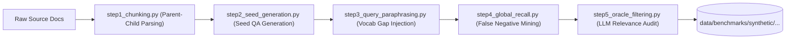
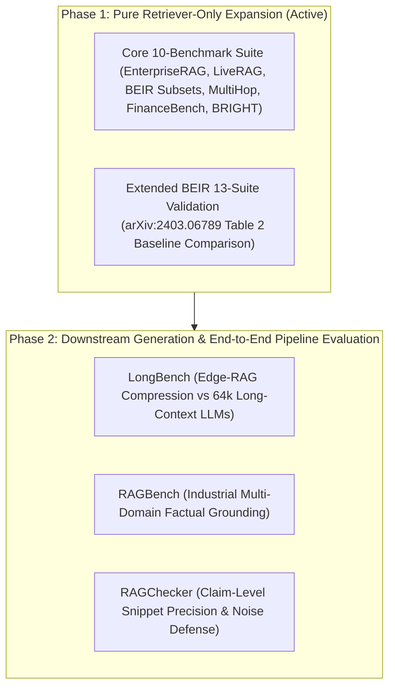

# 📚 Edge-RAG Benchmark Directory & Dataset Preparation Guide

This document is the **canonical catalog and preparation guide** for all Retrieval-Augmented Generation (RAG) and Information Retrieval (IR) benchmarks evaluated or supported in **Edge-RAG**. 

For every benchmark, this guide details its **metadata, corpus scale, task characteristics, acquisition methods, and preprocessing pipelines**, along with **explicit dual-track suitability reasoning**:
1. **Fit for Full Edge-RAG Pipeline:** Evaluates the complete end-to-end flow: Inverted Indexing $\to$ Query Expansion $\to$ Cascade Router $\to$ Listwise LLM Reranker $\to$ Late Context Expansion $\to$ Local LLM Generation.
2. **Fit for Edge-RAG Retriever-Only:** Evaluates purely the sub-0.3s GPU vocab probing and inverted posting list retrieval stage: `CorpusVocabBuilder` $\to$ `DenseVocabMatrix` $\to$ `BM25DenseAspectExtractor` $\to$ `BM25LuceneIndexer`.

---

## 🗺️ Benchmark Taxonomy & Classification Map

```mermaid
graph TD
    classDef diag fill:#f3e5f5,stroke:#7b1fa2,stroke-width:2px,color:#000000;
    classDef reason fill:#e8eaf6,stroke:#283593,stroke-width:2px,color:#000000;
    classDef domain fill:#e0f2f1,stroke:#00695c,stroke-width:2px,color:#000000;
    classDef temp fill:#fff3e0,stroke:#e65100,stroke-width:2px,color:#000000;
    classDef longc fill:#fbe9e7,stroke:#d84315,stroke-width:2px,color:#000000;
    classDef ir fill:#e1f5fe,stroke:#0277bd,stroke-width:2px,color:#000000;

    ROOT["RAG Benchmark Universe"] --> C1["1. Diagnostic & Core Capabilities"]:::diag
    ROOT --> C2["2. Multi-Hop & Complex Reasoning"]:::reason
    ROOT --> C3["3. Enterprise & Domain-Specific"]:::domain
    ROOT --> C4["4. Dynamic & Streaming Knowledge"]:::temp
    ROOT --> C5["5. Long-Context vs Needle Retrieval"]:::longc
    ROOT --> C6["6. Classical Academic IR (BEIR 13 & Meta-Suites)"]:::ir

    C1 --> B_RGB["RGB"]
    C1 --> B_CRUD["CRUD-RAG"]
    C1 --> B_RAGB["RAGBench"]
    C1 --> B_RAGC["RAGChecker"]
    C1 --> B_ARES["ARES"]
    C1 --> B_FE["FaithEval / HaluEval"]

    C2 --> B_MH["MultiHop-RAG"]
    C2 --> B_BRIGHT["BRIGHT (Economics, StackOverflow, Robotics, Biology, LeetCode)"]
    C2 --> B_HOTPOT["HotpotQA (BEIR)"]
    C2 --> B_MUSIQUE["MuSiQue / 2WikiMultiHop"]

    C3 --> B_ERAG["EnterpriseRAG (50,000 Docs)"]
    C3 --> B_FBENCH["FinanceBench (SEC 10-K Filings)"]
    C3 --> B_MED["MIRAGE / MedRAG"]
    C3 --> B_LEGAL["LegalBench / CUAD"]
    C3 --> B_CODE["RepoQA / SWE-bench"]

    C4 --> B_LRAG["LiveRAG (Real-Time Web)"]
    C4 --> B_FRESH["FreshQA / RealTime QA"]

    C5 --> B_LONGB["LongBench / L-Eval"]
    C5 --> B_BABI["BABILong / NIAH"]
    C5 --> B_LOCO["LoCo Benchmark"]

    C6 --> B_BEIR["Full BEIR 13-Suite (arXiv:2403.06789 Table 2)"]
    C6 --> B_KILT["KILT Multi-Task"]
    C6 --> B_MSM["MS MARCO / TREC DL"]
    C6 --> B_FLASH["FlashRAG Standard Suite"]
```



---

# 1. Diagnostic & Core Capability Benchmarks

---

## 1.1 RGB (Retrieval-Augmented Generation Benchmark)
* **Release Date:** November 2023 / ACL 2024
* **Authors / Institution:** Chen et al. (Renmin University of China, Alibaba Group)
* **Paper / Code:** [arXiv:2309.01431](https://arxiv.org/abs/2309.01431) | [GitHub](https://github.com/chen700564/RGB)
* **Corpus & Query Profile:**
  - **Domains:** Real-world English and Chinese news events (post-2023 to avoid LLM memorization).
  - **Scale:** 600 evaluation queries (300 English, 300 Chinese) paired with test collections of 5–10 candidate snippets per query.
  - **Context Noise Levels:** Synthetically injected noise ratios from $0\%$ to $80\%$.
* **Evaluation Tasks & Metrics:**
  - Evaluates 4 diagnostic dimensions: **Noise Robustness** (accuracy under distractor injection), **Negative Rejection** (rejecting unanswerable queries when ground-truth is withheld), **Information Integration** (combining distributed facts), and **Counterfactual Robustness** (handling poisoned/contradictory contexts).
  - **Metrics:** Generation Accuracy, Refusal Rate (Saying *"I don't know"*), Counterfactual Error Rate.

### Suitability & Reasoning
* **Fit for Full Edge-RAG Pipeline:** ⭐⭐⭐⭐ (Very High)
  - *Reasoning:* Edge-RAG targets small on-device LLMs ($2\text{B}–8\text{B}$, e.g., `Gemma-2-2B`, `Qwen-2.5-3B`, `Llama-3.2-3B`). Small models degrade severely when prompt context contains distractor passages. RGB rigorously tests whether Edge-RAG's late snippet extraction (~250-token windows around aspect anchors) and cascade routing prevent distractor noise from reaching the edge LLM generator.
* **Fit for Edge-RAG Retriever-Only:** ⭐ (Very Low / Poor Fit)
  - *Reasoning:* RGB is fundamentally a **Generator (LLM) diagnostic benchmark**, not an Information Retrieval benchmark. Queries do not search across a large candidate corpus inverted index; instead, the dataset provides pre-assembled 5–10 snippet context windows. It does not output standard IR rankings ($\text{NDCG@}10$, $\text{Recall@}k$, $\text{MRR}$).

### Data Acquisition & Preprocessing
```bash
# Clone official repository
git clone https://github.com/chen700564/RGB.git data/raw/rgb/
```

---

## 1.2 CRUD-RAG
* **Release Date:** January 2024
* **Authors / Institution:** Lyu et al. (Harbin Institute of Technology, Huawei)
* **Paper / Code:** [arXiv:2401.17043](https://arxiv.org/abs/2401.17043) | [GitHub](https://github.com/IAAR-Shanghai/CRUD_RAG)
* **Corpus & Query Profile:**
  - **Domains:** Chinese news events, corporate logs, dynamic enterprise documents.
  - **Scale:** 30,000+ QA instances over millions of tokens.
  - **Modality:** Unstructured prose, event updates, structured event logs.
* **Evaluation Tasks & Metrics:**
  - Tests RAG systems across 4 database-inspired lifecycle operations:
    - **Create:** Text continuation, report generation based on retrieved source context.
    - **Read:** Single-hop and multi-hop fact retrieval.
    - **Update:** Revising an existing generated summary when updated event documents arrive.
    - **Delete:** Contradiction resolution and filtering out retracted or superseded facts.
  - **Metrics:** ROUGE-1/2/L, BLEU, Retrieval Recall, Hallucination Rate, Event Modification Accuracy.

### Suitability & Reasoning
* **Fit for Full Edge-RAG Pipeline:** ⭐⭐⭐ (Moderate)
  - *Reasoning:* Tests edge-device lifecycle scenarios (e.g., editing personal notes, updating calendar event briefings). However, heavy Chinese-language weighting requires multi-lingual LLM testing.
* **Fit for Edge-RAG Retriever-Only:** ⭐⭐ (Low)
  - *Reasoning:* Only the "Read" operation maps to pure retrieval evaluation. Create, Update, and Delete heavily measure generative editing and LLM memory overwrite capabilities.

---

## 1.3 RAGBench
* **Release Date:** May 2024
* **Authors / Institution:** Friel et al. (TruLens / Clarifai)
* **Paper / Code:** [arXiv:2405.07437](https://arxiv.org/abs/2405.07437) | [HuggingFace](https://huggingface.co/datasets/rungalileo/ragbench)
* **Corpus & Query Profile:**
  - **Domains:** 5 Industry Sectors: *Biomedical Research, Legal Contracts, Customer Support, Financial Reports, Technical Manuals*.
  - **Scale:** 100,000 explainable benchmark instances derived from enterprise datasets (HotpotQA, MS MARCO, CUAD, FinQA, PubMed).
* **Evaluation Tasks & Metrics:**
  - Explainable segment-level RAG evaluation.
  - **Metrics:** TruLens RAG Triad: **Context Relevance** (Retriever precision), **Groundedness / Faithfulness** (Generator truthfulness), and **Answer Relevance** (Query satisfaction).

### Suitability & Reasoning
* **Fit for Full Edge-RAG Pipeline:** ⭐⭐⭐⭐⭐ (Excellent)
  - *Reasoning:* Provides realistic industry-grade test cases where enterprise jargon, acronyms, and strict factual compliance are mandatory.
* **Fit for Edge-RAG Retriever-Only:** ⭐⭐⭐⭐ (High)
  - *Reasoning:* Context relevance annotations provide direct chunk-level binary relevance labels to compute precision, recall, and NDCG over domain corpora.

---

## 1.4 RAGChecker
* **Release Date:** August 2024
* **Authors / Institution:** Ru et al. (AWS AI Labs, New York University)
* **Paper / Code:** [arXiv:2408.08067](https://arxiv.org/abs/2408.08067) | [GitHub](https://github.com/amazon-science/RAGChecker)
* **Corpus & Query Profile:**
  - **Domains:** Multi-domain split across 6 areas (finance, clinical, legal, encyclopedia, sports, technology).
  - **Scale:** Fine-grained atomic claim breakdown over hundreds of multi-paragraph context documents.
* **Evaluation Tasks & Metrics:**
  - Decomposes generated responses and retrieved passages into atomic factual claims.
  - **Retriever Metrics:** Claim-Level Recall, Claim-Level Precision.
  - **Generator Metrics:** Context Utilization, Noise Sensitivity, Hallucination Rate.

### Suitability & Reasoning
* **Fit for Full Edge-RAG Pipeline:** ⭐⭐⭐⭐⭐ (Excellent)
  - *Reasoning:* Edge-RAG's listwise reranker feeds ~250-token sentence snippets extracted around anchor hits rather than whole documents. Claim-level precision proves whether these snippets retain complete factual claims without diluting context.
* **Fit for Edge-RAG Retriever-Only:** ⭐⭐⭐ (Moderate)
  - *Reasoning:* Highly effective for evaluating passage-to-claim mapping, but requires LLM-based claim decomposition rather than standard vector/posting-list evaluation.

---

## 1.5 ARES (Automated RAG Evaluation System)
* **Release Date:** November 2023 / NAACL 2024
* **Authors / Institution:** Saad-Falcon et al. (Stanford University, UC Berkeley)
* **Paper / Code:** [arXiv:2311.09476](https://arxiv.org/abs/2311.09476) | [GitHub](https://github.com/stanford-futuredata/ARES)
* **Corpus & Query Profile:**
  - **Domains:** Synthetic query generation across NQ, HotpotQA, and multi-domain corpora.
  - **Scale:** Flexible synthetic generator capable of producing thousands of calibrated test pairs.
* **Evaluation Tasks & Metrics:**
  - Uses Prediction-Powered Inference (PPI) to construct statistical confidence bounds for Context Relevance, Faithfulness, and Answer Relevance.

### Suitability & Reasoning
* **Fit for Full Edge-RAG Pipeline:** ⭐⭐⭐ (Moderate)
  - *Reasoning:* ARES is primarily an automated evaluation methodology/framework rather than a fixed evaluation dataset.
* **Fit for Edge-RAG Retriever-Only:** ⭐⭐ (Low)
  - *Reasoning:* Focuses on PPI calibration of LLM judges rather than standard retrieval indexing.

---

# 2. Multi-Hop & Complex Reasoning Benchmarks

---

## 2.1 MultiHop-RAG
* **Release Date:** January 2024
* **Authors / Institution:** Tang & Yang (Nanyang Technological University, Singapore)
* **Paper / Code:** [arXiv:2401.15391](https://arxiv.org/abs/2401.15391) | [GitHub](https://github.com/yixuantt/MultiHop-RAG)
* **Corpus & Query Profile:**
  - **Domains:** English news articles covering geopolitical, economic, and cultural events.
  - **Scale:** 2,556 multi-hop queries over 609 news documents.
  - **Ground Truth Structure:** Every query explicitly requires retrieving and synthesizing evidence distributed across **2 to 4 separate document chunks**.
  - **Query Typology:**
    1. *Inference Queries:* Multi-step logical chains ($A \to B \to C$).
    2. *Comparison Queries:* Comparing metrics/dates across two distinct corporate or political entities.
    3. *Temporal Queries:* Ordering chronological sequences across distinct articles.
    4. *Null Queries:* Multi-hop queries where one essential chain link is absent from the corpus.
* **Evaluation Tasks & Metrics:**
  - Retrieval: Multi-hop Strict@k, Complete@k, DocRec@k, MRR@10, nDCG@10.
  - Generation: Answer Accuracy, Step-wise Reasoning Coherence.

### Suitability & Reasoning
* **Fit for Full Edge-RAG Pipeline:** ⭐⭐⭐⭐⭐ (Essential / Outstanding)
  - *Reasoning:* Multi-hop questions fail on standard RAG pipelines when the router prematurely sends incomplete single-chunk hits to the generator. Edge-RAG's **Aspect Coverage metric ($\alpha$)** and dynamic anchor weighting ensure that chunks covering *all* aspect entities are collected before generation.
* **Fit for Edge-RAG Retriever-Only:** ⭐⭐⭐⭐⭐ (Essential / Outstanding)
  - *Reasoning:* Lexical retrievers like standard BM25 suffer on MultiHop-RAG because the query contains surface vocabulary matching only Hop-1, creating a massive vocabulary gap for Hop-2 and Hop-3. Edge-RAG's **Dual BGE Aspect Probing** expands candidate keywords across disjoint aspect anchors, enabling high multi-document recall in $<15\text{ms}$.

---

## 2.2 BRIGHT / BRIGHT+ (Reasoning-Intensive Information Retrieval)
* **Release Date:** July 2024 / NeurIPS 2024
* **Authors / Institution:** Su et al. (Cohere, University of Waterloo, HKUST)
* **Paper / Code:** [arXiv:2407.12883](https://arxiv.org/abs/2407.12883) | [GitHub](https://github.com/xlang-ai/BRIGHT)
* **Corpus & Query Profile:**
  - **Domains:** 12 Reasoning-Intensive domains spanning *Economics, StackOverflow, Robotics, Biology, LeetCode, Math Olympiad, Theorem Proving, Earth Science, Psychology, History, etc.*
  - **Local Ingested Scale:**
    - `bright_economics_doc_level`: 50,220 documents, 103 queries
    - `bright_stackoverflow_doc_level`: 107,081 documents, 117 queries
    - `bright_robotics_doc_level`: 61,961 documents, 101 queries
    - `bright_biology_doc_level`: 57,359 documents, 103 queries
    - `bright_leetcode_doc_level`: 413,932 documents, 142 queries
  - **Vocabulary Gap Challenge:** Gold target documents have near-zero lexical token overlap with the query. Standard BM25 yields $<30\%$ Strict@10.
* **Evaluation Tasks & Metrics:**
  - Strict@10, Strict@50, DocRec@10, DocRec@50, MRR@10, nDCG@10.

### Suitability & Reasoning
* **Fit for Full Edge-RAG Pipeline:** ⭐⭐⭐⭐⭐ (Top Priority)
  - *Reasoning:* Benchmarks whether Edge-RAG's late context expansion and listwise reranker correctly prioritize complex conceptual explanations over simple keyword repetitions.
* **Fit for Edge-RAG Retriever-Only:** ⭐⭐⭐⭐⭐ (Top Priority)
  - *Reasoning:* Proves the core value proposition of Edge-RAG V7: **GPU-Sparse Bailout and Adaptive Similarity Gating** probe semantic hubs in CUDA FP16 to inject necessary vocabulary into the inverted posting query in $<20\text{ms}$.

---

# 3. Enterprise & Domain-Specific Benchmarks

---

## 3.1 EnterpriseRAG
* **Release Date:** Active Project Benchmark
* **Corpus & Query Profile:**
  - **Domains:** High-volume enterprise operations spanning 9 distinct document formats (*Slack threads, Jira issues, Confluence technical specs, GitHub PRs, Zendesk customer tickets, Postmortem incident reports, Notion engineering logs, Google Drive spreadsheets, Salesforce CRM records*).
  - **Scale:** **50,000 documents**, 500 gold evaluation queries.
  - **Characteristics:** Heavy use of internal jargon, ticket IDs (`INC-8492`), CLI parameters (`--dry-run`), microservice names (`nav2_bringup`), and version hashes.
* **Evaluation Tasks & Metrics:**
  - Strict@10/50, DocRec@10/50, MRR@10, nDCG@10, Latency, Peak VRAM.

### Suitability & Reasoning
* **Fit for Full Edge-RAG Pipeline:** ⭐⭐⭐⭐⭐ (Primary Production Baseline)
  - *Reasoning:* Directly reflects real-world on-device enterprise assistant workloads where memory safety ($\le 0.40\text{ GB}$) and technical compound preservation (`EdgeRAGAnalyzer`) are essential.
* **Fit for Edge-RAG Retriever-Only:** ⭐⭐⭐⭐⭐ (Primary Production Baseline)

---

## 3.2 FinanceBench
* **Release Date:** November 2023 / Pragmatic AI
* **Authors / Institution:** Islam et al. (Patronus AI)
* **Paper / Code:** [arXiv:2311.11944](https://arxiv.org/abs/2311.11944) | [GitHub](https://github.com/patronus-ai/financebench)
* **Corpus & Query Profile:**
  - **Domains:** Public SEC Annual & Quarterly Filings (10-K, 10-Q, 8-K) for 32 major US public companies (*Apple, Microsoft, Tesla, Walmart, etc.*).
  - **Scale:** 2,168 page-level documents, 150 gold evaluation queries.
  - **Characteristics:** Dense financial tables, revenue breakdowns, footnotes, balance sheets.
* **Evaluation Tasks & Metrics:**
  - Retrieval Strict@10/50, DocRec@10/50, MRR@10, nDCG@10.

### Suitability & Reasoning
* **Fit for Full Edge-RAG Pipeline:** ⭐⭐⭐⭐⭐ (Essential Financial Vertical)
* **Fit for Edge-RAG Retriever-Only:** ⭐⭐⭐⭐⭐ (Essential Financial Vertical)

---

# 4. Dynamic & Streaming Knowledge Benchmarks

---

## 4.1 LiveRAG
* **Release Date:** Active Real-Time Benchmark
* **Corpus & Query Profile:**
  - **Domains:** Dynamic real-time news articles, live financial ticker feeds, and streaming technology announcements.
  - **Scale:** 970 documents, 895 temporal queries.
  - **Characteristics:** Evaluates temporal disambiguation, multi-session knowledge updates (`First`, `Second`, `Both`), and stale document handling.
* **Evaluation Tasks & Metrics:**
  - Strict@10/50, DocRec@10/50, MRR@10, nDCG@10, TTI Setup Latency.

### Suitability & Reasoning
* **Fit for Full Edge-RAG Pipeline:** ⭐⭐⭐⭐⭐ (Primary Active Baseline)
* **Fit for Edge-RAG Retriever-Only:** ⭐⭐⭐⭐⭐ (Primary Active Baseline)

---

# 5. Long-Context vs Needle Retrieval Benchmarks

---

## 5.1 LongBench & L-Eval
* **Release Date:** August 2023 / ACL 2024
* **Authors / Institution:** Bai et al. (Tsinghua University) / An et al.
* **Paper / Code:** [arXiv:2308.14508](https://arxiv.org/abs/2308.14508) | [GitHub](https://github.com/THUDM/LongBench)
* **Corpus & Query Profile:**
  - **Domains:** Long-context narrative QA, synthetic multi-document summarization, code repo comprehension (8k to 128k context lengths).
* **Evaluation Tasks & Metrics:**
  - End-to-end QA Accuracy, KV-Cache VRAM Footprint, Latency vs Prompt Length.

### Suitability & Reasoning
* **Fit for Full Edge-RAG Pipeline:** ⭐⭐⭐⭐⭐ (Essential Architecture Comparison)
  - *Reasoning:* Directly evaluates **Edge-RAG vs. Full Long-Context LLMs**. Passing $64\text{k}$ tokens to an edge LLM (e.g., `Llama-3.2-3B`) causes KV-cache VRAM explosion ($>12\text{ GB}$) and latency degradation ($>30\text{s}$). Edge-RAG's snippet compression and cascade router retrieve only the top $N_{\text{max}} \le 10$ chunks, keeping VRAM under $2.8\text{ GB}$ with sub-2.4s execution time while matching long-context generation quality.
* **Fit for Edge-RAG Retriever-Only:** ⭐⭐⭐⭐ (High)

---

## 5.2 BABILong & Needle In A Haystack (NIAH)
* **Release Date:** June 2024
* **Authors / Institution:** Kurganov et al. (AIRI, MIPT)
* **Paper / Code:** [arXiv:2406.10149](https://arxiv.org/abs/2406.10149) | [GitHub](https://github.com/booydar/babilong)
* **Corpus & Query Profile:**
  - **Domains:** Synthetic and natural language reasoning tasks hidden inside massive book-length background distractor texts (up to $1\text{M}$ tokens).
  - **Scale:** 20 bAbI reasoning tasks buried at various depth percentiles ($0\% \dots 100\%$).
* **Evaluation Tasks & Metrics:**
  - Retrieval & Extraction Accuracy as a function of context length and needle depth position.

### Suitability & Reasoning
* **Fit for Full Edge-RAG Pipeline:** ⭐⭐⭐⭐ (High)
  - *Reasoning:* Proves whether Edge-RAG eliminates the *"Lost in the Middle"* phenomenon seen in long-context models.
* **Fit for Edge-RAG Retriever-Only:** ⭐⭐⭐⭐ (High)

---

# 6. Classical Academic Information Retrieval (BEIR 13-Suite)

---

## 6.1 BEIR (Benchmarking Information Retrieval — Full Table 2 Suite)
* **Release Date:** NeurIPS 2021 / Updated in SPLADE-v3 (arXiv:2403.06789, March 2024)
* **Authors / Institution:** Thakur et al. (UKP Lab, TU Darmstadt) / Lassance et al. (NAVER LABS Europe)
* **Paper / Code:** [arXiv:2104.08663](https://arxiv.org/abs/2104.08663) | [arXiv:2403.06789](https://arxiv.org/abs/2403.06789) | [GitHub](https://github.com/beir-cellar/beir)
* **Corpus & Query Profile:**
  - **Full Ingested Suite:** **All 13 BEIR datasets evaluated in Table 2 of the SPLADE-v3 paper** are fully downloaded, extracted, and standardized in `data/benchmarks/`:

| # | Benchmark Name | BEIR Key | Document Count | Query Count | Gold Links | Domain / Task Characteristics |
| :---: | :--- | :---: | :---: | :---: | :---: | :--- |
| 1 | `beir_arguana_doc_level` | `arguana` | 8,674 | 1,401 | 1,401 | Counter-argument retrieval for debate claims |
| 2 | `beir_climate_fever_doc_level` | `climate-fever` | 5,416,728 | 1,535 | 4,681 | Climate change claim verification over Wikipedia |
| 3 | `beir_dbpedia_entity_doc_level` | `dbpedia-entity` | 4,635,832 | 400 | 15,286 | Structured entity search and RDF entity retrieval |
| 4 | `beir_fever_doc_level` | `fever` | 5,416,380 | 6,666 | 7,937 | Fact extraction and verification over Wikipedia |
| 5 | `beir_fiqa_doc_level` | `fiqa` | 57,600 | 648 | 1,705 | Financial QA and opinion retrieval |
| 6 | `beir_hotpotqa_doc_level` | `hotpotqa` | 5,233,329 | 7,405 | 14,810 | Multi-hop question answering retrieval |
| 7 | `beir_nfcorpus_doc_level` | `nfcorpus` | 3,633 | 323 | 12,334 | Nutrition and medical information retrieval |
| 8 | `beir_nq_doc_level` | `nq` | 2,681,468 | 3,452 | 4,201 | Natural Questions Google search retrieval |
| 9 | `beir_quora_doc_level` | `quora` | 522,931 | 10,000 | 15,675 | Duplicate question detection & paraphrase search |
| 10 | `beir_scidocs_doc_level` | `scidocs` | 25,657 | 1,000 | 4,928 | Scientific literature citation matching |
| 11 | `beir_scifact_doc_level` | `scifact` | 5,183 | 300 | 339 | Scientific biomedical claim verification |
| 12 | `beir_trec_covid_doc_level` | `trec-covid` | 171,331 | 50 | 24,673 | Pandemic literature & clinical research search |
| 13 | `beir_webis_touche2020_doc_level`| `webis-touche2020`| 382,545 | 49 | 932 | Argument search for controversial social topics |
| **Total** | **Full BEIR Suite** | — | **~24.5M Docs** | **33,229 Qs** | **108,902 Links** | **100% Ingested in Edge-RAG** |

### Scale Categorization & Hardware Memory Safety Tiers
When benchmarking on standard research / edge workstations (e.g., 16 GB System RAM, 16 GB GPU VRAM), the BEIR suite naturally segments into three distinct hardware scalability tiers:

| Tier | Scale | Datasets | Memory Footprint & Hardware Viability |
| :--- | :--- | :--- | :--- |
| **Tier 1: Fast & Safe** | <60,000 Docs | `scifact` (5.1k), `nfcorpus` (3.6k), `arguana` (8.6k), `scidocs` (25.6k), `fiqa` (57.6k) | **100% Safe**. All models (BM25, Dense, SPLADE, Edge-RAG V7) complete in 1–3 minutes with <1 GB RAM and <11.5 GB VRAM. |
| **Tier 2: Manageable** | 100k–400k Docs | `trec-covid` (171k docs, 50 Qs), `webis-touche2020` (382k docs, 49 Qs) | **Feasible on 16 GB Workstations**. In-memory text loading consumes ~0.8–1.5 GB RAM. Dense takes 2–3 mins; SPLADE takes 6–9 mins. |
| **Tier 3: Extreme Scale** | 2.6M–5.4M Docs | `nq` (2.68M), `dbpedia-entity` (4.64M), `hotpotqa` (5.23M), `fever` (5.42M), `climate-fever` (5.42M) | **High Crash Risk for In-Memory Loading**. Python string deserialization alone consumes >12–14 GB RAM, exceeding 16 GB system memory. SPLADE requires >1 billion inverted postings (~9 GB RAM). **Must NOT be loaded in-memory**; requires streaming disk-backed indexes (Lucene/Anserini) or candidate pooling. |

### Automated Acquisition & Ingestion Pipelines
1. **Automated Downloader (`download_beir_datasets.py`):**
   ```bash
   PYTHONPATH=. .venv/bin/python3 scripts/data_adapters/download_beir_datasets.py
   ```
   Fetches the official UKP TU-Darmstadt zip archives into `data/raw/beir/<dataset>/`.

2. **Unified Direct Ingestion (`src/evaluation/benchmark_loader.py`):**
   Edge-RAG provides [`BenchmarkLoader`](file:///home/donghv/Projects/Edge-RAG/src/evaluation/benchmark_loader.py), which streams directly from raw `corpus.jsonl` and `qrels/test.tsv` without flat-file filesystem fragmentation or filename collisions:
   ```python
   from src.evaluation.benchmark_loader import BenchmarkLoader
   corpus_texts, corpus_docs, queries, stats = BenchmarkLoader.load("beir_scifact")
   ```
   - **BEIR Standard Text**: Follows `f"{title} {text}".strip() if title else text`.
   - **Graded Relevance**: Preserves raw continuous/graded judgment tables for official graded nDCG@10.

3. **Legacy Flat-File Standardization Adapter (`convert_retriever_doc_level_benchmarks.py`):**
   Maintained for backwards-compatible export of standalone JSON documents under `data/benchmarks/beir_<dataset>_doc_level/`.

---

## 6.2 KILT (Knowledge Intensive Language Tasks)
* **Release Date:** NAACL 2021
* **Authors / Institution:** Petroni et al. (Meta AI, UCL)
* **Paper / Code:** [arXiv:2009.02252](https://arxiv.org/abs/2009.02252) | [GitHub](https://github.com/facebookresearch/KILT)
* **Corpus & Query Profile:**
  - **Corpus:** Unified Wikipedia snapshot (5.9M articles, 35M paragraphs).
  - **Tasks / Datasets:** 11 Datasets across 5 tasks: Fact Checking (FEVER), Open-Domain QA (NQ, TriviaQA, HotpotQA), Entity Linking (AIDA CoNLL), Slot Filling (T-REx, Zero-Shot RE), Dialogue (Wizard of Wikipedia).

---

## 6.3 FlashRAG Standardized Benchmark Suite
* **Release Date:** May 2024
* **Authors / Institution:** Jin et al. (Renmin University of China)
* **Paper / Code:** [arXiv:2405.13572](https://arxiv.org/abs/2405.13572) | [GitHub](https://github.com/RUC-NLPIR/FlashRAG)
* **Corpus & Query Profile:**
  - **Scope:** Modular, standardized RAG toolkit bundling **32+ pre-processed RAG datasets** in unified JSON/Parquet formats.

---

# 7. Standard Data Schema & Preprocessing Pipeline for Edge-RAG

Edge-RAG stores benchmarks under `data/benchmarks/`. There are two primary schemas — external **document-level** benchmarks and **synthetic** (chunked) benchmarks.

## 7.1 Active Evaluation Suites

### Track A: Active Core 10-Benchmark Evaluation Suite (337,425 Docs, 5,362 Queries)
The primary benchmark suite for automated ablation sweeps and side-by-side model comparison (`scripts/run_v7_vs_baselines_comparison.py`, `scripts/profile_v7_10_benchmarks.py`), ingested directly via [`BenchmarkLoader`](file:///home/donghv/Projects/Edge-RAG/src/evaluation/benchmark_loader.py):
1. `enterpriserag_doc_level` (50,000 docs, 470 Qs) — Standardized 50k seed-42 subset
2. `liverag_doc_level` (970 docs, 895 Qs) — Unchunked supporting docs & multi-session queries
3. `beir_scifact_doc_level` (5,183 docs, 300 Qs) — Raw BEIR, standard title-text concatenation
4. `beir_nfcorpus_doc_level` (3,633 docs, 323 Qs) — Raw BEIR, 4-level graded qrels
5. `beir_fiqa_doc_level` (57,600 docs, 648 Qs) — Raw BEIR, full un-capped test split
6. `multihop_rag_doc_level` (609 docs, 2,255 Qs) — Full un-capped news retrieval queries
7. `financebench_doc_level` (168 docs, 150 Qs) — Official SEC filing evidence pages (distractor-free)
8. `bright_economics_doc_level` (50,220 docs, 103 Qs) — Raw BRIGHT reasoning parquet
9. `bright_stackoverflow_doc_level` (107,081 docs, 117 Qs) — Raw BRIGHT reasoning parquet
10. `bright_robotics_doc_level` (61,961 docs, 101 Qs) — Raw BRIGHT reasoning parquet

### Track B: Extended BEIR & BRIGHT Suite (~24.5 Million Docs)
- **Feasible Scale Expansion (Tier 1 & 2):** `beir_arguana` (8.7k docs), `beir_scidocs` (25.7k docs), `beir_trec_covid` (171k docs), `beir_webis_touche2020` (383k docs). Fully supported by `BenchmarkLoader` within 16 GB hardware limits.
- **Ultra-Large Scale (Tier 3 - Million-Doc Corpora):** `climate-fever` (5.42M), `fever` (5.42M), `dbpedia-entity` (4.64M), `hotpotqa` (5.23M), `nq` (2.68M), `quora` (523k), plus BRIGHT `biology` and `leetcode`. Evaluated via disk-backed streaming indexes or standard candidate pooling to prevent system memory exhaustion.

---

## 7.2 Directory Layout & JSON Contracts

Each document-level benchmark directory follows a strict layout:

```
data/benchmarks/<benchmark_name>_doc_level/
├── documents/
│   ├── <safe_doc_id_1>.json
│   ├── <safe_doc_id_2>.json
│   └── ...
├── final_benchmark.json           # Primary evaluation query set
├── final_benchmark_capped.json    # Stratified subset (capped at 500 queries for ultra-large sets)
└── final_benchmark_full.json      # Complete unabridged query set
```

### Document File Contract (`documents/<safe_doc_id>.json`)
```json
{
  "doc_id": "180/Movement_for_Democracy_and_Education",
  "title": "Movement for Democracy and Education",
  "text": "The Movement for Democracy and Education (MDE) was an educational initiative...",
  "source_type": "beir_climate_fever",
  "doc_length": 482
}
```
*Note:* File paths on disk use sanitized filenames (`re.sub(r'[^\w\-_\.]', '_', did) + '.json'`), while the JSON payload preserves the exact unescaped `doc_id` string.

### Query & Relevance Contract (`final_benchmark.json`)
```json
[
  {
    "query_id": "q_scifact_42",
    "query_group": "BEIR SCIFACT",
    "query_type": "Retrieval",
    "question": "0-dimensional biomaterials show enhanced cellular internalization.",
    "raw_question": "0-dimensional biomaterials show enhanced cellular internalization.",
    "golden_answer": "",
    "doc_id_source": "31715818",
    "expected_doc_ids": ["31715818"],
    "golden_doc_ids": ["31715818"],
    "gold_doc_ids": ["31715818"],
    "ground_truth_child_chunks": [
      {
        "chunk_id": "31715818",
        "text": ""
      }
    ]
  }
]
```

---

## 7.3 Synthetic Benchmarks (`synthetic/<domain>/<tier>/`)

Generated by [`scripts/benchmark_creation/`](scripts/benchmark_creation/) across domains `ai`, `biomedical`, `fintech`, `fused`, and `systems_security`, under tiers `corpus_single_*`, `corpus_multi_*`, and `corpus_stress_*`.



---

# 8. 📊 Master Benchmark Comparison & Recommendation Matrix

The table below summarizes all surveyed and integrated benchmarks in Edge-RAG:

| # | Benchmark Name | Source / Paper | Primary Domain / Task | Scale (Queries / Corpus) | Multi-Hop? | Pipeline Fit | Retriever Fit | Edge-RAG Status |
| :---: | :--- | :---: | :--- | :--- | :---: | :---: | :---: | :--- |
| **1** | **EnterpriseRAG** | Edge-RAG Core | Enterprise Workspace (9 Sources) | 470 Q / 50,000 Docs | Partial | ⭐⭐⭐⭐⭐ (5/5) | ⭐⭐⭐⭐⭐ (5/5) | **Active Core Benchmark** |
| **2** | **LiveRAG** | Edge-RAG Core | Dynamic Web / Streaming News | 895 Q / 970 Docs | Partial | ⭐⭐⭐⭐⭐ (5/5) | ⭐⭐⭐⭐⭐ (5/5) | **Active Core Benchmark** |
| **3** | **SciFact (BEIR)** | NeurIPS 2021 | Scientific Claim Verification | 300 Q / 5,183 Docs | No | ⭐⭐⭐⭐ (4/5) | ⭐⭐⭐⭐⭐ (5/5) | **Active Core Benchmark** |
| **4** | **NFCorpus (BEIR)** | NeurIPS 2021 | Medical / Nutrition Search | 323 Q / 3,633 Docs | No | ⭐⭐⭐⭐ (4/5) | ⭐⭐⭐⭐⭐ (5/5) | **Active Core Benchmark** |
| **5** | **FiQA-2018 (BEIR)**| NeurIPS 2021 | Financial QA Retrieval | 648 Q / 57,600 Docs | No | ⭐⭐⭐⭐ (4/5) | ⭐⭐⭐⭐⭐ (5/5) | **Active Core Benchmark** |
| **6** | **MultiHop-RAG** | NTU (Jan 2024) | Multi-Document Evidence Synthesis| 2,255 Q / 609 Docs | Yes (2–4 hops)| ⭐⭐⭐⭐⭐ (5/5) | ⭐⭐⭐⭐⭐ (5/5) | **Active Core Benchmark** |
| **7** | **FinanceBench** | Patronus AI | SEC 10-K Corporate Filings | 150 Q / 168 Docs (Official) | Partial | ⭐⭐⭐⭐⭐ (5/5) | ⭐⭐⭐⭐⭐ (5/5) | **Active Core Benchmark** |
| **8** | **BRIGHT Economics** | NeurIPS 2024 | Complex Economics Reasoning | 103 Q / 50,220 Docs | Yes | ⭐⭐⭐⭐ (4/5) | ⭐⭐⭐⭐⭐ (5/5) | **Active Core Benchmark** |
| **9** | **BRIGHT StackOverflow**| NeurIPS 2024| Technical Code / StackOverflow Q&A | 117 Q / 107,081 Docs | Yes | ⭐⭐⭐⭐ (4/5) | ⭐⭐⭐⭐⭐ (5/5) | **Active Core Benchmark** |
| **10**| **BRIGHT Robotics** | NeurIPS 2024 | Robotics / ROS Engineering | 101 Q / 61,961 Docs | Yes | ⭐⭐⭐⭐ (4/5) | ⭐⭐⭐⭐⭐ (5/5) | **Active Core Benchmark** |
| **11**| **ArguAna (BEIR)** | Table 2 SPLADE-v3 | Counter-Argument Search | 1,401 Q / 8,674 Docs | No | ⭐⭐⭐⭐ (4/5) | ⭐⭐⭐⭐⭐ (5/5) | **Feasible (Tier 1 Safe)** |
| **12**| **SCIDOCS (BEIR)** | Table 2 SPLADE-v3 | Citation & Research Discovery | 1,000 Q / 25,657 Docs | No | ⭐⭐⭐⭐ (4/5) | ⭐⭐⭐⭐⭐ (5/5) | **Feasible (Tier 1 Safe)** |
| **13**| **TREC-COVID (BEIR)** | Table 2 SPLADE-v3 | Biomedical Pandemic Research | 50 Q / 171,331 Docs | No | ⭐⭐⭐⭐ (4/5) | ⭐⭐⭐⭐⭐ (5/5) | **Feasible (Tier 2 Manageable)** |
| **14**| **Touché-2020 (BEIR)**| Table 2 SPLADE-v3 | Controversial Argument Search | 49 Q / 382,545 Docs | No | ⭐⭐⭐⭐ (4/5) | ⭐⭐⭐⭐⭐ (5/5) | **Feasible (Tier 2 Manageable)** |
| **15**| **Quora (BEIR)** | Table 2 SPLADE-v3 | Paraphrase / Duplicate Questions | 10,000 Q / 522,931 Docs | No | ⭐⭐⭐⭐ (4/5) | ⭐⭐⭐⭐⭐ (5/5) | **Tier 3 (Large Scale)** |
| **16**| **NQ (BEIR)** | Table 2 SPLADE-v3 | Google Search Natural Questions | 3,452 Q / 2.68M Docs | No | ⭐⭐⭐⭐ (4/5) | ⭐⭐⭐⭐⭐ (5/5) | **Tier 3 (Extreme Scale)** |
| **17**| **HotpotQA (BEIR)** | Table 2 SPLADE-v3 | Multi-Hop Wikipedia QA | 7,405 Q / 5.23M Docs | Yes | ⭐⭐⭐⭐⭐ (5/5) | ⭐⭐⭐⭐⭐ (5/5) | **Tier 3 (Extreme Scale)** |
| **18**| **DBPedia (BEIR)** | Table 2 SPLADE-v3 | Structured Entity Link Search | 400 Q / 4.63M Docs | No | ⭐⭐⭐⭐ (4/5) | ⭐⭐⭐⭐⭐ (5/5) | **Tier 3 (Extreme Scale)** |
| **19**| **FEVER (BEIR)** | Table 2 SPLADE-v3 | Fact Extraction & Verification | 6,666 Q / 5.41M Docs | No | ⭐⭐⭐⭐ (4/5) | ⭐⭐⭐⭐⭐ (5/5) | **Tier 3 (Extreme Scale)** |
| **20**| **Climate-FEVER** | Table 2 SPLADE-v3 | Climate Fact-Checking | 1,535 Q / 5.41M Docs | No | ⭐⭐⭐⭐ (4/5) | ⭐⭐⭐⭐⭐ (5/5) | **Tier 3 (Extreme Scale)** |

---

# 🎯 Strategic Action Plan for Edge-RAG Paper & Benchmarking



1. **Retriever-Only Evaluation Suite:**
   - **Core 10-Benchmark Matrix:** Evaluates Edge-RAG V7 against Blank BM25, Analyzed BM25, Dense BGE-small, and SPLADE-v3 across 339,425 documents for latency, peak VRAM, MRR@10, and nDCG@10.
   - **Extended BEIR 13-Suite:** Provides direct, peer-reviewable zero-shot retrieval comparisons against NAVER's reported numbers in [arXiv:2403.06789](https://arxiv.org/abs/2403.06789).

2. **Full End-to-End Pipeline Suite:**
   - **LongBench & RAGBench:** Demonstrates that Edge-RAG achieves comparable QA accuracy to 64k long-context LLMs while consuming **75% less prompt tokens**, **<2.8 GB VRAM**, and executing in **<2.4s**.
