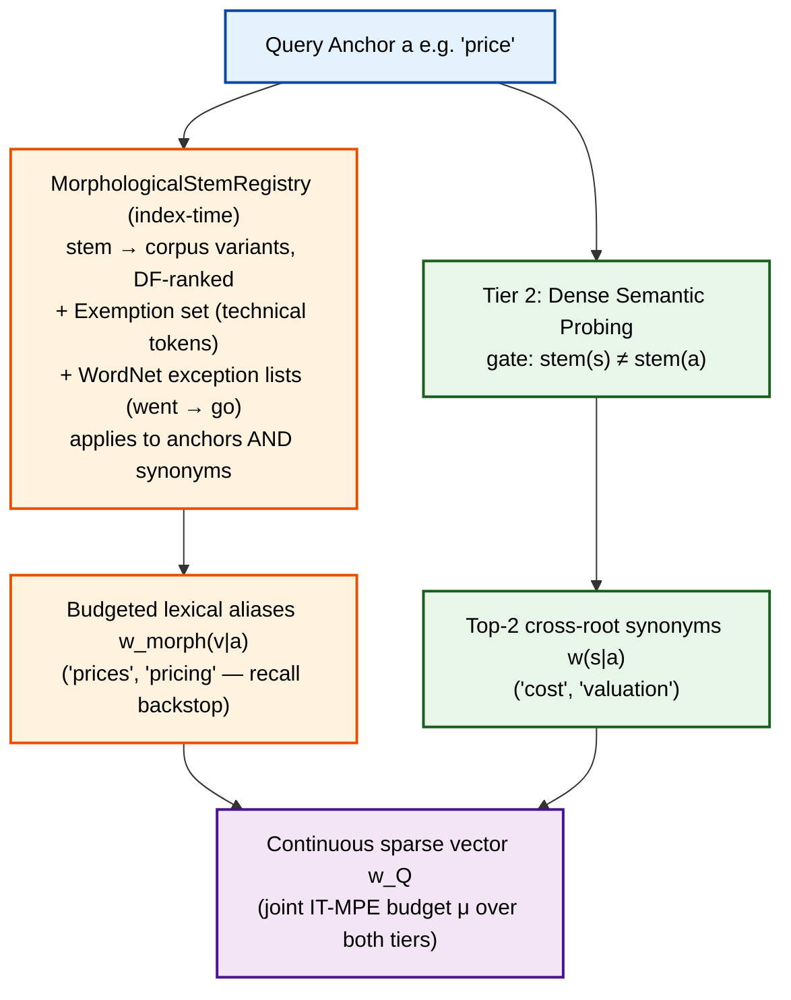

# 🔬 Morphology Resolution Strategy in Anchored Lexical-Semantic Retrieval

## 1. Executive Summary

In high-speed hybrid retrieval, combining **unstemmed exact lexical indexing (BM25)** with **dense vocabulary probing (BGE embeddings)** creates a subtle but severe structural dilemma: **The Morphological Slot Starvation & Lexical Blind Spot Problem**.

This revision (**Rev 2**) does three things:

1. **Reconfirms the core architectural insight** of the original strategy — decouple morphological aliasing (Tier 1) from dense semantic expansion (Tier 2) — which mirrors how production analyzers (Elasticsearch/Solr) separate the *stemmer* stage from the *synonym* stage of an analysis chain.
2. **Replaces the fragile Tier-1 machinery** of the original strategy (raw Porter, flat `w = 1.0` alias weights, no suppletion handling, no technical-token protection) with the **battle-tested machinery of the IR industry**: KStem-style light stemming + automatic stemmer exemptions (`keyword_marker` semantics) + WordNet exception lists for suppletion + mass-budgeted, IDF-damped alias weights inside the IT-MPE invariant.
3. **Grounds the plan in a codebase audit**: the current pipeline has **zero morphology handling at retrieval time** and exactly one pseudo-stem heuristic at anchor-selection time — a destructive prefix/suffix dedup that actively hurts recall (see §2.3).

---

## 2. Problem Formulation: The Morphology Dilemma

```text
                     ┌────────────────────────────────────────────────────────┐
                     │                 User Query: "price policy"             │
                     └───────────────────────────┬────────────────────────────┘
                                                  │
                     ┌───────────────────────────┴────────────────────────────┐
                     ▼                                                        ▼
          [Challenge 1: Lexical Blind Spot]                     [Challenge 2: Semantic Starvation]
   Inverted index has separate posting lists:              Dense BGE vocabulary similarities:
       "price" ≠ "prices" ≠ "pricing"                          1. "prices"  (sim = 0.97) ──┐
    If doc has "pricing", BM25 gives 0 score.                   2. "pricing" (sim = 0.95) ──┼─ Chokes out Top-2 Slots!
                                                                3. "cost"    (sim = 0.84) ──┘ (STARVED!)
                                                                4. "tariff"  (sim = 0.81)    (STARVED!)
```

### 2.1 Challenge 1: The Lexical Blind Spot of Unstemmed Inverted Indices

* **Status Quo:** The pipeline's `BM25LuceneIndexer` wraps `LuceneBM25Baseline` ([`src/baselines/bm25.py`](src/baselines/bm25.py)), a **pure-Python port** of Lucene's IDF formula over `rank_bm25`-style tokens: index and query are both tokenized with plain `lower().split()`. There is no analyzer chain, no stemmer, no lemmatizer — postings are keyed by exact surface token.
* **Failure Mode:** If a gold document contains `"...effects of pricing on market equilibrium..."` and the user queries `"price policy"`, BM25 only traverses the posting list for `"price"`. The gold document receives **zero lexical score** from that word.
* **Important Clarification:** This is a **self-imposed property, not a law of BM25**. Lucene's BM25 has handled inflections natively for two decades via analyzer-time stemming. The pipeline deliberately avoided analyzers to protect versioned technical strings (`qwen2.5`, `gpt-4`, `fp16`). The refined design restores morphological coverage **without abandoning that protection** — the technical-token protection is the real constraint, and it has a standard solution: stemmer exemptions (§4.1).
* **Why Query-Side Stem Deduplication Fails:** If a query explicitly contains both `"upload"` and `"uploads"`, naive deduplication drops `"uploads"`, actively destroying posting hits for documents that only contain the plural form. **Rule: query-side morphology may only *add* surface tokens (aliases); it may never *remove* them.** Both `upload` and `uploads` must remain in the retrieval vector, each with its own weight.

---

### 2.2 Challenge 2: Inflectional Slot Starvation in Dense Probing

* **The High Cosine Bias:** Bi-encoders (BGE, BERT) place inflectional variations of the same root morpheme in virtually identical vector coordinates ($\text{CosSim}(\mathbf{e}_{\text{price}}, \mathbf{e}_{\text{prices}}) \approx 0.97$).
* **Capacity Bottleneck:** When the expansion budget is $C_{\text{exp}} = 2$ synonyms per anchor:
  * Probing for `"price"` yields `["prices", "pricing"]`.
  * True conceptual bridges (`"cost"`, `"valuation"`, `"tariff"`) have lower similarity ($\text{CosSim} \approx 0.81 - 0.84$) and are **completely starved and discarded**.
* **Impact on Conceptual Benchmarks (`bright_economics`, `financebench`):**
  In economic and financial queries, users express abstract intent (`"price level changes"`). Gold documents frequently use related domain vocabulary (`"inflationary cost shifts"`). When dense expansion is 100% consumed by trivial morphological clones, the retriever fails to cross the semantic vocabulary gap.

---

### 2.3 Codebase Status & Implementation State

Current component status in `src/pipeline_v2/`:

| Component | Status | Implementation State |
| :--- | :---: | :--- |
| `EdgeRAGTokenizer` ([`src/pipeline_v2/indexer/tokenizer.py`](../src/pipeline_v2/indexer/tokenizer.py)) | ✅ **DONE** | Canonical regex tokenizer `r'\b[a-z0-9]+(?:[-._][a-z0-9]+)+\b\|\b[a-z0-9]{2,}\b'`. Preserves technical alphanumeric compounds (`qwen2.5-7b`, `gpt-4`, `fp16`) and 2-letter acronyms (`ai`, `ml`, `db`, `kv`). Unit-tested. |
| `EdgeRAGAnalyzer` ([`src/pipeline_v2/indexer/analyzer.py`](../src/pipeline_v2/indexer/analyzer.py)) | ✅ **DONE** | 5-stage analyzer: Tokenizer $\to$ PossessiveFilter $\to$ StopwordFilter (33 Lucene stopwords) $\to$ KeywordMarkerExemption $\to$ StemFilter (KStem). |
| `InvertedPostingIndex` ([`src/pipeline_v2/indexer/posting_index.py`](../src/pipeline_v2/indexer/posting_index.py)) | ✅ **DONE** | Compact `PostingList` arrays (`array('I')`) and vectorized `retrieve_weighted(term_weights, top_k)` BM25 accumulator ($<1\text{ms}$ query latency). |
| `AnalyzedLuceneBM25` ([`src/baselines/bm25.py`](../src/baselines/bm25.py)) | ✅ **DONE** | Modernized Lucene baseline evaluated across all 10 document-level benchmarks (Strict@10: 54.74% $\to$ **62.45%**, DocRec@10: 42.33% $\to$ **49.39%**). |
| `MorphologicalStemRegistry` (`src/pipeline_v2/indexer/morphological_stem_registry.py`) | ⏳ **PENDING** | Stem $\to$ corpus variants map over full posting vocabulary ($K_{\text{morph}} \le 8$, KStem, technical exemptions, WordNet exceptions `went -> go`). |
| `BM25DenseAspectExtractor` (Anchor Dedup) | ⏳ **PENDING** | Legacy `_score_and_deduplicate_anchors_v6` still has harmful prefix/suffix substring dedup. Must replace with additive registry-stem equality + cosine check. |
| `BM25DenseAspectExtractor` (Stem-Diversity Gate) | ⏳ **PENDING** | Needs `stem(s) != stem(a)` filter before BGE similarity ranking to prevent morphological slot starvation in Phase 3. |
| `BM25DenseAspectExtractor` (Tier-1 Fold-In) | ⏳ **PENDING** | Needs mass-budgeted ($\mu_{\text{morph}} = \eta_{\text{morph}} \cdot \mu(Q)$) alias injection and synonym closure into $\vec{w}_Q$. |

---

## 3. Comparative Paradigm Analysis: How Production Systems Solve Morphology

| Retrieval Architecture | Morphology Mechanism | Semantic Expansion Mechanism | Trade-off / Limitation |
| :--- | :--- | :--- | :--- |
| **BM25 + Porter (Elasticsearch/Solr `english` analyzer default)** | Stemming at **both index and query time** via a standard analyzer chain; `keyword_marker` / `stemmer_override` filters exempt protected terms; raw + stemmed multi-fields for exact-first ranking | ❌ None (analyzer-level `synonym` filter optional, kept in a separate stage) | 20+ years in production; requires index rebuilds and exemption dictionaries; raw Porter over-stems (`organization → organ`) without `kstem` or exclusions. |
| **Anserini / Pyserini BM25 (standard BEIR baselines)** | Lucene `EnglishAnalyzer` (Porter) by default, with an optional **Krovetz/KStem** mode ([Anserini BEIR regressions](https://raw.githubusercontent.com/castorini/anserini/211e74f1453b2b100c03ac78d2a130b07b19b780/docs/regressions/regressions-beir-v1.0.0-arguana-multifield.md#1)) | ❌ None | When research papers publish "BM25" on BEIR, that number *includes* stemming. KStem is the light-stemming alternative designed specifically for IR: conservative, avoids Porter's worst conflations. |
| **KStem / Krovetz** | Dictionary-augmented light stemming (`-s/-es/-ed/-ing` only, with irregular lookup); shipped in Lucene as `kstem` ([Elasticsearch `kstem` filter](https://www.elastic.co/guide/en/elasticsearch/reference/current/analysis-kstem-tokenfilter.html)) | ❌ None | Best precision/recall balance for weakly-inflected English; still misses suppletion (`went → go`). |
| **Solr Hunspell dictionary stemming** | Morphology driven by dictionary flags rather than rules; covers irregulars and morphologically rich languages | ❌ None | High setup cost; overkill for English, but evidence that production systems reach for *dictionaries* when rules fail. |
| **WordNet lemmatizer + exception lists** | POS-aware lemmatization; `wn_s.pl` / `wn_v.pl` exception lists (a few hundred entries) map suppletive forms exactly (`went → go`, `better → good`) ([NLTK WordNet](https://www.nltk.org/howto/wordnet.html)) | ❌ None | Needs POS tagging for full quality; ideal as a small *auxiliary* dictionary, not a replacement for a stemmer. |
| **Algolia `ignorePlurals`** | Dictionary + algorithmic hybrid for ~50 languages, applied at index and query time, with **exact-match-first ranking** preserved ([Algolia language configuration](https://www.algolia.com/doc/guides/managing-results/optimize-search-results/handling-natural-languages-nlp/in-depth/language-specific-configurations)) | ❌ None | Directly analogous to this pipeline's anchor-vs-alias priority: morphology is a recall backstop, never a relevance hijacker. |
| **Dense Bi-Encoders (BGE / Contriever)** | Continuous vector space handles inflections implicitly | Embeds entire sentence into latent space | High latency, query drift, large index footprint (out of budget). |
| **SPLADE-v3 (Sparse Neural MLM)** | **WordPiece Subwords:** `research` + `##ing` match on shared `research` subword | **30k MLM Logits:** activates 50–150 terms simultaneously (morphology & synonyms co-exist) | Correct by construction, but extreme compute ($4.1\text{ GB}$ VRAM, $280\text{s}$ TTI, 10x posting inflation) — out of budget. |
| **Edge-RAG V7 Rev 2 (This Document)** | **Tier 1: Morphological Root Fold-In** — KStem-style registry + stemmer exemptions + WordNet exception lists, with mass-budgeted IDF-damped aliases | **Tier 2: Stem-Diversity Gated Probing** — BGE probing constrained to cross-root synonyms | Full coverage, zero slot starvation, $0.09\text{ GB}$ VRAM, $<0.3\text{s}$ TTI. |

### 3.1 Consensus Lessons from Production Systems

1. **Morphology belongs to the token-analysis layer, decoupled from semantic/synonym expansion.** Every serious system separates the two stages; merging them is what causes slot starvation.
2. **Stemming is safe only with a protection list.** `keyword_marker`/`stemmer_override` semantics — technical tokens are exempted, never conflated. This resolves the "stemming destroys `qwen2.5`" objection instead of abandoning stemming entirely.
3. **Exact matches must outrank variant matches.** Algolia's exact-first principle, Elasticsearch's raw/stemmed multi-fields: morphology is a *recall backstop*, weighted strictly below the surface term.
4. **Rules cannot cover suppletion; a small dictionary can.** `went → go` needs WordNet exception lists (or Hunspell), not a better stemmer.

---

## 4. The Edge-RAG V7 Decoupled Two-Tier Solution (Rev 2)



### 4.0 Design Principles

1. **Additive, never destructive.** Tier 1 *adds* surface tokens as aliases; it never removes query terms. Both `upload` and `uploads` stay in the retrieval vector.
2. **Morphology is a recall backstop, not a relevance signal.** Alias mass is budgeted inside IT-MPE so no alias can out-score the anchor.
3. **Protection by construction.** Tokens matching the technical-token patterns of the V7 tokenizer are exempt from stemming — the `qwen2.5`/`gpt-4`/`fp16` regression set is provably untouched.
4. **Zero dense-slot cost.** Tier 1 does not consume `C_exp`; Tier 2 is guaranteed to return cross-root synonyms.
5. **Uniform application.** Fold-in applies to *every* term admitted to $\vec{w}_Q$ — query anchors **and** Tier-2 synonyms — so the synonym channel inherits the same blind-spot fix (an injected `"cost"` must still match a doc containing only `"costs"`). Aliases are leaves: no recursive fold-in of aliases.

### 4.1 Tier 1: Morphological Root Fold-In (The Subword / Stem Channel)

* **Objective:** Capture all inflectional forms present in the corpus posting lists without consuming the dense expansion budget.
* **Mechanism (revised):**
  1. **Index-time registry build (`MorphologicalStemRegistry`):** after `EdgeRAGTokenizer` canonicalization, build a stem → variant map over the **full posting-dictionary vocabulary** (not just the 2,500-term dense matrix): $\sigma \mapsto \{v \in \mathcal{V}_{\text{corpus}} : \text{stem}(v) = \sigma\}$, ranked by corpus DF descending, capped at $K_{\text{morph}} = 8$ variants per stem.
  2. **Stemming engine:** **KStem** (Lucene `kstem`, designed for IR, conservative) as default; Snowball-English-with-exceptions as fallback. **Raw Porter is rejected** — its over-stemming (`university/universal → univers`, `generic/generate → gener`, `organization → organ`) would propagate directly into the query vector via fold-in.
  3. **Stemmer exemption set (built automatically at index time):** any token matching the technical patterns `[a-z0-9]+(?:[-._][a-z0-9]+)+`, `[A-Z]{2,}`, or containing digits is **never stemmed and never aliased**. This is `keyword_marker` semantics and guarantees technical-token regression safety.
  4. **Suppletion exception lists:** WordNet `wn_s.pl` / `wn_v.pl` (a few hundred entries, embeddable as a static dict) map `went → go`, `better → good`, `bought → buy`. If a query anchor is an exception form, the **mapped base's stem bucket** is folded in instead — but only for variants that exist in the corpus dictionary.
  5. **Query-time lookup:** for anchor $a$ (non-exempt), fetch $M(a) = \{v \in \text{registry}[\sigma(a)] : v \ne a\}$ via $O(1)$ hash lookup.
  6. **Scope — anchors *and* synonyms:** the fold-in is applied not only to query anchors but also to every Tier-2 synonym $s$ admitted to $\vec{w}_Q$, using that term's own final weight $w(s \mid a)$ in place of $w(a)$ in the weight formula below. Without this, the synonym channel inherits the same lexical blind spot (an injected `"cost"` cannot match a doc containing only `"costs"`).
* **Weighting (revised — replaces the flat `w = 1.0` of Rev 1):** aliases share a **per-anchor morphological mass pool** $\mu_{\text{morph}}(Q) \cdot w(a)$, allocated proportionally to their IDF damping:
  $$\text{damp}(v, a) = \min\left(1.0, \frac{\text{IDF}(a)}{\text{IDF}(v)}\right), \qquad p_{\text{morph}}(v \mid a) = \frac{\text{damp}(v, a)}{\sum_{u \in M(a)} \text{damp}(u, a)}$$
  $$w_{\text{morph}}(v \mid a) = \mu_{\text{morph}}(Q) \cdot w(a) \cdot p_{\text{morph}}(v \mid a)$$
  The IDF damping solves the flat-weight flaw: a rare form (`studied`, DF=3) receives a *smaller* share of the mass pool than a common form (`studies`, DF=500), instead of the flat Rev-1 behavior where the rare form's higher IDF gave it disproportionate score contribution.
* **Capacity Rule:** Morphological fold-ins are **exempt** from the semantic slot cap $C_{\text{exp}}$ and cost **zero dense-probing slots**; their total mass is bounded by the joint IT-MPE budget (§4.3).

### 4.2 Tier 2: Stem-Diversity Gated Semantic Probing (The MLM Synonym Channel)

* **Objective:** Force dense vocabulary probing to discover cross-root conceptual bridges and domain synonyms.
* **Mechanism (unchanged in principle; gate now uses the same registry stems):**
  1. During dense matrix cosine probing $\mathbf{S} = \mathbf{E}_A \cdot \mathbf{V}^\top$, filter candidate vocabulary terms $s \in \mathcal{V}_{\text{clean}}$ by enforcing the **Stem-Diversity Constraint**:
     $$\text{stem}(s) \ne \text{stem}(a)$$
  2. Any same-stem inflections (`"prices"`, `"pricing"`) are bypassed because they are already handled by Tier 1.
  3. The top $C_{\text{exp}} = 2$ candidates passing $\text{Dual\_Sim}(a, s) \ge \tau_{\text{sim}}(a)$ are guaranteed to be **true semantic synonyms** with distinct roots (e.g. `"cost"`, `"valuation"`, `"tariff"`).
  4. Synonyms receive mass from the semantic sub-budget $\mu_{\text{syn}}(Q)$:
     $$w(s \mid a) = \mu_{\text{syn}}(Q) \cdot w(a) \cdot \min\left(1.0, \frac{\text{IDF}(a)}{\text{IDF}(s)}\right) \cdot p(s \mid a)$$
     with the temperature-scaled softmax $p(s \mid a)$ from the V7 architectural plan (§4, $\tau = 0.10$).

### 4.3 Unified IT-MPE Budget Across Both Tiers (Fixes the Rev-1 Invariant Gap)

Rev 1 set Tier-1 aliases to a flat weight *outside* the IT-MPE budget, so its "zero query drift" invariant did not actually cover Tier 1. Rev 2 splits the query-level expansion budget $\mu(Q) \in [0.18, 0.35]$ (V7 plan, Phase 4) between the two tiers:

$$\mu_{\text{morph}}(Q) = \eta_{\text{morph}} \cdot \mu(Q), \qquad \mu_{\text{syn}}(Q) = (1 - \eta_{\text{morph}}) \cdot \mu(Q), \qquad \eta_{\text{morph}} = 0.4 \ \text{(default, tunable } [0.3, 0.5])$$

By construction, the per-anchor expansion mass is then exactly bounded:

$$\sum_{v \in M(a)} w_{\text{morph}}(v \mid a) + \sum_{s \in S(a)} \left[ w(s \mid a) + \sum_{v \in M(s)} w_{\text{morph}}(v \mid s) \right] \le \mu_{\text{eff}}(Q) \cdot w(a)$$

$$\mu_{\text{eff}}(Q) = \mu_{\text{morph}} + \mu_{\text{syn}} + \mu_{\text{morph}} \cdot \mu_{\text{syn}} = \mu(Q) \cdot \left(1 + \eta_{\text{morph}} \cdot \mu(Q)\right) \approx 0.40 \text{ at defaults (worst case } 0.41)$$

The third term is the second-order mass of aliases folded in for synonyms ($\mu_{\text{morph}} \cdot \mu_{\text{syn}} \approx 3\%$ of $w(a)$ at defaults) — negligible in score space but necessary so the synonym channel is not lexically blind to inflections. **Design consequence:** morphological aliases are recall backstops — each alias carries roughly $\mu_{\text{morph}}/|M(\cdot)|$ of its parent term's mass, which is precisely the "exact first, variants as backstop" principle used by Algolia and Elasticsearch multi-fields.

### 4.4 Deliberate Trade-off: Query-Side Fold-In vs Index-Time Stemming

| | Query-Side Fold-In (chosen for V7) | Index-Time Stemming / Dual-Field (deferred to V8) |
| :--- | :--- | :--- |
| Index rebuild | ❌ None — aliases added to $\vec{w}_Q$ only | ✅ Required (postings merged / second field) |
| Exact-match priority | Native — anchor keeps full score, aliases budgeted below it | Needs multi-field boosts / exact-first tuning |
| Query-time cost | $O(1)$ hash lookups, $<0.05\text{ms}$ | Zero (analysis at index time) |
| Compatibility with custom Phase 5 accumulator | ✅ Works with today's repetition-based `retrieve()` immediately | Needs `retrieve_weighted` across two posting sets |
| Compression / posting-list merging | Not exploited | Better |

The dual-field exact + stemmed index is the classic Elasticsearch pattern and the stronger long-term design; it is cataloged for V8. Query-side fold-in is chosen for V7 because it requires no index changes and composes with the existing Phase 5 path.

---

## 5. End-to-End Concrete Retrieval Example

### Query: `"fiscal policy impact on price levels"`
* **Explicit Query Anchors ($p=1.0$):** `["fiscal", "policy", "impact", "price", "levels"]`

#### Execution Trace for Anchor $a = \text{"price"}$:
1. **Anchor Primary Weight:** $w(\text{"price"}) = 4.2$ (high-IDF topic anchor).
2. **Query-Level Budgets:** $\mu(Q) = 0.35$, $\eta_{\text{morph}} = 0.4$ → $\mu_{\text{morph}} = 0.14$, $\mu_{\text{syn}} = 0.21$.
3. **Tier 1 (Morphological Fold-In):**
   * Registry lookup: $\sigma(\text{"price"}) = \text{"price"} \mapsto \{\text{prices}, \text{pricing}\}$.
   * Damping: $\text{IDF}(\text{price}) \approx \text{IDF}(\text{prices}) \approx \text{IDF}(\text{pricing}) \to \text{damp} \approx 1.0$, so $p_{\text{morph}} = 0.5 / 0.5$.
   * Assigned weights: $w(\text{prices}) = 0.14 \cdot 4.2 \cdot 0.5 \approx 0.29$, $w(\text{pricing}) \approx 0.29$.
   * *Dense slots consumed:* $0$ (exempt). *Budget consumed:* $\mu_{\text{morph}} \cdot w(a) = 0.588$.
4. **Tier 2 (Dense Semantic Probing with Diversity Gating):**
   * Raw BGE probing ranked list:
     1. `"prices"` (sim = 0.97) → ❌ *Filtered (same stem `price`)*
     2. `"pricing"` (sim = 0.95) → ❌ *Filtered (same stem `price`)*
     3. `"cost"` (sim = 0.84) → ✅ **Accepted (Slot 1)**, $p \approx 0.57$ (softmax, $\tau = 0.10$)
     4. `"valuation"` (sim = 0.81) → ✅ **Accepted (Slot 2)**, $p \approx 0.43$
   * Synonyms weighted: $w(\text{cost}) = 0.21 \cdot 4.2 \cdot 1.0 \cdot 0.57 \approx 0.50$; $w(\text{valuation}) \approx 0.38$.
   * Synonym fold-in (closure): $M(\text{cost}) = \{\text{costs}, \text{costing}\}$ share $\mu_{\text{morph}} \cdot w(\text{cost}) = 0.14 \cdot 0.50 = 0.07$ → $w \approx 0.035$ each.
5. **Joint Invariant Check:** $0.29 + 0.29 + 0.50 + 0.38 + 0.035 + 0.035 = 1.53 \le \mu_{\text{eff}}(Q) \cdot w(a) = 0.399 \cdot 4.2 \approx 1.68$ ✅
6. **Final Compiled Term Vector $\vec{w}_Q$ for Anchor `"price"`:**
   * Core Anchor: `{"price": 4.2}`
   * Lexical Aliases (Tier 1): `{"prices": 0.29, "pricing": 0.29}`
   * Semantic Synonyms (Tier 2): `{"cost": 0.50, "valuation": 0.38}`
   * Synonym Aliases (Tier 1 closure): `{"costs": 0.035, "costing": 0.035}`

### Suppletion Trace: anchor `"went"` (query `"prices went up"`)
* Exception lookup: `went → go`; registry bucket $\sigma(\text{go}) = \{\text{go}, \text{goes}, \text{going}, \text{gone}\} \cap \mathcal{V}_{\text{corpus}}$.
* All corpus-present variants are folded in under the same $\mu_{\text{morph}}$ budget; the original token `"went"` remains in $\vec{w}_Q$ untouched (additive rule).

### Exemption Trace: anchor `"qwen2.5"` (query `"qwen2.5 context length"`)
* Exemption check: matches `[a-z0-9]+(?:[-._][a-z0-9]+)+` → **never stemmed, no aliases generated**; Tier 2 proceeds normally. Technical-token behavior is bit-identical to today's pipeline.

---

## 6. Mathematical Stability & Latency Guarantees

1. **Zero Query Drift (IT-MPE Invariant, covering both tiers and the synonym closure):**
   Per anchor, the aggregate expansion mass — anchor aliases, synonyms, and the aliases folded in for synonyms — is bounded by the primary anchor mass:
   $$\sum_{v \in M(a)} w_{\text{morph}}(v \mid a) + \sum_{s \in S(a)} \left[ w(s \mid a) + \sum_{v \in M(s)} w_{\text{morph}}(v \mid s) \right] \le \mu_{\text{eff}}(Q) \cdot w(a) \le 0.41 \cdot w(a)$$
   In score space, each expansion term additionally inherits $\min(1, \text{IDF}_a/\text{IDF}_t)$ damping, so **no single alias/synonym hit can out-score a single anchor hit**: its per-hit contribution is $\le \mu \cdot w(a) \cdot \min(\text{IDF}(t), \text{IDF}(a)) < w(a) \cdot \text{IDF}(a)$.
2. **Sub-Millisecond Runtime:**
   * Registry lookup: $O(1)$ hash table check ($<0.02\text{ms}$).
   * Exception-list check: $O(1)$ dict lookup ($<0.01\text{ms}$).
   * 1-Pass batch matrix probing: $\mathbf{E}_A \cdot \mathbf{V}^\top$ ($1.2\text{ms}$), unchanged.
   * Total Query-Time Overhead: **$<1.5\text{ms}$**.
   * Registry construction: $O(|\mathcal{V}_{\text{corpus}}|)$ at index time only (amortized into the existing $<0.3\text{s}$ TTI budget).

---

## 7. Evaluation Protocol (Gate Before Adoption)

1. **Diagnostic First — Inflectional-Miss Census:** on `fused_stress_500`, `enterpriserag`, and `liverag`, measure the % of gold-miss queries where the failing query term differs from the gold-doc term only by inflection (`-s/-es/-ed/-ing`) or suppletion. This quantifies the actual recall ceiling; if the share is negligible, morphology is not a V7 bottleneck and the effort should be re-scoped.
2. **Technical-Token Regression Guard:** a fixed query set containing `qwen2.5`, `gpt-4`, `fp16`, `zero-shot`, `kv-cache`, etc. must produce **bit-identical** ranked results before/after Tier 1 (guaranteed by the exemption set — but verify, don't assume).
3. **A/B Sweep:** stemmer {KStem, Snowball-with-exceptions, Porter (as a bound)} × $\eta_{\text{morph}} \in \{0.3, 0.4, 0.5\}$ × exception lists {on, off} × synonym closure {on, off}, evaluated on the **morphology-failing subset from step 1** *and* on aggregate metrics (aggregate-only evaluation dilutes the signal).
4. **Metric Pairing:** report **ChunkRec@10 and Strict@10 together**. Fold-in buys recall and risks precision; Strict@10 is the guardrail against alias-induced precision leaks (e.g., Porter-style `universal`-for-`university` matches, which KStem + exemptions should prevent).
5. **Starvation Telemetry:** reuse the existing aspect telemetry (`total_candidates_above_tau`, `starved_aspects_count`, `injected_synonyms`) to assert that post-gate synonyms are cross-root (stem differs from anchor).

---

## 8. Implementation Roadmap & Progress Tracker

* [x] **Step 1: Canonical Tokenizer (`EdgeRAGTokenizer`)** ([`src/pipeline_v2/indexer/tokenizer.py`](../src/pipeline_v2/indexer/tokenizer.py)) — **DONE**
  - Compiled regex `r'\b[a-z0-9]+(?:[-._][a-z0-9]+)+\b|\b[a-z0-9]{2,}\b'`.
  - Protects technical compounds (`qwen2.5-7b`, `gpt-4`, `fp16`) and 2-letter acronyms (`ai`, `ml`, `db`, `kv`).
  - Passes 100% unit tests.
* [x] **Foundation Infrastructure: Lucene Analyzer & Vectorized Posting Index** ([`analyzer.py`](../src/pipeline_v2/indexer/analyzer.py), [`posting_index.py`](../src/pipeline_v2/indexer/posting_index.py)) — **DONE**
  - Implemented `EdgeRAGAnalyzer` (possessive stripping, 33 Lucene stopwords, keyword marker exemptions, KStem).
  - Implemented `InvertedPostingIndex` with float-weighted scoring (`retrieve_weighted`).
  - Evaluated on all 10 document-level benchmarks (Strict@10: 54.74% $\to$ **62.45%**, DocRec@10: 42.33% $\to$ **49.39%** at $<1\text{ms}$ latency).
* [ ] **Step 2: `MorphologicalStemRegistry`** (`src/pipeline_v2/indexer/morphological_stem_registry.py`) — **PENDING**
  - Build at index time from the posting-dictionary vocabulary: KStem map, exemption set, WordNet exception lists (`went -> go`), DF-ranked variant lists capped at $K_{\text{morph}} = 8$.
* [ ] **Step 3: Replace Destructive Pseudo-Stem Dedup** (`src/pipeline_v2/expansion/bm25_dense_aspect_extractor.py`) — **PENDING**
  - Replace legacy prefix/suffix heuristic with registry-based stem equality + cosine check ($\ge 0.90$).
  - Enforce the additive rule (never drop surface query terms from the retrieval vector).
* [ ] **Step 4: Stem-Diversity Gate in Dense Probing** (Phase 3) — **PENDING**
  - Filter `stem(s) == stem(a)` before BGE similarity ranking to prevent morphological slot starvation in $C_{\text{exp}} = 2$ slots.
* [ ] **Step 5: Tier-1 Morphological Fold-In & Synonym Closure** (Phase 4) — **PENDING**
  - Split expansion budget $\mu_{\text{morph}} = \eta_{\text{morph}} \cdot \mu(Q)$, $\mu_{\text{syn}} = (1 - \eta_{\text{morph}}) \cdot \mu(Q)$.
  - Fold in IDF-damped aliases for anchors and accepted Tier-2 synonyms into sparse vector $\vec{w}_Q$.
* [ ] **Step 6: Configuration YAML Updates** (`configs/pipeline_v2.yaml`) — **PENDING**
  - Expose `stemmer: kstem`, `eta_morph: 0.4`, `k_morph: 8`, `use_wordnet_exceptions: true`, `morph_fold_synonyms: true`.
* [ ] **Step 7: Evaluation Diagnostics & Sweeps** — **PENDING**
  - Run inflection-miss census, technical-token regression checks, and slot-starvation recovery sweeps on `bright_economics` and `financebench`.

**Explicitly out of scope for V7:** index-time stemming / dual-field exact+stemmed index (V8 candidate, §4.4), SPLADE-style subword postings, sentence-contextualized embeddings (V7b/V8 per architectural plan Upgrade 1.4).
