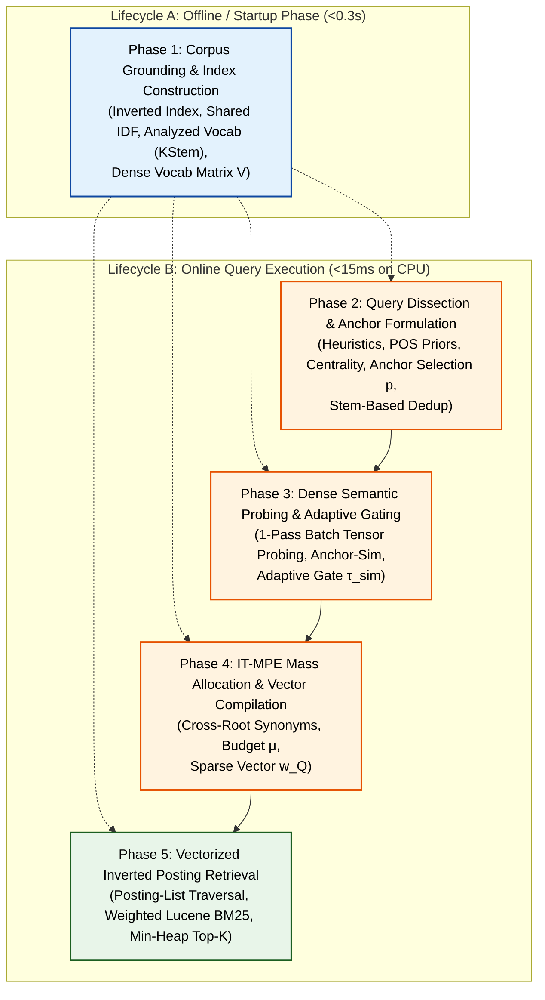

# 🏛️ Edge-RAG Pipeline V7 Architectural Plan: 5-Phase Anchored Lexical-Semantic Retriever

## Executive Summary

Edge-RAG Pipeline V2 (Schemas 1 through 6b) demonstrated that near-zero VRAM ($0.09\text{ GB}$) lexical-semantic hybrid retrieval can match or surpass heavy neural bi-encoders on standard corpora without the latency or memory footprint of SPLADE-v3 ($174\text{s}$ TTI, $4.2\text{ GB}$ VRAM) or Dense BGE-Large ($17.5\text{s}$ TTI, $2.6\text{ GB}$ VRAM).

However, empirical evaluations across diverse benchmarks (`fused_stress_500`, `enterpriserag`, `liverag`, and BEIR datasets) revealed that the legacy architecture suffered from modular coupling, discrete integer repetition artifacts, and query drift on rare technical vocabulary. A separate audit also established two structural weaknesses this plan now addresses head-on:

1. **Morphological blind spot — resolved at the analyzer.** The index is no longer exact-token; V7 adopts an **index-time-stemmed (KStem) index** (already built in `EdgeRAGAnalyzer` / `AnalyzedLuceneBM25`), which conjoins inflectional variants (`price`/`prices`/`pricing`) into one posting list. The Rev 2 two-tier fold-in machinery is **cancelled**; the only residual morphology work is a small **WordNet suppletion override** in the analyzer (Phase 1, Upgrade 1.8).
2. **Baseline parity achieved.** The [`lucene_bm25_parity_plan.md`](lucene_bm25_parity_plan.md) Stages 1–2 are complete: `AnalyzedLuceneBM25` now has the analyzer chain, posting-list index, and weighted retrieval. Empirically it **beats every v1/v5/v6 schema** on the doc-level benchmarks, so it is now the primary control V7 must beat.

This document restructures the **Edge-RAG V7 Retriever (`BM25Dense_V7`)** into **5 clean, decoupled architectural phases** across two distinct execution lifecycles: **Index-Time (Offline / Startup)** and **Query-Time (Online Execution)**, and pins down where each of the above concerns lands.

---

## 1. End-to-End 5-Phase Architecture & Data Flow

---

## 2. Detailed Phase Specifications & Upgrades

### Phase 1: Corpus Grounding & Index Construction (Index-Time / Startup)
* **Module Owner:** `src/pipeline_v2/indexer/` ([`bm25_lucene_indexer.py`](src/pipeline_v2/indexer/bm25_lucene_indexer.py), [`corpus_idf_registry.py`](src/pipeline_v2/indexer/corpus_idf_registry.py), [`corpus_vocab_builder.py`](src/pipeline_v2/indexer/corpus_vocab_builder.py), [`dense_vocab_matrix.py`](src/pipeline_v2/indexer/dense_vocab_matrix.py))
* **Role:** Establishes static corpus statistics, inverted posting lists, shared Lucene IDF tables, and the analyzed (stemmed) dense vocabulary embedding matrix before query arrival.
* **Baseline Heritage:** Built on the fast, lightweight **V5 Indexer Foundation (`BM25Dense_V5b`)**, operating in $<0.3\text{s}$ TTI and $<0.09\text{GB}$ VRAM.
* **Canonical Baseline Reference:** [`docs/ARCHITECTURE.md` (§2)](docs/ARCHITECTURE.md) and [`pathway_bm25_dense_aspect.md` (§2.1, §4)](src/pipeline_v2/expansion/pathway_bm25_dense_aspect.md)

> **Lucene-Parity Note (cross-ref [`lucene_bm25_parity_plan.md`](lucene_bm25_parity_plan.md)):** the analyzer chain (canonical tokenization, possessive stripping, stopword removal, case folding, and **KStem**) is **already implemented** in `EdgeRAGAnalyzer` and proven in `AnalyzedLuceneBM25`. Phase 1 adopts this **index-time-stemmed** index wholesale — stemming is **no longer query-side**. Technical-token protection is preserved by the analyzer's exemption set, not by keeping stemming out of the index.

#### 1. Finalized Upgrades for Phase 1
* **Upgrade 1.1 — Canonical Tokenization (`EdgeRAGTokenizer`):**
  - **Role:** the tokenization stage of `EdgeRAGAnalyzer` — not the sole source of truth (that is the analyzer, Upgrade 1.7).
  - **Tokenization Pattern (`r'\b[a-z0-9]+(?:[-._][a-z0-9]+)+\b|\b[a-z0-9]{2,}\b'`):**
    - Splits on whitespace and standard delimiter punctuation (commas, parentheses, brackets, slashes).
    - Preserves alphanumeric technical compounds and version identifiers intact (e.g., `"qwen2.5-7b"`, `"gpt-4"`, `"llama-3.1"`, `"fp16"`, `"zero-shot"`).
    - Retains vital 2-letter technical acronyms (`"ai"`, `"ml"`, `"db"`, `"kv"`, `"ip"`).
  - **Bug Fix:** Eliminates cross-module tokenization boundary mismatches (e.g. indexing `"qwen-2.5"` in BM25 but querying `"qwen"` + `"2.5"`), guaranteeing 1:1 key parity across inverted index postings, vocabulary matrix, and query parsing.
* **Upgrade 1.2 — Coverage-Based Vocabulary Pool (Static, Index-Time):**
  - Build the pool from the **full analyzed stem vocab (no DF floor)** and select $N_{\text{vocab}}$ by **farthest-point sampling (FPS)** over the $L_2$-normalized stem embeddings — coverage/hub selection replacing the retired frequency salience ($\text{IDF} \times \ln(1+\text{DF})$ over $\text{DF}\ge 2$).
  - **Cache the full stem embedding matrix**, not just the pool: the $N_{\text{vocab}}$ selected rows become the runtime `DenseVocabMatrix`; the remaining rows are the **assessment store for query-time bailout** (Phase 2). One embedding pass, one matrix, three uses (coverage scoring, runtime pool, bailout assessment).
  - **Selection cost:** FPS is $O(N_{\text{vocab}}\cdot V\cdot 384) \approx 96$ GFLOP at $V\approx 50\text{k}$ — ~10 ms on GPU, ~1 s on CPU — **cheaper than the embedding pass feeding it**, and one-time offline. Never materialize the $V\times V$ pairwise matrix (10 GB at $V=50\text{k}$).
  - **Calibration:** re-validate $N_{\text{vocab}} \in \{500, 1000, 2500, 5000\}$ and $\{5\%, 10\%\}$ of distinct stems against the analyzed-parity baseline (Strict@10 + DocRec@10). Coverage should saturate recall at a *smaller* $N$ than frequency selection — a falsifiable prediction.
* **Upgrade 1.3 — Normalized Vocab Matrix Preparation (Index-Time):**
  - Pre-allocate and $L_2$-normalize the analyzed vocabulary tensor $\mathbf{V} \in \mathbb{R}^{N_{\text{vocab}} \times 384}$ as a contiguous CUDA FP16 tensor in `DenseVocabMatrix`. (The query-time GEMM $\mathbf{E}_A \cdot \mathbf{V}^\top$ is a Phase 3 operation, already specified there.)
  - **Embedding-form note:** $\mathbf{V}$ embeds a **canonical surface form per stem** (BGE is surface-trained; KStem outputs like `relat` embed poorly), while postings are keyed by **stems**; the analyzer bridges surface ↔ stem (Upgrade 1.7). Surface-form variants are *not* embedded separately — KStem has already conjoined them.
* **Upgrade 1.7 — Analyzer-Parity Wiring (the single source of truth):**
  - `EdgeRAGAnalyzer` (tokenizer → possessive → stopword → exemption → `stemmer_override` → KStem) is the sole token-producing source of truth.
  - **1.7a (index-side, Phase 1):** route `CorpusVocabBuilder`, `CorpusIDFRegistry`, and the posting index through `EdgeRAGAnalyzer`, so postings, IDF tables, and the vocab pool are keyed by analyzed stems.
  - **1.7b (query-side, Phase 2):** route `BM25DenseAspectExtractor`'s query analysis through the same analyzer, so query anchors are analyzed stems matching the index keys.
* **Upgrade 1.8 — WordNet Suppletion Override (new):**
  - Add a `stemmer_override` stage to `EdgeRAGAnalyzer` (before KStem) using WordNet `wn_s.pl` / `wn_v.pl` to map suppletive forms (`went → go`, `bought → buy`, `better → good`); exempt technical tokens. This is the only residual morphology work.

> **Retired / relocated from Phase 1** (kept for history; not active):
> - **1.4 In-Context Sample Embedding** — deferred to V7b/V8.
> - **1.5 Stem-Diversified Vocabulary Pool** — cancelled (index-time KStem conjoins inflections before the pool is built).
> - **1.6 `MorphologicalStemRegistry`** — cancelled (redundant once postings are keyed by stem).
> - **Query-Time Anchor Bailout (formerly part of 1.2)** — relocated to Phase 2 (needs the finished anchor list).

#### 2. Phase 1 Parameter Defaults & Calibration
| Parameter | Default Value | Mathematical & Operational Rationale |
| :--- | :---: | :--- |
| **$N_{\text{vocab}}$ (Vocab Pool Size)** | **$2,500$ (re-calibrate)** | Selected by FPS coverage over the full stem vocab (no DF floor); sweep $\{500, 1000, 2500, 5000\}$ and $\{5\%, 10\%\}$ of distinct stems; recall plateau (not VRAM) sets the value. |
| **Analyzer `stemmer`** | **`kstem`** | Conservative IR stemmer applied at index and query time; conjoins inflections without derivational conflation. |
| **Analyzer `use_wordnet_override`** | **`true`** | WordNet `stemmer_override` maps suppletive forms (`went → go`); the only residual morphology stage. |

*Bailout params (`τ_rescue_IDF`, `min_len_rescue`, acronym exception) live in Phase 2, alongside the relocated Anchor Bailout operation.*

---

### Phase 2: Query Dissection & Anchor Formulation (Query Analysis)
* **Module Owner:** `src/pipeline_v2/expansion/` (`bm25_dense_aspect_extractor.py`)
* **Role:** Analyzes the user query, identifies technical entities, and assigns every analyzed token an anchor weight — **no selection, no centrality, no extra-IDF scaling** (all retired on empirical grounds).
* **Analyzer parity (Upgrade 1.7b) & pipeline order:** the query is analyzed with `EdgeRAGAnalyzer`, so anchors are keyed by analyzed stems. **Order matters** — ops 1–2 (entity detection, POS) run on **raw text** (pre-lowercase, pre-stemming); the analyzer runs between op 2 and op 3; ops 3–5 operate on analyzed stems.
* **Empirical basis** (see [`weighting_expansion_ablation_spec.md`](weighting_expansion_ablation_spec.md) and [`pos_ratio_grid_ablation_spec.md`](pos_ratio_grid_ablation_spec.md)): the weighting ablation (W0–W4) showed **POS (W2) is the only positive external-weighting signal** — extra-IDF scaling (W1) and centrality (W3) are neutral-to-negative, and the full composite (W4) is *worse* than POS alone. The POS-ratio grid calibrated the priors; its gain is **concentrated in `financebench_doc_level`** (neutral elsewhere — disclosed, not hidden).

#### 1. Finalized Operations for Phase 2
  1. **Technical Entity Detection (raw text):** Regex detection of technical acronyms (`\b[A-Z]{2,}\b`) and hyphenated/versioned identifiers (`\b[A-Za-z0-9\.]+(?:-[A-Za-z0-9\.]+)+\b`), running *before* `EdgeRAGAnalyzer` (acronyms require uppercase; the analyzer lowercases). **Quoted-phrase extraction is removed** — the posting index has no term positions, so phrases have nothing to match (parity-plan Stage 4). The entity signal feeds the Anchor Bailout gate (op 5); the analyzer's exemption flags can serve as the same signal.
  2. **Linguistic POS Tagging & Weighting (raw text):** POS-tag **surface tokens** (POS tagging needs unstemmed words) and assign the calibrated priors:
     $$w_{\text{POS}}(\text{Noun / Entity}) = 1.0, \quad w_{\text{POS}}(\text{Verb}) = 0.75, \quad w_{\text{POS}}(\text{Modifier / Other}) = 0.60$$
     Labels are carried onto the corresponding analyzed stems via token index. *(The ratio grid landscape is a broad plateau — only the `noun > verb > modifier` order is structurally required. Technical tokens default to Noun/Entity.)*
  3. **Anchor Formation (no selection):** After `EdgeRAGAnalyzer`, **every analyzed token is an anchor** — the top-$p$ selection mechanism is retired ($p=1.0$ is the empirical optimum; the p-sweep showed selection only ever hurt recall). $|Q_{\text{clean}}|$ = distinct analyzed tokens after stopword removal.
  4. **Anchor Weighting:**
     $$w(a) = w_{\text{POS}}(a)$$
     No IDF re-scaling, no centrality multiplier. BM25's own `IDF(t)` inside the scoring function is the term weight; the external `w_Q(a)` layer is the POS prior only — empirically the best external layer, and the composite was worse than POS alone.
  5. **Anchor Bailout (Not-in-Pool Candidate Generation):** For each anchor $a$ meeting the gate ($\text{IDF}(a) \ge 3.0$ and $\text{length}(a) \ge 3$, or $a \in \text{TechnicalEntities}$), perform an instant $O(1)$ token-boundary prefix/suffix lookup in the **posting dictionary** (`a-`, `a_`, `a.`, `a[0-9]`, `-a`) to surface corpus terms **not in the pool** (rare compounds, versions, typos — e.g., `gpt` $\to$ `gpt-4`, `gpt4`; `qwen` $\to$ `qwen2.5`, `qwen-vl`; `kv` $\to$ `kv-cache`). Bailout is **not** a "$DF=1$ rescue": its scope is *any* corpus term that lost the coverage ranking, not just singletons.
     - **Assessment:** a bailed term $a'$ is a *candidate*, not an accepted expansion term. It must pass the **same $\tau_{\text{sim}}$ semantic gate** as a pool term (Phase 3) before joining $\vec{w}_Q$; its embedding is a lookup into the cached full-embedding matrix from Phase 1 — zero extra inference.
     - **Weighting:** an accepted bailed term $a'$ joins $\vec{w}_Q$ with the anchor's weight under score-space IDF damping, $w(a') = w(a) \cdot \min\left(1.0,\ \frac{\text{IDF}(a)}{\text{IDF}(a')}\right)$, **outside** the Phase-4 $\mu(Q)$ synonym budget. Note $\text{DF}(a') \ge 1$ always (corpus-sourced — no $DF=0$ case exists).

> **No separate anchor dedup.** Morphological variants (`upload`/`uploads`, `steal`/`stole`/`stolen`, `went`/`go`) are already conjoined by the analyzer (KStem + WordNet override), and no-selection keeps every analyzed token — so there is no dedup step. The legacy destructive prefix/suffix heuristic is simply **not used** (V7 doesn't select anchors).

#### 2. Phase 2 Parameter Defaults & Calibration
| Parameter | Default Value | Mathematical & Operational Rationale |
| :--- | :---: | :--- |
| **$w_{\text{POS}}$ (POS priors)** | **Noun/Entity 1.0 / Verb 0.75 / Modifier-Other 0.60** | Calibrated by the POS-ratio grid; plateau-robust (only `noun > verb > modifier` required). Gain concentrated in `financebench` — disclosed. |
| **$\tau_{\text{rescue\_IDF}}$ (Bailout Anchor IDF Gate)** | **$3.0$** | Only anchors in $\le 4.98\%$ of the corpus trigger bailout (rare/technical anchors). |
| **$\text{min\_len}_{\text{rescue}}$ (Bailout Anchor Length)** | **$3$ chars** | Permits 3-letter technical anchors (`gpt`, `rag`, `sql`, `ehr`, `llm`). |
| **Regex Entity Acronym Exception** | **`[A-Z]{2,}`** | Raw-text (pre-lowercase) acronym detection for the entity/bailout gate. |

> **Retired from Phase 2**: anchor selection (`p < 1`), query-centrality weighting, and extra-IDF anchor scaling (`γ`) — empirically unsupported; **anchor dedup** (morphological + semantic) — obsolete, since the analyzer (KStem + WordNet override) conjoins variants and no-selection keeps every token.

* **Output Artifacts:** Grounded anchor dictionary $\mathcal{A} = \{(a, w(a))\}$ with $w(a) = w_{\text{POS}}(a)$, plus any bailed-out candidates that passed the semantic assessment.

---

### Phase 3: Dense Semantic Probing & Adaptive Gating (Vocabulary Projection)
* **Module Owner:** `src/pipeline_v2/expansion/` (`bm25_dense_aspect_extractor.py`)
* **Role:** Projects query anchors into the grounded pool and keeps the terms that are genuine synonyms of each anchor, forwarding them untruncated to Phase 4 for mass allocation.
* **Design decisions (this revision):** the gated score is **pure anchor-candidate cosine** ($\beta = 1.0$); the gate is an **IDF-scaled, anchor-first** threshold whose **sign is an open empirical question** (looser vs stricter for rare anchors, op 3); and the **$C_{\text{exp}}$ count cap is retired** (mass, not count, is Phase 4's concern).

#### 1. Finalized Operations for Phase 3
  1. **1-Pass Batch Tensor Probing:** Stacks anchor embeddings $\mathbf{E}_A \in \mathbb{R}^{|A| \times d}$ and computes the full similarity tensor in one GEMM against the runtime pool matrix $\mathbf{V} \in \mathbb{R}^{N_{\text{vocab}} \times 384}$ (the $N_{\text{vocab}}$ cached rows from Phase 1):
     $$\mathbf{S} = \mathbf{E}_A \cdot \mathbf{V}^\top \in \mathbb{R}^{|A| \times N_{\text{vocab}}} \quad (\approx 1.2\text{ms};\ O(|A| \cdot N_{\text{vocab}} \cdot d))$$
  2. **Anchor-Candidate Similarity ($\beta = 1.0$):** the gated quantity is the **pure cosine** $\text{CosSim}(\mathbf{e}_a, \mathbf{e}_v)$. The query-context blend (Dual-Sim, $\beta < 1$) is **retired as the default** — the global-query term contaminates per-anchor synonymy, and $\beta = 0.65$ was never ablated. Query context survives only as an ablation arm: $\beta \in \{0, 0.5, 0.65, 1.0\}$, a second hard gate, or a post-gate soft reweight.
  3. **Adaptive Similarity Quality Gate (IDF-scaled, anchor-first):** keep $v$ iff $\text{CosSim}(\mathbf{e}_a, \mathbf{e}_v) \ge \tau_{\text{sim}}(a)$, where
     $$\tau_{\text{sim}}(a) = \tau_{\text{base}} + \Delta\tau \cdot \left(\frac{\text{IDF}(a)}{\text{IDF}_{\text{max\_corpus}}}\right), \quad \tau_{\text{base}} = 0.55,\ \Delta\tau = 0\ (\text{default; sign calibrated})$$
     **The sign of $\Delta\tau$ is an open empirical question — not a settled fact.** Two competing mechanisms, neither proven:
     - **$\Delta\tau > 0$ (rarer → stricter):** a rare specific anchor has a tight synonym space, so only near-identical terms qualify; a loose synonym on a specific term is precision poison.
     - **$\Delta\tau < 0$ (rarer → looser):** rare anchors are where lexical matching is weakest, so they most need expansion; a strict gate starves them.
     $\Delta\tau = 0$ is the no-adaptivity baseline. The gate is **anchor-first** because synonymy is the *necessary* condition; topicality (if used) is a *refinement* applied after. (The legacy range $[0.80, 0.90]$ was too strict for BGE-small regardless of sign.)
  4. **Stem-Diversity Gate** *(removed):* No longer needed — the pool is built from analyzed (stemmed) tokens, so inflectional clones never enter; probing returns cross-root candidates by construction.
  5. **Candidate Forwarding (no count cap):** forward **all** terms passing the gate to Phase 4 — no $C_{\text{exp}}$ truncation, no mass floor. $C_{\text{exp}}$ is a legacy count constraint orthogonal to IT-MPE (which bounds *mass*, not *count*); the Phase-3 gate is the sole filter, and Phase 4's normalized-cosine allocation keeps the tail naturally small.

> **Retired from Phase 3**: Dual-Sim query-context blend ($\beta = 0.65$) — query term removed from the gated score ($\beta = 1.0$; $\beta < 1$ kept as an ablation arm); the legacy gate range $\tau_{\text{sim}} \in [0.80, 0.90]$ — too strict for BGE-small, re-anchored to $\tau_{\text{base}} = 0.55$ with a **signed** $\Delta\tau$ (sign calibrated); $C_{\text{exp}}$ top-2 count cap — removed (gate-only, no count/mass cap); Stem-Diversity Gate — obsolete (stem-keyed pool).

#### 2. Phase 3 Parameter Defaults & Calibration
| Parameter | Default Value | Mathematical & Operational Rationale |
| :--- | :---: | :--- |
| **$\beta$ (query-context blend)** | **$1.0$** | Pure anchor-sim; query term retired from the gate ($\beta < 1$ is an ablation arm, not the default). |
| **$\tau_{\text{sim}}(a)$ (Adaptive Similarity Gate)** | **$\tau_{\text{base}} = 0.55,\ \Delta\tau = 0$ (calibrate)** | $\Delta\tau = 0$ = no-adaptivity default (hold-fixed); the **sign** of $\Delta\tau$ (looser vs stricter for rare anchors) is the open question — sweep both signs jointly with $\beta$. |
| **$C_{\text{exp}}$ (Synonym Count Cap)** | **removed** | Count cap → gate-only (IT-MPE bounds mass, not count; the Phase-3 gate is the sole filter). |

> **Ablation axes (to be specified as a spec):** $\beta \in \{0, 0.5, 0.65, 1.0\}$; gate variant $\in \{\text{adaptive single gate},\ \text{two-gate (anchor then query)},\ \text{gate + soft reweight}\}$; signed adaptivity $\Delta\tau \in \{-0.25, -0.20, -0.15, -0.10, -0.05, 0, +0.05, +0.10, +0.15, +0.20, +0.25\}$ (step 0.05; sign $\Rightarrow$ looser/stricter for rare anchors, $\tau_{\text{base}} = 0.55$ fixed) — all jointly, reporting `starved_aspects` + Strict@10 + DocRec@10. *(The count cap is not an ablation axis: $C_{\text{exp}}$ is retired, with no count/mass floor — the Phase-3 gate is the sole filter, and sparsity is guarded by $\tau_{\text{sim}}$ + the Phase-5 latency budget.)*

* **Output Artifacts:** Per-anchor candidate sets $\{v : \text{CosSim}(\mathbf{e}_a, \mathbf{e}_v) \ge \tau_{\text{sim}}(a)\}$ with their similarity scores, forwarded to Phase 4 untruncated (no $C_{\text{exp}}$ cap).

---

### Phase 4: IT-MPE Mass Allocation & Vector Compilation (Expansion Weighting)
* **Module Owner:** `src/pipeline_v2/expansion/` (`bm25_dense_aspect_extractor.py`)
* **Role:** Assigns continuous float weights to **cross-root semantic synonyms** under the Information-Theoretic Mass-Preserving Expansion (IT-MPE) Theorem, strictly preventing rare-synonym score hijacking.
* **Design decisions (this revision):** allocation is **normalized cosine** (linear, theory-§4.2-aligned) — the temperature-scaled softmax is retired; the **mass floor is removed** (the Phase-3 gate is the sole filter); the budget parameters $\mu_{\text{ceil}}$ (scale) and $\eta$ (direction) are **both calibrated** (free parameters, no privileged value — theory $\mu \in (0,1]$).

#### 1. Finalized Operations for Phase 4
  1. **Query-Level Expansion Budget:**
     $$\mu(Q) = \mu_{\text{ceil}} \cdot \left(1 - \eta \cdot \frac{\max_{t \in Q} \text{IDF}(t)}{\text{IDF}_{\text{max\_corpus}}}\right), \quad \mu_{\text{ceil}} = 0.5\ (\text{default; calibrated}),\ \eta = 0\ (\text{default; signed, calibrated})$$
     Both parameters are **free** (theory $\mu \in (0,1]$; no privileged value). $\mu_{\text{ceil}}$ sets the budget *scale* at $\max\text{IDF} = 0$; $\eta$ sets the *direction/shape*: $\eta > 0$ = rarer query → smaller budget, $\eta < 0$ = rarer query → larger budget, $\eta = 0$ = flat. (Mirrors, but is distinct from, Phase 3's $\Delta\tau$ sign.) Constraint: $\mu(Q) \le 1$ requires $\mu_{\text{ceil}} \cdot (1 + |\eta|) \le 1$ — so $\eta < 0$ limits $\mu_{\text{ceil}}$ (e.g. $\eta = -0.5 \Rightarrow \mu_{\text{ceil}} \le 0.67$).
  2. **Allocation Distribution (normalized cosine):**
     $$p(s_k \mid a) = \frac{\text{CosSim}(\mathbf{e}_{s_k}, \mathbf{e}_a)}{\sum_{j=1}^{K} \text{CosSim}(\mathbf{e}_{s_j}, \mathbf{e}_a)}$$
     Linear in similarity — the faithful instantiation of theory §4.2 ($P(s \mid a) \propto \text{CosSim}$). All admitted candidates have $\text{CosSim} \ge \tau_{\text{sim}} > 0$, so the denominator is positive. (Softmax / uniform are ablation arms, not defaults.)
  3. **Score-Space IDF Damping Factor:** Prevents rare synonyms ($\text{IDF}(s) \gg \text{IDF}(a)$) from overpowering the anchor:
     $$\text{Damping}(s_k, a) = \min\left(1.0, \ \frac{\text{IDF}(a)}{\text{IDF}(s_k)}\right)$$
  4. **Continuous Expansion Weight:**
     $$w(s_k \mid a) = \mu(Q) \cdot w(a) \cdot \min\left(1.0, \ \frac{\text{IDF}(a)}{\text{IDF}(s_k)}\right) \cdot p(s_k \mid a)$$
  5. **Sparse Vector Synthesis:** Compiles primary anchors $w(a)$ and synonyms $w(s \mid a)$ into a unified sparse float vector $\vec{w}_Q \in \mathbb{R}^{|V|}$, summing weights when two entries collide on the same term (Lucene boost-summing semantics). No mass floor — the Phase-3 gate is the sole filter, and normalized cosine keeps the tail naturally small.
* **Mathematical Invariant (single-tier):**
  $$\sum_{s \in S(a)} w(s \mid a) \le \mu(Q) \cdot w(a)$$
  In score space, each synonym inherits $\min(1, \text{IDF}_a/\text{IDF}_s)$ damping, so no single synonym hit can out-score a single anchor hit. (The bound is *mass-bounded*, not "preserving": damping ≤ 1 means emitted mass is `≤`, not `=`, $\mu \cdot w(a)$.)

> **Retired from Phase 4**: temperature-scaled softmax allocation ($\tau = 0.10$) — replaced by normalized cosine (theory §4.2 implies linear; sharp softmax was an unexplained exponential that hid a top-1 allocation); mass floor $\varepsilon$ — removed (Phase-3 gate is the sole filter; normalized cosine bounds $|w_Q|$ naturally).

#### 2. Phase 4 Parameter Defaults & Calibration
| Parameter | Default Value | Mathematical & Operational Rationale |
| :--- | :---: | :--- |
| **$\mu_{\text{ceil}}$ (budget ceiling / scale)** | **$0.5$ (calibrate)** | Default = half anchor mass (the hold-fixed value in the $\eta$ sweep); sweep $\mu_{\text{ceil}} \in \{0.25, 0.5, 0.75, 1.0\}$ — $\mu = 1.0$ is the RM3 toolkit-default equivalent ($\lambda = 0.5$). |
| **$\eta$ (budget direction)** | **$0$ (calibrate, signed)** | Default = flat budget (no rarity modulation, hold-fixed); sweep $\eta \in \{-0.5, 0, +0.5\}$; $\eta < 0$ requires $\mu_{\text{ceil}}(1+|\eta|) \le 1$ (theory $\mu \in (0,1]$). |
| **allocation** | **normalized cosine** | Theory §4.2 implies linear; softmax retired as default. |

> **Ablation axes (to be specified as a spec):** allocation $\in \{\text{normalized cosine},\ \text{softmax}(\tau = 1.0),\ \text{softmax}(\tau = 0.1),\ \text{uniform}\}$; budget $\mu_{\text{ceil}} \in \{0.25, 0.5, 0.75, 1.0\}$ and $\eta \in \{-0.5, 0, +0.5\}$ — **staged**: sweep $\eta$ first at fixed $\mu_{\text{ceil}} = 0.5$ (answer the direction), then sweep $\mu_{\text{ceil}}$ at the winning $\eta$ (tune the scale), then a small joint confirmation ($2\text{--}3$ combos) to check for interaction. Respect $\mu_{\text{ceil}}(1+|\eta|) \le 1$. Jointly with Phase 3's $\beta$ / $\Delta\tau$ / gate-variant axes, reporting `starved_aspects` + Strict@10 + DocRec@10.

* **Output Artifacts:** Continuous sparse term weight dictionary $\vec{w}_Q = \{t: w_Q(t)\}$.

---

### Phase 5: Vectorized Inverted Posting Retrieval (Scoring Execution)
* **Module Owner:** `src/pipeline_v2/indexer/` (`bm25_lucene_indexer.py`, `posting_index.py`)
* **Role:** Evaluates the compiled sparse vector directly over inverted posting lists with sub-15ms CPU latency.
* **Status:** *(largely implemented already — `InvertedPostingIndex` + `AnalyzedLuceneBM25.retrieve_weighted` exist from parity-plan Stage 2. Remaining work is routing the extractor's $\vec{w}_Q$ through it, not building the index.)*
* **Design decisions (this revision):** Phase 5 is the **score-space enforcement point** — it consumes $\vec{w}_Q$ verbatim and applies the *same* `CorpusIDFRegistry` IDF as Phase 4's damping (the theorem-critical identity); it is also the **last line of defense** for the `<15ms` budget now that the mass floor is gone.

#### 1. Finalized Operations for Phase 5
  1. **Posting-List Traversal:** Traverse inverted posting lists only for active terms $t \in \vec{w}_Q$ — a true posting-list structure (compact `array`-typed doc-id/TF arrays) replaces the legacy O($|Q| \cdot N$) full scan. Cost $\propto \sum_{t \in \vec{w}_Q} |\text{posting}(t)|$.
  2. **Single-Pass Weighted Lucene BM25 Scoring:**
     $$\text{Score}(D, Q) = \sum_{t \in \vec{w}_Q} w_Q(t) \cdot \text{IDF}(t) \cdot \frac{\text{TF}(t, D) \cdot (k_1 + 1)}{\text{TF}(t, D) + k_1 \cdot \left(1 - b + b \cdot \frac{|D|}{\text{avgDL}}\right)}$$
     **IDF identity invariant (theorem-critical):** the $\text{IDF}(t)$ here must be the *identical* `CorpusIDFRegistry.get_idf(t)` used in Phase 4's damping — otherwise the rare-synonym IDF cancellation in Theorem 1 fails and the "no synonym out-scores the anchor" guarantee silently breaks (single source of truth, Upgrade 1.7).
  3. **Top-$K$ Selection:** Accumulates scores into a pre-allocated `float32` buffer and extracts top-$K$ chunks via a min-heap ($<15\text{ms}$ on 17k chunks). *(Doc-level benchmarks aggregate chunk scores to documents; aggregation rule to be pinned in §4.)*

> **Retired from Phase 5**: legacy full-scan scoring O($|Q| \cdot N$) — replaced by posting-list traversal; discrete repetition-scaling path (`augmented_token_list`) — removed from the pipeline path, kept only in the frozen baseline.

#### 2. Phase 5 Parameter Defaults & Calibration
| Parameter | Default Value | Mathematical & Operational Rationale |
| :--- | :---: | :--- |
| **$k_1$ (BM25 term saturation)** | **$1.2$** | Lucene default; a frozen baseline parameter, not calibrated. |
| **$b$ (BM25 length normalization)** | **$0.75$** | Lucene default; a frozen baseline parameter, not calibrated. |
| **$\text{avgDL}$** | **corpus-derived** | Computed at index time, shared with `CorpusIDFRegistry`. |
| **IDF source** | **`CorpusIDFRegistry.get_idf`** | Must be *identical* to Phase 4's damping (single source of truth, Upgrade 1.7). |
| **OOV anchor IDF** | **clamp** $\text{IDF}(a)/\text{IDF}_{\text{max\_corpus}} \le 1$ | `docFreq = 0` gives $\text{IDF}(0) = \text{IDF}_{\text{max\_corpus}} + \ln 3$ (above the corpus max); clamp in the $\tau_{\text{sim}}$ and $\mu(Q)$ normalizations to keep them in range. |

> **Cross-phase dependency (latency):** with the mass floor removed (Phase 4), $|\vec{w}_Q|$ is bounded only by the Phase-3 gate. Validate the `<15ms` budget against the *loosest* gate in the $\tau_{\text{sim}}$ / $\Delta\tau$ sweep (e.g. $\tau_{\text{sim}} = 0.30$ at $\Delta\tau < 0$), not just the default.

* **Output Artifacts:** Ranked list of retrieved candidate chunks `List[Dict[str, Any]]`.

---

## 3. Mapping Current V7 Upgrades to the 5 Phases

| Upgrade / Refinement | Target Phase | Implementation Impact |
| :--- | :--- | :--- |
| **Canonical Tokenization (`EdgeRAGTokenizer`)** | **Phase 1** | Tokenization stage of `EdgeRAGAnalyzer`; eliminates cross-module boundary mismatches. *(done)* |
| **Analyzer Chain (possessive + stopword + case + KStem, index-time)** | **Phase 1** | Adopted from `EdgeRAGAnalyzer`; stemming is index-time, not query-side. *(done, extend with suppletion override)* |
| **Punctuation Tokenization** | **Phase 1** | Canonical `EdgeRAGTokenizer`; splits delimiters, preserves technical compounds. *(done)* |
| **WordNet Suppletion Override (Upgrade 1.8)** | **Phase 1** | Add `stemmer_override` stage to `EdgeRAGAnalyzer` (suppletion → lemma). |
| **Analyzer-Parity Wiring — index-side (Upgrade 1.7a)** | **Phase 1** | Route VocabBuilder / IDF registry / posting index through `EdgeRAGAnalyzer`. |
| **Coverage-Based Vocabulary Pool (Upgrade 1.2)** | **Phase 1** | FPS coverage selection over the full stem vocab (no DF floor); cache full embedding matrix for pool + bailout assessment. |
| **Analyzer-Parity Wiring — query-side (Upgrade 1.7b)** | **Phase 2** | Route `BM25DenseAspectExtractor` query analysis through `EdgeRAGAnalyzer`. |
| **Anchor Bailout (not-in-pool candidate generation)** | **Phase 2** | Query-time bailout surfaces corpus terms not in the pool; bailed terms pass the same $\tau_{\text{sim}}$ assessment before joining $\vec{w}_Q$. |
| **1-Pass Batch Tensor Probing** | **Phase 3** | Single matrix multiplication $\mathbf{E}_A \cdot \mathbf{V}^\top$ in `DenseVocabMatrix`. |
| **No Anchor Selection (all tokens; $p = 1.0$)** | **Phase 2** | Every analyzed token is an anchor; the top-$p$ selection mechanism is retired (p-sweep optimum). |
| **POS-Only Anchor Weighting (calibrated)** | **Phase 2** | $w(a) = w_{\text{POS}}(a)$ with ratios $1.0/0.75/0.60$; centrality and extra-IDF retired (weighting ablation). |
| **Anchor-Candidate Similarity ($\beta = 1.0$)** | **Phase 3** | Gated score is pure anchor-sim; query-context blend retired as default ($\beta < 1$ = ablation arm). |
| **Adaptive Similarity Quality Gate ($\tau_{\text{sim}}(a) = \tau_{\text{base}} + \Delta\tau \cdot \text{IDF}$, anchor-first)** | **Phase 3** | IDF-scaled gate; **sign of $\Delta\tau$ calibrated** (looser vs stricter for rare anchors); synonymy (necessary) before topicality (refinement). |
| **Query-Level Expansion Budget ($\mu_{\text{ceil}}$, $\eta$)** | **Phase 4** | Free parameters (no privileged value); staged calibration — $\eta$ direction first, then $\mu_{\text{ceil}}$ scale; respect $\mu_{\text{ceil}}(1+|\eta|) \le 1$. |
| **IT-MPE Continuous Mass Allocation & Score-Space Damping** | **Phase 4** | Enforces $\min(1, \text{IDF}_a/\text{IDF}_s)$ damping and normalized-cosine allocation (single-tier). |
| **Retirement of Discrete Repetition** | **Phase 4 / 5** | Replaces discrete string replication (`augmented_token_list`) with sparse float vector $\vec{w}_Q$. |
| **Posting-List Index (no full scan)** | **Phase 5** | Compact posting arrays; traversal cost ∝ matched postings. *(done)* |
| **Float-Weighted Inverted Posting Accumulator** | **Phase 5** | `retrieve_weighted` consumes $\vec{w}_Q$ directly. *(done)* |
| **IDF Identity Invariant (scoring ≡ damping IDF)** | **Phase 5** | Phase 5's $\text{IDF}(t)$ must be identical to Phase 4's damping IDF (single source of truth) — theorem-critical; plus OOV clamp $\text{IDF}(a)/\text{IDF}_{\text{max\_corpus}} \le 1$. |

Removed: Stem-Diversified Vocabulary Pool (1.5), `MorphologicalStemRegistry` (1.6), Stem-Diversity Gate, Tier-1 Fold-In + Synonym Closure, Budget Tier-Split ($\eta_{\text{morph}}$) — obsolete under index-time stemming; **frequency salience vocabulary ranking ($\text{IDF} \times \ln(1+\text{DF})$ over $\text{DF}\ge 2$) and the $DF\ge 2$ pool floor** — retired in favor of FPS coverage selection (Upgrade 1.2); **Dual-Sim query-context blend ($\beta = 0.65$), the $[0.80, 0.90]$ gate range, $C_{\text{exp}}$ synonym count cap** — retired in favor of anchor-only gating ($\beta = 1.0$), the re-anchored adaptive gate with signed $\Delta\tau$, and gate-only allocation (no count/mass floor); **temperature-scaled softmax allocation ($\tau = 0.10$) and mass floor $\varepsilon$** — retired in favor of normalized-cosine allocation and gate-only filtering; **Anchor Selection (top-$p$), Query Centrality, extra-IDF anchor scaling, Anchor Dedup (semantic)** — retired (p-sweep + weighting ablation; the analyzer already conjoins variants).

---

## 4. Detailed Calibration Plan

The V7 architecture fixes the structure; the calibration plan fixes the free parameters. All calibration is staged **phase-by-phase** (Phase 1 → Phase 3 → Phase 4), holding earlier phases at their winning config. Phase 2 and Phase 5 carry no calibration burden (Phase 2's POS priors and bailout gate are already calibrated; Phase 5's BM25 is frozen).

### 4.1 Measurement Harness (frozen controls + harness)

- **Frozen controls (integrity rules):** `AnalyzedLuceneBM25` is the **primary control** — all V7 gains are measured against it, *never* the legacy baseline. `LuceneBM25Baseline`, `BM25Baseline`, `BM25_stemmed`, and v1/v5/v6 are measurement controls, **untouched — no backport**. Analyzed scores live in a separate avgdl/DF space and are never mixed with legacy numbers.
- **Benchmarks, metrics & trace files:** follow the [`results/p_sweep_ablation/`](results/p_sweep_ablation/p_sweep_summary.md) convention — its **10 benchmarks** (`beir_fiqa_doc_level`, `beir_nfcorpus_doc_level`, `beir_scifact_doc_level`, `bright_economics_doc_level`, `bright_robotics_doc_level`, `bright_stackoverflow_doc_level`, `enterpriserag_doc_level`, `financebench_doc_level`, `liverag_doc_level`, `multihop_rag_doc_level`), its metric set and trace files reuse the same harness that produced the p-sweep.

### 4.2 Stage 0 — Stem census (prerequisite, not an ablation)

One line: `len(idf_registry.doc_freqs)` after the 1.7a analyzer wiring = `#distinct stems`. This bounds the "embed all" cost, the pool-size sweep, and the `%`-scaling range. Run once per benchmark before Stage 1.

### 4.3 Stage 1 — Phase 1 pool: selection × size

Hold Phases 2–4 at defaults. Sweep:

| Axis | Values |
| :--- | :--- |
| **selection** | `{coverage/FPS, pure IDF, salience, random}` |
| **pool size N** | `{500, 1000, 2500, 5000}` and `{5%, 10%}` of stems |

Each selection runs **cleanly over the full stem vocab** (no `[:2500]`-by-DF pre-truncation). Fix the winning selection, then sweep `N`. *Prediction to falsify:* coverage > random > salience > pure IDF on recall, and coverage saturates at a **smaller** `N` than frequency selection.

### 4.4 Stage 2 — Phase 3 gate: β × variant × Δτ

Phase 1 at winning config, Phase 4 at defaults. Sweep:

| Axis | Values |
| :--- | :--- |
| **β (query-context blend)** | `{0, 0.5, 0.65, 1.0}` |
| **gate variant** | `{adaptive single, two-gate (anchor→query), gate + soft reweight}` |
| **Δτ (signed adaptivity)** | `{-0.25 … +0.25}` step 0.05, `τ_base = 0.55` |

**Staged:** answer the `Δτ` **sign** first (`{-0.25, 0, +0.25}` at `β = 1.0`, single gate) — the open question (`Δτ < 0` looser, `Δτ > 0` stricter for rare anchors) — then refine magnitude, then sweep `β` and the gate variant. Report `starved_aspects` + the p-sweep metric set (Strict@10 as the precision guardrail, DocRec@10 for recall).

### 4.5 Stage 3 — Phase 4 budget/allocation: η → μ_ceil → allocation

Phases 1 & 3 at winning config. Sweep:

| Axis | Values |
| :--- | :--- |
| **η (budget direction, signed)** | `{-0.5, 0, +0.5}` |
| **μ_ceil (budget scale)** | `{0.25, 0.5, 0.75, 1.0}` |
| **allocation** | `{normalized cosine, softmax(τ=1.0), softmax(τ=0.1), uniform}` |

**Staged (separate, then a small joint check):**
1. `η` at fixed `μ_ceil = 0.5` — answer the direction (rarer query → more / less / flat budget).
2. `μ_ceil` at the winning `η` — tune the scale.
3. `allocation` at the winning `(η, μ_ceil)` — confirm the theory-§4.2 normalized-cosine default.
4. 2–3 joint `η` × `μ_ceil` combos — check for interaction.

Respect `μ_ceil(1+|η|) ≤ 1` (theory `μ ∈ (0,1]`) — e.g. `η = -0.5 ⇒ μ_ceil ≤ 0.67`.

### 4.6 Phase 5 — frozen (no calibration)

`k1 = 1.2`, `b = 0.75` frozen at Lucene defaults (baseline-consistency; the IT-MPE guarantee is invariant to them). `K` set by the metric. Phase 5 is the stable measurement substrate across all stages.

---

## 5. File Modification Plan

1. **[`src/pipeline_v2/indexer/tokenizer.py`](src/pipeline_v2/indexer/tokenizer.py)** *(already created):* `EdgeRAGTokenizer` — Phase 1 canonical tokenization.
2. **[`src/pipeline_v2/indexer/analyzer.py`](src/pipeline_v2/indexer/analyzer.py)** *(already created — extend):* add the WordNet `stemmer_override` (suppletion) stage before KStem.
3. **[`src/pipeline_v2/indexer/posting_index.py`](src/pipeline_v2/indexer/posting_index.py)** *(already created):* compact posting lists + weighted top-K retrieval (Phase 5).
4. **[`src/pipeline_v2/indexer/corpus_vocab_builder.py`](src/pipeline_v2/indexer/corpus_vocab_builder.py):** analyzer-parity wiring (build pool from analyzed tokens); FPS coverage selection over the full stem vocab; cache the full embedding matrix (pool + bailout assessment store).
5. **[`src/pipeline_v2/indexer/dense_vocab_matrix.py`](src/pipeline_v2/indexer/dense_vocab_matrix.py):** Phase 1 & 3 batch tensor projection $\mathbf{E}_A \cdot \mathbf{V}^\top$; serve the runtime $N_{\text{vocab}}$ rows and expose the cached full matrix for bailout assessment lookups.
6. **[`src/pipeline_v2/expansion/bm25_dense_aspect_extractor.py`](src/pipeline_v2/expansion/bm25_dense_aspect_extractor.py):** Phase 2 anchor weighting + stem dedup; Phase 3 adaptive $\tau_{\text{sim}}(a)$ anchor-first gating (no $C_{\text{exp}}$); Phase 4 single-tier IT-MPE compilation (normalized-cosine allocation, no mass floor).
7. **[`src/pipeline_v2/indexer/bm25_lucene_indexer.py`](src/pipeline_v2/indexer/bm25_lucene_indexer.py):** Phase 5 `retrieve_weighted` over the posting index; `mode: legacy | parity` switch.
8. **[`src/pipeline_v2/indexer/corpus_idf_registry.py`](src/pipeline_v2/indexer/corpus_idf_registry.py):** consume analyzed DF tables (single source of truth).
9. **[`configs/pipeline_v2.yaml`](configs/pipeline_v2.yaml):** authoritative single-source-of-truth configuration for 5-phase parameters (`stemmer: kstem`, `use_wordnet_override: true`, `indexer.mode`, `vocab_selection: coverage | idf | salience | random`, `vocab_size`, `vocab_frac`). **Drop** `eta_morph`, `k_morph`, `morph_fold_synonyms`.

*Removed from the plan:* `morphological_stem_registry.py` (redundant under index-time stemming).
