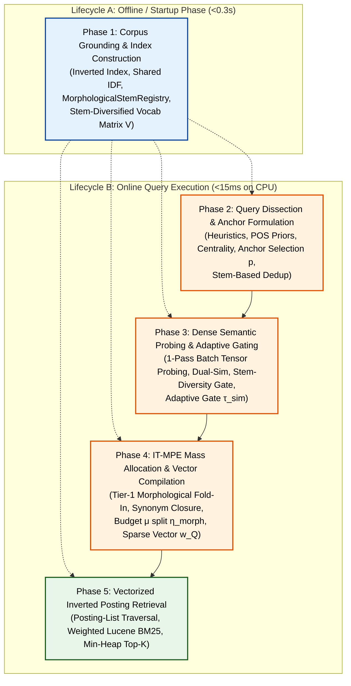

# 🏛️ Edge-RAG Pipeline V7 Architectural Plan: 5-Phase Anchored Lexical-Semantic Retriever

## Executive Summary

Edge-RAG Pipeline V2 (Schemas 1 through 6b) demonstrated that near-zero VRAM ($0.09\text{ GB}$) lexical-semantic hybrid retrieval can match or surpass heavy neural bi-encoders on standard corpora without the latency or memory footprint of SPLADE-v3 ($174\text{s}$ TTI, $4.2\text{ GB}$ VRAM) or Dense BGE-Large ($17.5\text{s}$ TTI, $2.6\text{ GB}$ VRAM).

However, empirical evaluations across diverse benchmarks (`fused_stress_500`, `enterpriserag`, `liverag`, and BEIR datasets) revealed that the legacy architecture suffered from modular coupling, discrete integer repetition artifacts, and query drift on rare technical vocabulary. A separate audit also established two structural weaknesses this plan now addresses head-on:

1. **Morphological blind spot.** The retrieval index is exact-token (`price` ≠ `prices` ≠ `pricing`), and dense probing starves cross-root synonyms by over-prioritizing morphological clones. V7 resolves this with a **decoupled two-tier morphology solution** (Tier-1 morphological fold-in + Tier-2 stem-diversity gate) — fully specified in [`morphology_expansion_strategy.md`](morphology_expansion_strategy.md) (Rev 2).
2. **Baseline parity gap.** `LuceneBM25Baseline` is a pure-Python *formula* port over naive `.split()` tokens — no analyzer chain, no postings, no weighted retrieval. Its upgrade path is specified in [`lucene_bm25_parity_plan.md`](lucene_bm25_parity_plan.md).

This document restructures the **Edge-RAG V7 Retriever (`BM25Dense_V7`)** into **5 clean, decoupled architectural phases** across two distinct execution lifecycles: **Index-Time (Offline / Startup)** and **Query-Time (Online Execution)**, and pins down where each of the above concerns lands.

---

## 1. End-to-End 5-Phase Architecture & Data Flow

---

## 2. Detailed Phase Specifications & Upgrades

### Phase 1: Corpus Grounding & Index Construction (Index-Time / Startup)
* **Module Owner:** `src/pipeline_v2/indexer/` ([`bm25_lucene_indexer.py`](src/pipeline_v2/indexer/bm25_lucene_indexer.py), [`corpus_idf_registry.py`](src/pipeline_v2/indexer/corpus_idf_registry.py), [`corpus_vocab_builder.py`](src/pipeline_v2/indexer/corpus_vocab_builder.py), [`dense_vocab_matrix.py`](src/pipeline_v2/indexer/dense_vocab_matrix.py))
* **Role:** Establishes static corpus statistics, inverted posting lists, shared Lucene IDF tables, the morphological stem registry, and the stem-diversified dense vocabulary embedding matrix before query arrival.
* **Baseline Heritage:** Built on the fast, lightweight **V5 Indexer Foundation (`BM25Dense_V5b`)**, operating in $<0.3\text{s}$ TTI and $<0.09\text{GB}$ VRAM.
* **Canonical Baseline Reference:** [`docs/ARCHITECTURE.md` (§2)](docs/ARCHITECTURE.md) and [`pathway_bm25_dense_aspect.md` (§2.1, §4)](src/pipeline_v2/expansion/pathway_bm25_dense_aspect.md)

> **Lucene-Parity Note (cross-ref [`lucene_bm25_parity_plan.md`](lucene_bm25_parity_plan.md)):** the indexer is currently a pure-Python Lucene-*formula* port with no analyzer. Phase 1 delivers the **index-time half of the analyzer chain** — canonical tokenization, possessive stripping, stopword removal, and case folding — while **stemming itself stays query-side** (Phase 3 gate + Phase 4 fold-in) to preserve exact-match priority and technical-token protection. Index-time stemming is the V8 dual-field path, not V7.

#### 1. Finalized Upgrades for Phase 1
* **Upgrade 1.1 — Unified Canonical Tokenizer & Cross-Module Synchronization (`EdgeRAGTokenizer` / Architecture Fix):**
  - **Single Source of Truth (`src/pipeline_v2/indexer/tokenizer.py`):** Create a dedicated, canonical `EdgeRAGTokenizer.tokenize(text)` module used strictly across `BM25LuceneIndexer`, `CorpusVocabBuilder`, `CorpusIDFRegistry`, and `BM25DenseAspectExtractor`.
  - **Tokenization Pattern (`r'\b[a-z0-9]+(?:[-._][a-z0-9]+)+\b|\b[a-z0-9]{2,}\b'`):**
    - Splits on whitespace and standard delimiter punctuation (commas, parentheses, brackets, slashes).
    - Preserves alphanumeric technical compounds and version identifiers intact (e.g., `"qwen2.5-7b"`, `"gpt-4"`, `"llama-3.1"`, `"fp16"`, `"zero-shot"`).
    - Retains vital 2-letter technical acronyms (`"ai"`, `"ml"`, `"db"`, `"kv"`, `"ip"`).
  - **Bug Fix:** Eliminates cross-module tokenization boundary mismatches (e.g. indexing `"qwen-2.5"` in BM25 but querying `"qwen"` + `"2.5"`), guaranteeing 1:1 key parity across inverted index postings, vocabulary matrix, and query parsing.
* **Upgrade 1.2 — Scaled Vocabulary Pool & Query-Time Anchor Bailout (The Rescue Plan):**
  - **Static Index-Time Pool:** Scale candidate vocabulary capacity from $1,000 \to N_{\text{vocab}} = 2,500$ terms in `CorpusVocabBuilder` using sublinear salience ranking ($\text{IDF} \times \ln(1 + \text{DF})$ for $\text{Doc\_Freq} \ge 2$), providing broad domain coverage at negligible VRAM ($<0.12\text{GB}$).
  - **Query-Time Anchor Bailout:** When a discriminative query anchor $a$ meets the gate ($\text{IDF}(a) \ge 3.0$ and $\text{length}(a) \ge 3$, or $a \in \text{HeuristicEntities}$), perform an instant $O(1)$ token-boundary prefix/suffix lookup in the inverted index posting dictionary (`a-`, `a_`, `a.`, `a[0-9]`, `-a`) to bail out matching $DF=1$ compounds, versions, and typos (e.g., `gpt` $\to$ `gpt-4`, `gpt4`; `qwen` $\to$ `qwen2.5`, `qwen-vl`; `kv` $\to$ `kv-cache`). These bailed terms are dynamically injected into candidate evaluation under IT-MPE score-space damping.
* **Upgrade 1.3 — 1-Pass Batch Tensor Probing Alignment (Matrix GEMM Acceleration):**
  - Pre-allocate and $L_2$-normalize tensor $\mathbf{V} \in \mathbb{R}^{2500 \times 384}$ as a contiguous CUDA FP16 tensor in `DenseVocabMatrix`, enabling single GEMM matrix multiplication ($\mathbf{E}_A \cdot \mathbf{V}^\top \approx 1.2\text{ms}$) during query probing with 100% mathematical cosine equivalence and zero quality loss.
* **Upgrade 1.4 — In-Context Sample Embedding (Deferred to V7b / V8):**
  - Generating sentence-contextualized embeddings for candidate vocabulary terms is cataloged as a future research milestone.
* **Upgrade 1.5 — Stem-Diversified Vocabulary Pool (Morphology at Construction Time):**
  - **Goal:** one distinct *concept* per dense slot, so the 2,500-term matrix is not wasted on inflectional clones (`price`/`prices`/`pricing` share ~0.97-identical embeddings).
  - **Mechanism:** group pool candidates by stem **after** salience scoring and **before** slotting into $\mathbf{V}$; the surviving representative inherits the **summed DF** of its stem bucket (merge, never drop) and is re-ranked by combined salience.
  - **Conflation scope:** *inflectional only* — a light stemmer (S-stemmer + `-ed`/`-ing` verb rules), **not** raw KStem/Porter, so `price/prices/pricing` merge but `organ`/`organization` stay distinct (distinct concepts deserve distinct slots).
  - **No cosine-dedup** — near-synonyms (`cost`/`expense`) are the cross-root diversity Tier 2 exists to exploit; cosine-dedup would starve them.
  - **Exemption set applies** — technical tokens are never stem-merged.
  - **Recovery guarantee:** dropped inflections are still matched at query time via Tier-1 fold-in (Phase 4), which operates over the full posting dictionary, independent of the dense pool.
* **Upgrade 1.6 — `MorphologicalStemRegistry` (Tier-1 Index-Time Machinery):**
  - Build, at index time, a stem → corpus-variant map over the **full posting dictionary** (not just the 2,500 dense pool): $\sigma \mapsto \{v \in \mathcal{V}_{\text{corpus}} : \text{stem}(v) = \sigma\}$, DF-ranked, capped at $K_{\text{morph}} = 8$ variants per stem.
  - **Engine:** KStem (`krovetzstemmer`) for this registry (over-folding here is damped by the Phase-4 μ budget and A/B'd); **exemption set** (technical patterns `[a-z0-9]+(?:[-._][a-z0-9]+)+`, `[A-Z]{2,}`, digits) never stemmed; **WordNet exception lists** (`wn_s.pl`/`wn_v.pl`) for suppletion (`went → go`).
  - This is the index-time sibling of `CorpusVocabBuilder`/`CorpusIDFRegistry`; the *action* of fold-in happens in Phase 4.

#### 2. Phase 1 Parameter Defaults & Calibration
| Parameter | Default Value | Mathematical & Operational Rationale |
| :--- | :---: | :--- |
| **$N_{\text{vocab}}$ (Vocab Pool Size)** | **$2,500$** | Expands domain coverage $2.5\times$ over V5 with zero latency penalty ($<0.5\text{s}$ TTI, $<0.12\text{GB}$ VRAM). |
| **$\tau_{\text{rescue\_IDF}}$ (Bailout Anchor IDF Gate)** | **$3.0$** | Enforces that only anchors in $\le 4.98\%$ of the corpus trigger $DF=1$ bailout, preventing generic stopwords from pulling noise. |
| **$\text{min\_len}_{\text{rescue}}$ (Bailout Anchor Length)** | **$3$ chars** | Permits crucial 3-letter technical anchors (`gpt`, `rag`, `sql`, `ehr`, `llm`) to trigger bailout, using boundary matching to prevent collision. |
| **Regex Entity Acronym Exception** | **`[A-Z]{2,}`** | Allows short uppercase technical acronyms (`KV`, `AI`, `ML`, `DB`) to trigger strict token-boundary bailout. |
| **$K_{\text{morph}}$ (max variants per stem)** | **$8$** | Bounds query blowup from productive stems; English inflectional families are ≤8 forms. |
| **Stemmer (pool dedup)** | **light inflectional (S-stem + `-ed`/`-ing`)** | Merges pure inflections without derivational conflation (`organ`/`organization` stay separate). |
| **Stemmer (registry fold-in)** | **KStem** | Conservative IR stemmer for Tier-1 aliasing; over-fold damped by μ and A/B'd. |

---

### Phase 2: Query Dissection & Anchor Formulation (Query Analysis)
* **Module Owner:** `src/pipeline_v2/expansion/` (`bm25_dense_aspect_extractor.py`)
* **Role:** Analyzes user query intent, isolates explicit technical entities, identifies grounded anchors, and computes continuous base weights $w(a)$.
* **Core Operations:**
  1. **Heuristic Entity Extraction:** Regex pattern matching for technical acronyms (`\b[A-Z]{2,}\b`), hyphenated/versioned identifiers (`\b[A-Za-z0-9\.]+(?:-[A-Za-z0-9\.]+)+\b`), and quoted phrases (`"..."`).
  2. **Linguistic POS Weighting:** Assigns grammatical prior weights:
     $$w_{\text{POS}}(\text{Noun / Entity}) = 1.25, \quad w_{\text{POS}}(\text{Verb}) = 0.85, \quad w_{\text{POS}}(\text{Modifier / Other}) = 0.70$$
  3. **Anchor Selection Policy ($p$):** Selects top $N_{\text{anchors}} = \max(2, \lceil p \cdot |Q_{\text{clean}}| \rceil)$ distinct query terms. (Recent empirical sweeps demonstrate $p \in [0.8, 1.0]$ maximizes recall across broad corpora).
  4. **Query Centrality Formulation:** Computes graph density in BGE embedding space:
     $$\text{Centrality}(a) = \frac{1}{|Q| - 1} \sum_{t \in Q \setminus \{a\}} \cos(\mathbf{e}_a, \mathbf{e}_t) \quad \text{or} \quad \cos(\mathbf{e}_a, \mathbf{e}_Q)$$
  5. **Continuous Anchor Base Weighting:**
     $$w(a) = w_{\text{POS}}(a) \times \left(1.0 + \gamma \cdot \frac{\text{IDF}(a)}{\max_{t \in Q} \text{IDF}(t)} \cdot \text{Centrality}(a)\right), \quad \gamma = 2.0$$
  6. **Anchor Deduplication & Entity Validation (stem-based, additive):**
     - Replace the current destructive prefix/suffix heuristic (`w.startswith(sel) ... → is_dup`) — which falsely conflates `plan`/`planet`, `cost`/`costume`, `organ`/`organization` — with **registry-stem equality** from `MorphologicalStemRegistry` + the existing semantic cosine check ($\text{CosSim} \ge 0.90$).
     - **Additive rule:** dedup may only prevent *duplicate anchor slots*; it must **never drop a surface token from the retrieval vector**. Query-side morphology adds aliases (Phase 4); it never subtracts query terms (`upload` and `uploads` both survive).
* **Output Artifacts:** Grounded anchor dictionary $\mathcal{A} = \{(a, w(a))\}$.

---

### Phase 3: Dense Semantic Probing & Adaptive Gating (Vocabulary Projection)
* **Module Owner:** `src/pipeline_v2/expansion/` (`bm25_dense_aspect_extractor.py`)
* **Role:** Projects query anchors into the grounded corpus vocabulary space and enforces anchor-calibrated quality filters, including the anti-slot-starvation stem-diversity gate.
* **Core Operations:**
  1. **1-Pass Batch Tensor Probing:** Stacks anchor embeddings $\mathbf{E}_A \in \mathbb{R}^{|A| \times d}$ and computes full similarity tensor in a single matrix multiplication:
     $$\mathbf{S} = \mathbf{E}_A \cdot \mathbf{V}^\top \in \mathbb{R}^{|A| \times |\mathcal{V}|} \quad (\approx 1.2\text{ms})$$
  2. **Dual-Similarity Synthesis:** Blends anchor-specific and global query context:
     $$\text{Dual\_Sim}(a, v) = \beta \cdot \text{CosSim}(\mathbf{e}_a, \mathbf{e}_v) + (1 - \beta) \cdot \text{CosSim}(\mathbf{e}_Q, \mathbf{e}_v), \quad \beta = 0.65$$
  3. **Adaptive Similarity Quality Gate:** Replaces rigid binary entity freezing with an anchor-importance scaled threshold:
     $$\tau_{\text{sim}}(a) = \tau_{\text{base}} + \Delta\tau \cdot \left(\frac{\text{IDF}(a)}{\text{IDF}_{\max}}\right) \quad \implies \tau_{\text{sim}}(a) \in [0.80, \ 0.90]$$
  4. **Stem-Diversity Gate (anti-slot-starvation):** filter candidates by
     $$\text{stem}(s) \ne \text{stem}(a)$$
     before similarity ranking, so morphological clones (`prices`, `pricing`) never occupy the $C_{\text{exp}}$ slots — they are handled by Tier-1 fold-in (Phase 4) instead. This gate is **defense-in-depth** on top of Upgrade 1.5's stem-diversified pool, and protects probes whose anchor was not in the pool.
  5. **Candidate Extraction:** Gathers candidate vocabulary terms satisfying $\text{Dual\_Sim}(a, v) \ge \tau_{\text{sim}}(a)$ **and** the stem-diversity gate, retaining top $C_{\text{exp}} = 2$ synonyms per anchor.
* **Output Artifacts:** Per-anchor candidate sets $\text{Syn}(a) = \{s_1, \dots, s_K\}$ with corresponding similarity scores, all cross-root.

---

### Phase 4: IT-MPE Mass Allocation & Vector Compilation (Expansion Weighting)
* **Module Owner:** `src/pipeline_v2/expansion/` (`bm25_dense_aspect_extractor.py`)
* **Role:** Assigns continuous float weights to **morphological aliases (Tier 1)** and **semantic synonyms (Tier 2)** under the Information-Theoretic Mass-Preserving Expansion (IT-MPE) Theorem, strictly preventing rare-synonym score hijacking and alias-induced query drift.
* **Core Operations:**
  1. **Query-Level Expansion Budget:**
     $$\mu(Q) = 0.35 \times \left(1 - 0.5 \times \frac{\max_{t \in Q} \text{IDF}(t)}{\text{IDF}_{\text{max\_corpus}}}\right) \quad \implies \mu(Q) \in [0.18, \ 0.35]$$
  2. **Tier-Split of the Budget:**
     $$\mu_{\text{morph}}(Q) = \eta_{\text{morph}} \cdot \mu(Q), \qquad \mu_{\text{syn}}(Q) = (1 - \eta_{\text{morph}}) \cdot \mu(Q), \qquad \eta_{\text{morph}} = 0.4 \in [0.3, 0.5]$$
  3. **Tier-1 Morphological Fold-In:** for each anchor $a$ (and, via synonym closure, each accepted synonym $s$), fetch $M(\cdot)$ from the registry and allocate the morphological mass pool proportionally to IDF damping:
     $$\text{damp}(v, t) = \min\left(1.0, \frac{\text{IDF}(t)}{\text{IDF}(v)}\right), \qquad p_{\text{morph}}(v \mid t) = \frac{\text{damp}(v, t)}{\sum_{u \in M(t)} \text{damp}(u, t)}$$
     $$w_{\text{morph}}(v \mid t) = \mu_{\text{morph}}(Q) \cdot w(t) \cdot p_{\text{morph}}(v \mid t)$$
     with $t = a$ for anchors and $t = s$ for synonyms. **Synonym closure** ensures an injected `"cost"` still matches a doc containing only `"costs"`; aliases are leaves (no recursive fold-in).
  4. **Tier-2 Temperature-Scaled Softmax Allocation:**
     $$p(s_k \mid a) = \frac{\exp\left(\frac{\text{CosSim}(\mathbf{e}_{s_k}, \mathbf{e}_a)}{\tau}\right)}{\sum_{j=1}^K \exp\left(\frac{\text{CosSim}(\mathbf{e}_{s_j}, \mathbf{e}_a)}{\tau}\right)}, \quad \tau = 0.10$$
  5. **Score-Space IDF Damping Factor:** Prevents rare synonyms ($\text{IDF}(s) \gg \text{IDF}(a)$) from overpowering the anchor:
     $$\text{Damping}(s_k, a) = \min\left(1.0, \ \frac{\text{IDF}(a)}{\text{IDF}(s_k)}\right)$$
  6. **Tier-2 Continuous Expansion Weight:**
     $$w(s_k \mid a) = \mu_{\text{syn}}(Q) \cdot w(a) \cdot \min\left(1.0, \ \frac{\text{IDF}(a)}{\text{IDF}(s_k)}\right) \cdot p(s_k \mid a)$$
  7. **Sparse Vector Synthesis:** Compiles primary anchors $w(a)$, Tier-1 aliases $w_{\text{morph}}$, and Tier-2 synonyms $w(s \mid a)$ into a unified sparse float vector $\vec{w}_Q \in \mathbb{R}^{|V|}$, summing weights when two entries collide on the same term (Lucene boost-summing semantics).
* **Mathematical Invariant (covers both tiers + synonym closure):**
  $$\sum_{v \in M(a)} w_{\text{morph}}(v \mid a) + \sum_{s \in S(a)} \left[ w(s \mid a) + \sum_{v \in M(s)} w_{\text{morph}}(v \mid s) \right] \le \mu_{\text{eff}}(Q) \cdot w(a)$$
  $$\mu_{\text{eff}}(Q) = \mu(Q) \cdot \left(1 + \eta_{\text{morph}} \cdot \mu(Q)\right) \approx 0.40 \text{ at defaults (worst case } 0.41)$$
  In score space, each expansion term inherits $\min(1, \text{IDF}_a/\text{IDF}_t)$ damping, so no single alias/synonym hit can out-score a single anchor hit.
* **Output Artifacts:** Continuous sparse term weight dictionary $\vec{w}_Q = \{t: w_Q(t)\}$.

---

### Phase 5: Vectorized Inverted Posting Retrieval (Scoring Execution)
* **Module Owner:** `src/pipeline_v2/indexer/` (`bm25_lucene_indexer.py`, `posting_index.py`)
* **Role:** Evaluates the compiled sparse vector directly over inverted posting lists with sub-15ms CPU latency.
* **Core Operations:**
  1. **Posting-List Traversal:** Traverse inverted posting lists only for active terms $t \in \vec{w}_Q$ — a true posting-list structure (compact `array`-typed doc-id/TF arrays, per [`lucene_bm25_parity_plan.md`](lucene_bm25_parity_plan.md) Stage 2) replaces the legacy O($|Q| \cdot N$) full scan.
  2. **Single-Pass Weighted Lucene BM25 Scoring:**
     $$\text{Score}(D, Q) = \sum_{t \in \vec{w}_Q} w_Q(t) \cdot \text{IDF}(t) \cdot \frac{\text{TF}(t, D) \cdot (k_1 + 1)}{\text{TF}(t, D) + k_1 \cdot \left(1 - b + b \cdot \frac{|D|}{\text{avgDL}}\right)}$$
  3. **Top-$K$ Selection:** Accumulates scores into a pre-allocated `float32` buffer and extracts top-$K$ chunks via a min-heap ($<15\text{ms}$ on 17k chunks).
* **Semantics note:** this consumes $\vec{w}_Q$ directly via `retrieve_weighted`; token **repetition is retired** (the legacy repetition-scaling path is removed from the pipeline path, kept only in the frozen baseline). Unseen query terms receive IDF computed with `docFreq = 0`.
* **Output Artifacts:** Ranked list of retrieved candidate chunks `List[Dict[str, Any]]`.

---

## 3. Mapping Current V7 Upgrades to the 5 Phases

| Upgrade / Refinement | Target Phase | Implementation Impact |
| :--- | :--- | :--- |
| **Unified Canonical Tokenizer (`EdgeRAGTokenizer`)** | **Phase 1** | Single tokenization source of truth; eliminates cross-module boundary mismatches. |
| **Analyzer Chain (possessive + stopword + case, index-time)** | **Phase 1** | New `analyzer.py` stage; stemming deliberately excluded (query-side). |
| **Punctuation Tokenization & Rare Singleton Rescue** | **Phase 1** | Modifies `CorpusVocabBuilder` to preserve $DF=1$ alphanumeric technical entities. |
| **Stem-Diversified Vocabulary Pool (Upgrade 1.5)** | **Phase 1** | Stem-merge pool with summed DF; inflectional-only; no cosine-dedup. |
| **`MorphologicalStemRegistry` (Upgrade 1.6)** | **Phase 1** | KStem + exemptions + WordNet exceptions; stem → variants map. |
| **1-Pass Batch Tensor Probing** | **Phase 1 / 3** | Replaces sequential loop probing with single matrix multiplication $\mathbf{E}_A \cdot \mathbf{V}^\top$ in `DenseVocabMatrix`. |
| **High Anchor Selection Ratio ($p \in [0.8, 1.0]$)** | **Phase 2** | Updates default $p$ parameter in `configs/pipeline_v2.yaml` and anchor extractor. |
| **Continuous POS & Centrality Weighting** | **Phase 2** | Implements continuous $w(a) \in [1.0, 3.75]$ replacing discrete integer repetition. |
| **Stem-Based Anchor Dedup (additive)** | **Phase 2** | Replaces destructive prefix/suffix heuristic with registry-stem equality + cosine. |
| **Adaptive Similarity Quality Gate ($\tau_{\text{sim}} \in [0.80, 0.90]$)** | **Phase 3** | Replaces hard binary entity freezing with dynamic similarity cutoff based on anchor IDF. |
| **Dual-Sim Context Synthesis ($\beta = 0.65$)** | **Phase 3** | Combines local anchor embedding with global query embedding. |
| **Stem-Diversity Gate ($\text{stem}(s) \ne \text{stem}(a)$)** | **Phase 3** | Anti-slot-starvation filter before similarity ranking. |
| **IT-MPE Continuous Mass Allocation & Score-Space Damping** | **Phase 4** | Enforces $\min(1, \text{IDF}_a/\text{IDF}_s)$ damping and temperature-scaled softmax allocation. |
| **Tier-1 Morphological Fold-In + Synonym Closure** | **Phase 4** | Budgeted aliases ($\mu_{\text{morph}}$) for anchors and synonyms; additive. |
| **Budget Tier-Split ($\eta_{\text{morph}} = 0.4$)** | **Phase 4** | Extends IT-MPE invariant over both tiers; $\mu_{\text{eff}} \le 0.41$. |
| **Retirement of Discrete Repetition** | **Phase 4 / 5** | Replaces discrete string replication (`augmented_token_list`) with sparse float vector $\vec{w}_Q$. |
| **Posting-List Index (no full scan)** | **Phase 5** | Compact posting arrays; traversal cost ∝ matched postings. |
| **Float-Weighted Inverted Posting Accumulator** | **Phase 5** | Updates `BM25LuceneIndexer.retrieve_weighted` to consume $\vec{w}_Q$ directly. |

---

## 4. Evaluation Protocol & Targets

### 4.1 Baselines (frozen controls — integrity rules)

| Baseline condition | Role | Status |
| :--- | :--- | :--- |
| `LuceneBM25Baseline` (legacy, pure-Python port) | Primary control; all historical targets reference it | **Frozen** |
| `BM25Baseline` (`rank_bm25` pip package) | Secondary control; external-package credibility | **Frozen, optional** |
| `BM25_stemmed` (`rank_bm25` over pre-analyzed text) | Industry-style "stemmed BM25" morphology reference | **New, cheap** |
| v1 / v5 / v6 pipelines | Measurement controls | **Untouched — no backport** |

Rules: add named conditions, never mutate a frozen baseline. Analyzed scores live in a different avgdl/DF space and are reported as separate conditions, never mixed with legacy numbers.

### 4.2 Benchmark Targets

| Benchmark Corpus | Chunks / Docs | Queries | Primary Baseline to Beat | Target V7 Metric |
| :--- | :---: | :---: | :--- | :--- |
| **`fused_stress_500`** | 17,241 / 500 | 1,084 | Lucene BM25 (78.3% ChunkRec@10 / 92.3% Strict@10) | **$\ge 79.5\%$ ChunkRec@10** |
| **`enterpriserag_doc_level`** | 1,722 full docs | 500 | Lucene BM25 (83.9% DocRec@10 / 86.8% Strict@10) | **$\ge 84.5\%$ DocRec@10** |
| **`liverag_doc_level`** | 970 full docs | 895 | Lucene BM25 (93.9% DocRec@10 / 94.8% Strict@10) | **$\ge 95.5\%$ DocRec@10** |
| **BEIR Scientific / Financial Sets** | Variable | Variable | Lucene BM25 / Dense BGE | Close recall gap on hard semantic corpora |

### 4.3 Morphology Evaluation Gate (cross-ref `morphology_expansion_strategy.md` §7)

1. **Diagnostic census first:** measure the % of gold-miss queries failing *only* on inflection/suppletion — quantifies the recall ceiling before any implementation.
2. **Technical-token regression guard:** `qwen2.5`/`gpt-4`/`fp16`/`zero-shot`/`kv-cache` query set must stay bit-identical (exemption set guarantees; verify anyway).
3. **A/B sweep axes:** stemmer {KStem, Snowball, light-inflectional} × $\eta_{\text{morph}} \in \{0.3, 0.4, 0.5\}$ × exception lists {on, off} × synonym closure {on, off} × pool stem-dedup {on, off}.
4. **Metric pairing:** report **ChunkRec@10 and Strict@10 together** — fold-in buys recall, risks precision; Strict@10 is the guardrail.
5. **Per-stage attribution:** isolate analyzer effect (Stage 1) vs posting-index effect (Stage 2) vs morphology effect (Stage 3) so regressions are traceable.

---

## 5. File Modification Plan

1. **[`src/pipeline_v2/indexer/tokenizer.py`](src/pipeline_v2/indexer/tokenizer.py)** *(new):* `EdgeRAGTokenizer` — Phase 1 canonical tokenization.
2. **[`src/pipeline_v2/indexer/analyzer.py`](src/pipeline_v2/indexer/analyzer.py)** *(new):* possessive + stopword + case filters (index-time half of the chain).
3. **[`src/pipeline_v2/indexer/morphological_stem_registry.py`](src/pipeline_v2/indexer/morphological_stem_registry.py)** *(new):* KStem + exemptions + WordNet exceptions; stem → variants map (Upgrade 1.6).
4. **[`src/pipeline_v2/indexer/posting_index.py`](src/pipeline_v2/indexer/posting_index.py)** *(new):* compact posting lists + weighted top-K retrieval (Phase 5).
5. **[`src/pipeline_v2/indexer/corpus_vocab_builder.py`](src/pipeline_v2/indexer/corpus_vocab_builder.py):** Phase 1 inclusive tokenization, singleton rescue, and stem-diversified pool (Upgrade 1.5).
6. **[`src/pipeline_v2/indexer/dense_vocab_matrix.py`](src/pipeline_v2/indexer/dense_vocab_matrix.py):** Phase 1 & 3 batch tensor projection $\mathbf{E}_A \cdot \mathbf{V}^\top$.
7. **[`src/pipeline_v2/expansion/bm25_dense_aspect_extractor.py`](src/pipeline_v2/expansion/bm25_dense_aspect_extractor.py):** Phase 2 anchor weighting + stem dedup; Phase 3 adaptive gating + stem-diversity gate; Phase 4 Tier-1 fold-in + synonym closure + IT-MPE compilation.
8. **[`src/pipeline_v2/indexer/bm25_lucene_indexer.py`](src/pipeline_v2/indexer/bm25_lucene_indexer.py):** Phase 5 `retrieve_weighted` over the posting index; `mode: legacy | parity` switch.
9. **[`src/pipeline_v2/indexer/corpus_idf_registry.py`](src/pipeline_v2/indexer/corpus_idf_registry.py):** consume analyzed DF tables (single source of truth).
10. **[`configs/pipeline_v2.yaml`](configs/pipeline_v2.yaml):** authoritative single-source-of-truth configuration for 5-phase parameters (incl. `stemmer`, `eta_morph`, `k_morph`, `morph_fold_synonyms`, `indexer.mode`).
