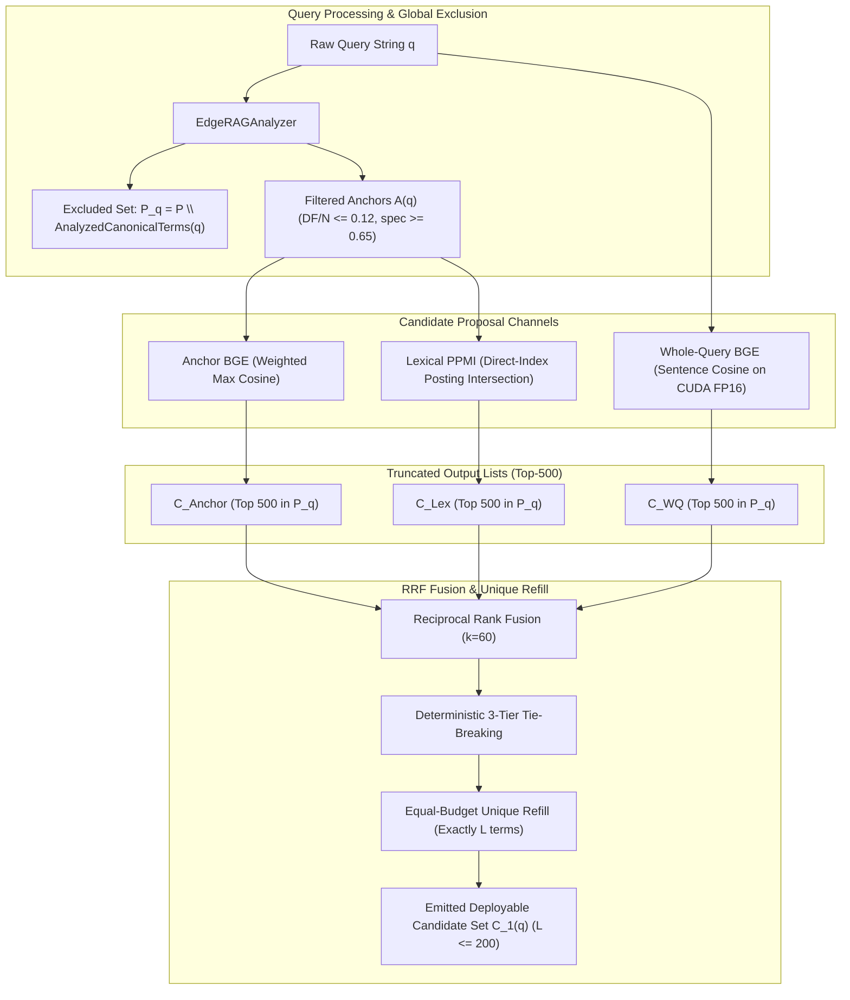

# Pathway Specification: Gate 1 Candidate Selection Under Uncertainty (`pathway_gate1_selection.md`)

## 1. Overview
Gate 1 implements the high-recall, low-latency candidate proposal stage of Edge-RAG Phase 2. Its sole objective is to retain useful expansion terms from the static 10,000-term vocabulary pool $\mathcal{P}$, passing a compact, high-quality candidate set $C_1(q)$ ($L \le 200$) downstream to Gate 2 (Context Verification) without deciding final lexical weights.

Gate 1 operates strictly under the edge hardware profile (WSL2 Linux, 15 GiB RAM ceiling) and evaluates four distinct proposal channels:
1. **$S_{\text{WQ}}$ — Whole-Query BGE Proposer**: Encodes raw query string with `BAAI/bge-small-en-v1.5` on CUDA FP16, evaluating cosine similarity against precomputed canonical pool surface forms.
2. **$S_{\text{Anchor}}$ — Anchor-to-Term BGE Proposer**: Extracts query anchors using `EdgeRAGAnalyzer`, applies high-DF filtering ($DF/N \le 0.12$) and specificity filtering ($\text{spec} \ge 0.65$), computing specificity-weighted max cosine similarity.
3. **$S_{\text{Lex}}$ — Lexical PPMI Proposer**: Evaluates unsmoothed Positive Pointwise Mutual Information directly from Terrier inverted and direct index postings, requiring joint support $DF(a,t) \ge 2$.
4. **$S_{\text{RRF}}$ — Hybrid Reciprocal Rank Fusion**: Fuses truncated top-500 candidate rankings with $k=60$, deterministic 3-tier tie-breaking, and equal-budget unique refill.

---

## 2. Architecture & Data Flow

---

## 3. Mathematical Formulations

### 3.1 Candidate Universe Invariants
- **Global Eligible Pool**:
  $$\mathcal{P}_q = \mathcal{P} \setminus \operatorname{AnalyzedCanonicalTerms}(q), \quad |\mathcal{P}| = \min(10,000, |V_{\text{eligible}}|)$$
- **Reference Evaluation Universe**:
  $$\mathcal{R}_q^{\text{core}} = (\mathcal{T}_{\text{Phase1},q} \cap \mathcal{P}_q) \cup C^{\text{WQ}}_{500}(q) \cup C^{\text{AnchorFiltered}}_{500}(q) \cup C^{\text{AnchorAll}}_{500}(q) \cup C^{\text{Lex}}_{500}(q)$$

### 3.2 Opportunity Metrics
- **Safe Ranking Gain**:
  $$g^{\text{rank}}_{q,t} = \max\left(0, \; \max_{\mu : \Delta R@1000(q,t,\mu) \ge -\tau} \Delta\text{nDCG}@10(q,t,\mu)\right), \quad \tau = 10^{-5}$$
- **Reference Ceiling**: $\hat{g}_q^* = \max_{t \in \mathcal{R}_q} g^{\text{rank}}_{q,t}$.
- **Material Ranking-Helpful Set**: $H_q^{\text{rank}}(\delta) = \{t \in \mathcal{R}_q : g^{\text{rank}}_{q,t} \ge \delta\}$.
- **Material Near-Best Set**: $H_q^{\text{near}}(\rho, \delta) = \{t \in \mathcal{R}_q : g^{\text{rank}}_{q,t} \ge \max(\delta, \rho \hat{g}_q^*)\}$.
- **Reference Best-Opportunity Retention (ReferenceBOR)**:
  $$\operatorname{ReferenceBOR}@L(q) = \begin{cases} \dfrac{\max_{t \in C_{1,L}(q)} g^{\text{rank}}_{q,t,+}}{\hat{g}_q^*}, & \hat{g}_q^* > \tau \\ \text{NA}, & \hat{g}_q^* \le \tau \end{cases}$$
- **Near-Best Opportunity Hit**:
  $$\operatorname{NearBestHit}@L(q; \rho, \delta) = \begin{cases} 1\left\{C_{1,L}(q) \cap H_q^{\text{near}}(\rho, \delta) \ne \varnothing\right\}, & \hat{g}_q^* \ge \delta \\ \text{NA}, & \hat{g}_q^* < \delta \end{cases}$$

### 3.3 Deep-Recall Opportunity
- **Recall-Helpful Set**:
  $$H^{\text{rec}}_{q,K} = \left\{t \in \mathcal{R}_q : \exists \mu, \operatorname{NetRelDocs}@K(q,t,\mu) \ge 1 \land \Delta\text{nDCG}@10(q,t,\mu) \ge -\epsilon\right\}$$
- **Proposer Recall Coverage**:
  $$\operatorname{RecallHit}@L,K(q) = \begin{cases} 1\left\{C_{1,L}(q) \cap H^{\text{rec}}_{q,K} \ne \varnothing\right\}, & r^*_{q,K} \ge 1 \\ \text{NA}, & r^*_{q,K} = 0 \end{cases}$$

---

## 4. Hardware Budgets & Execution Constraints
- **RAM Ceiling**: Strictly bounded under 15 GiB. Incremental query-by-query streaming writes for sparse document transition tables.
- **Latency Target**: Query encoding $< 5$ ms; GPU matrix dot-product $< 2$ ms; Lexical direct-index posting intersection $< 15$ ms; Total Gate 1 execution $< 25$ ms.
- **Deployment Cap**: $L_{\text{deploy,max}} = 200$ terms.

## 5. Results files

All 25 required files for reviewer inspection have been copied into [`for_review/selection_phase/gate_1/`](file:///home/donghv/Projects/Edge-RAG/for_review/selection_phase/gate_1):

### 1. Implementation, Architecture & Tests
- [`gate1_proposers.py`](file:///home/donghv/Projects/Edge-RAG/for_review/selection_phase/gate_1/gate1_proposers.py) — Implementations of WholeQuery BGE, Anchor BGE Filtered/All, Lexical PPMI, and RRF Hybrid proposers.
- [`gate1_metrics.py`](file:///home/donghv/Projects/Edge-RAG/for_review/selection_phase/gate_1/gate1_metrics.py) — Core metric functions: $\text{ReferenceBOR}$, $\text{NearBestHit}$, $\text{RecallHit}$, $\text{DocOpportunityRecall}$, and waste metrics.
- [`pathway_gate1_selection.md`](file:///home/donghv/Projects/Edge-RAG/for_review/selection_phase/gate_1/pathway_gate1_selection.md) — Tier 2 architectural and algorithmic specification.
- [`run_gate1_oracle_evaluation.py`](file:///home/donghv/Projects/Edge-RAG/for_review/selection_phase/gate_1/run_gate1_oracle_evaluation.py) — PyTerrier-backed counterfactual retrieval and evaluation harness.
- [`compile_gate1_research_tables.py`](file:///home/donghv/Projects/Edge-RAG/for_review/selection_phase/gate_1/compile_gate1_research_tables.py) — Statistical compilation script with paired query bootstrap CIs ($B=1,000$) and Gates A–D selection hierarchy.
- [`test_gate1_selection.py`](file:///home/donghv/Projects/Edge-RAG/for_review/selection_phase/gate_1/test_gate1_selection.py) — Unit and regression test suite.

---

### 2. Research Reports & Manifests
- [`gate1_dev_report.md`](file:///home/donghv/Projects/Edge-RAG/for_review/selection_phase/gate_1/gate1_dev_report.md) — Empirical report on 4 Development corpora (`scifact`, `bright_aops`, `nfcorpus`, `trec_covid`).
- [`gate1_ext_report.md`](file:///home/donghv/Projects/Edge-RAG/for_review/selection_phase/gate_1/gate1_ext_report.md) — Empirical report on 4 Held-Out Extension corpora (`fiqa`, `scidocs`, `arguana`, `bright_stackoverflow`).
- [`gate1_master_report.md`](file:///home/donghv/Projects/Edge-RAG/for_review/selection_phase/gate_1/gate1_master_report.md) — Combined master empirical report across all 8 benchmark corpora (400 queries, 3,795,175 variants).
- [`run_manifest_dev.json`](file:///home/donghv/Projects/Edge-RAG/for_review/selection_phase/gate_1/run_manifest_dev.json) & [`run_manifest_ext.json`](file:///home/donghv/Projects/Edge-RAG/for_review/selection_phase/gate_1/run_manifest_ext.json) — Environment, git commit, and execution telemetry manifests.
- [`frozen_gate1_config_dev.json`](file:///home/donghv/Projects/Edge-RAG/for_review/selection_phase/gate_1/frozen_gate1_config_dev.json) — Winning configuration `RRF_Core_L200` with frozen SHA-256 hash (`d62ffe3bd8d381f7...`).
- [`frozen_gate1_config_ext.json`](file:///home/donghv/Projects/Edge-RAG/for_review/selection_phase/gate_1/frozen_gate1_config_ext.json) & [`frozen_gate1_config_combined.json`](file:///home/donghv/Projects/Edge-RAG/for_review/selection_phase/gate_1/frozen_gate1_config_combined.json) — Extension and combined configuration verification logs.

---

### 3. Empirical Research Tables (CSV)
- **Table 1 (Q1: Opportunity Ceiling vs Baseline):**
  - [`table1_reference_ceiling_dev.csv`](file:///home/donghv/Projects/Edge-RAG/for_review/selection_phase/gate_1/table1_reference_ceiling_dev.csv)
  - [`table1_reference_ceiling_ext.csv`](file:///home/donghv/Projects/Edge-RAG/for_review/selection_phase/gate_1/table1_reference_ceiling_ext.csv)
  - [`table1_reference_ceiling_combined.csv`](file:///home/donghv/Projects/Edge-RAG/for_review/selection_phase/gate_1/table1_reference_ceiling_combined.csv)
- **Table 2 (Q2: Proposal Channels at Cap $L=200$):**
  - [`table2_channel_comparison_dev.csv`](file:///home/donghv/Projects/Edge-RAG/for_review/selection_phase/gate_1/table2_channel_comparison_dev.csv)
  - [`table2_channel_comparison_ext.csv`](file:///home/donghv/Projects/Edge-RAG/for_review/selection_phase/gate_1/table2_channel_comparison_ext.csv)
  - [`table2_channel_comparison_combined.csv`](file:///home/donghv/Projects/Edge-RAG/for_review/selection_phase/gate_1/table2_channel_comparison_combined.csv)
- **Table 6 (Q6: Retention Knee Curves across $L \in \{10, 20, 50, 100, 200\}$):**
  - [`table6_budget_sensitivity_dev.csv`](file:///home/donghv/Projects/Edge-RAG/for_review/selection_phase/gate_1/table6_budget_sensitivity_dev.csv)
  - [`table6_budget_sensitivity_ext.csv`](file:///home/donghv/Projects/Edge-RAG/for_review/selection_phase/gate_1/table6_budget_sensitivity_ext.csv)
  - [`table6_budget_sensitivity_combined.csv`](file:///home/donghv/Projects/Edge-RAG/for_review/selection_phase/gate_1/table6_budget_sensitivity_combined.csv)

---

### 4. Master Parquet Datasets
- [`gate1_candidate_audit.parquet`](file:///home/donghv/Projects/Edge-RAG/for_review/selection_phase/gate_1/gate1_candidate_audit.parquet) — Combined master audit dataset ($23.67\text{ MB}$, $3,795,175\text{ rows}$) covering all evaluated candidate actions.
- [`gate1_sparse_transitions_ext.parquet`](file:///home/donghv/Projects/Edge-RAG/for_review/selection_phase/gate_1/gate1_sparse_transitions_ext.parquet) — Extension sparse document transitions dataset ($3.46\text{ MB}$, $564,440\text{ rows}$).
