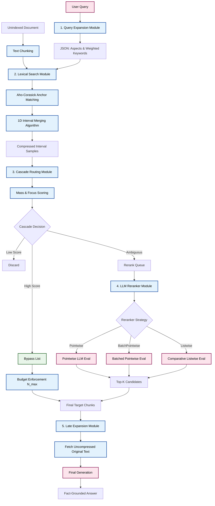

# Extractive-Compression RAG: Legacy Pipeline Architecture

This document represents the legacy state of the 5 core modules in the `src/legacy_pipeline/` directory. Maintained for historical baseline comparisons.

## Step-by-Step Flow

### 1. Query Expansion (`src/legacy_pipeline/query_expansion/`)
The first module resolves vocabulary mismatch before the CPU-bound search. The user query is expanded into orthogonal relational **aspects** and corresponding **keywords** with assigned weights.
- Depending on the configuration, this operates via lightweight statistical extraction (e.g., FastText/IDF) or neural dense vocabulary projections.
- **Output:** A structured JSON representation of aspects, containing synonyms/keywords and their precision weights.

**Active Evaluation Approaches:**
- **Aspect Only**:
  - `Dense_Vocab_V1` / `Dense_Vocab_V3` (Neural Dense Vocabulary Probe): Probes the corpus space using grounding embeddings (e.g., BGE) to extract relevant aspects.
- **Aspect with Similar Keywords**:
  - `Statistical_IDF` (FastText-based statistical expansion): Expands aspect terms with similar vocabulary from FastText, weighted by Inverse Document Frequency (IDF).

*Note: Underperforming methods like YAKE, LLM-based Aspect Extraction, LLM-based Query Expansion, and Vector Projection have been pruned from the primary benchmark pipeline.*

### 2. Lexical Search & Compression (`src/legacy_pipeline/lexical_search/`)
Using the keywords generated in Step 1, this module executes a deterministic, CPU-bound string matching search across the unindexed document chunks.
- **Aho-Corasick Matching:** Scans chunks for keyword anchors.
- **Context Windows:** Expands a symmetric window around each anchor point to preserve localized syntax.
- **1D Interval Merging Algorithm:** Overlapping windows are mathematically collapsed into disjoint, continuous text spans, stripping away irrelevant prose and lossily compressing the chunk.

**Current Approaches:**
- **Base Lexical Search:** Standard Aho-Corasick matching supporting multiple weighted keywords per aspect.
- **Aspect-Only Lexical Search:** Highly optimized extraction path assuming single-term aspects with maximum precision weights.

### 3. Cascade Routing (`src/legacy_pipeline/routing/`)
The extracted, compressed intervals are evaluated to determine their relevance without requiring an LLM forward pass for obvious hits.
- **Mass ($\mu$) & Focus ($\phi$):** Calculates the chunk's total weighted density (Mass) and the concentration of its longest unbroken span (Focus).
- **Three-Way Triage:** Chunks are routed into three discrete buckets:
  - **Bypass:** Highly relevant chunks bypass the reranker entirely (Zero KV cost).
  - **Discard:** Irrelevant chunks are dropped entirely.
  - **Rerank:** Ambiguous, fragmented chunks are sent to the `Rerank_Queue`.
- **VRAM Enforcement:** Bypassed chunks are capped at $N_{max}$ to strictly prevent OOM failures.

**Current Approaches:**
- **Cost-Aware Cascade Routing:** Independent Mass and Focus scoring for nuanced three-way triage.
- **Legacy Additive Routing:** Baseline thresholding utilizing contiguous and scattered density sums ($\rho_{cont} + \rho_{scat}$).

### 4. LLM Reranking (`src/legacy_pipeline/llm_reranker/`)
Chunks placed in the `Rerank_Queue` undergo evaluation by the generative LLM to filter out false positives.
- **JSON Structuring:** Within each chunk, multiple discontinuous compressed evidence samples are formatted inside a JSON envelope (`chunk_id` and `evidence_samples`). This prevents sequence-break hallucinations, prompting the LLM to treat them as independent data points rather than continuous prose.
- **Strict Response Schema:** The LLM responds conforming to a JSON schema, returning evaluated candidate chunks sorted by confidence.
- **Filtering & Sorting:** Only chunks classified as relevant are accepted and merged into the final retrieval list.

**Current Implementations (See `src/legacy_pipeline/llm_reranker/pathway_llm_reranker.md`):**
- `LLMReranker`: Pointwise evaluation (1 HTTP call per chunk; full relevance + score schema).
- `BatchPointwiseLLMReranker`: Batched pointwise evaluation (batch size = 5; evaluates multiple chunks per prompt).
- `ListwiseLLMReranker`: Global comparative listwise reranking (batch size = 10; returns array of relevant chunk IDs for minimal latency & token overhead).

### LLM Reranker Diagnostics
To evaluate and optimize the reranking process, the pipeline is instrumented with diagnostics:
- **Recall & Precision**:
  - **Reranker Recall**: $\frac{\text{Ground Truth accepted by Reranker}}{\text{Ground Truth in Rerank Queue}}$ — Measures the rate at which relevant chunks are correctly preserved.
  - **Reranker Precision**: $\frac{\text{Ground Truth accepted by Reranker}}{\text{Total Chunks accepted by Reranker}}$ — Measures the density of relevant chunks in the final reranked output.
- **Compression Ratio**:
  - For each chunk, measures $\frac{\text{Character Length of Merged Samples}}{\text{Original Chunk Character Length}}$. Tracks the average compression ratio for bypassed chunks versus reranked chunks.
- **False Negatives Tracing**:
  - Logs the specific IDs of ground-truth chunks that entered the reranking queue but were classified as irrelevant (discarded) by the LLM.

---

## 5. Late Context Expansion (`src/legacy_pipeline/late_expansion/`)
Restores full uncompressed chunk text from winner indices, enforces hardware VRAM safety budget ($N_{max} \le 10$), and prompts the local LLM to generate the final answer.

---

## Complete Architecture Diagram

