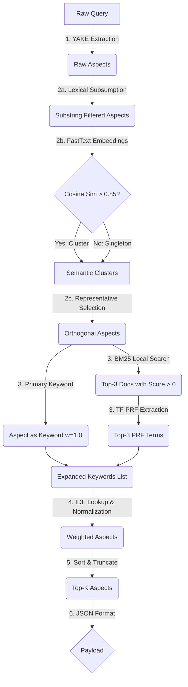

# Pathway A: The Statistical & Lexical Route (YAKE + FastText Clustering + IDF + PRF)

This pathway relies on rapid statistical math, pre-computed IDF dictionaries, and optional local BM25 Pseudo-Relevance Feedback (PRF), avoiding heavy dense neural networks like BGE.

Implementation file: [`idf_statistical.py`](file:///home/donghv/Projects/Edge-RAG/src/legacy_pipeline/query_expansion/aspect_with_similar_keywords/idf_statistical.py)

---

## 1. Step-by-Step Description

1. **Aspect Extraction:** The raw user query is parsed by the YAKE statistical algorithm (`n=3`, `dedupLim=0.9`, `top=20`). YAKE evaluates word position, casing, and co-occurrence to extract candidate phrases (Aspects).
2. **Orthogonalization (Lexical & Semantic De-duplication):**
   - **2a. Global Lexical Subsumption:** Overlapping n-grams (e.g. `"adobe creative cloud"` vs `"creative cloud"`) are deduplicated. Aspects are sorted by character length descending, dropping any candidate that is a substring of an already-retained longer candidate.
   - **2b. Semantic Clustering:** The lexically-filtered aspects are embedded using a FastText bag-of-words model (`cc.en.50.bin`). Pairwise cosine similarity is computed. If two aspects have similarity $> 0.85$, they are grouped into the same semantic cluster. Unique aspects pass through as singleton clusters.
   - **2c. Representative Selection:** From each semantic cluster, the longest aspect string is selected as the cluster representative (`orthogonal_aspects`). If no aspects remain, the raw query is preserved as fallback.
3. **Keyword Exploration (BM25 PRF):** For each orthogonal aspect:
   - The aspect itself is included as the primary keyword with weight `1.0`.
   - If corpus documents are provided, a BM25Okapi search retrieves up to the top 3 documents with positive BM25 scores.
   - High-frequency co-occurring terms (`len(token) > 3`) not present in the aspect are extracted. The top 3 terms are normalized by max term frequency to $[0, 1]$ and appended as expanded keywords.
4. **Weight Assignment (IDF Normalization):**
   - For each aspect, the average IDF of its constituent words is computed using the corpus `idf_dictionary` (or `idf_dict`).
   - The aspect weight is normalized against `max_idf` in the corpus: `aspect_weight = round(avg_idf / max_idf, 2)`.
5. **Top-K Pruning:** Aspects are sorted by `aspect_weight` in descending order and truncated to top $K$ (default $K=5$).
6. **Formatting:** Packed into the standard Edge-RAG JSON payload matching `QUERY_EXPANSION_SCHEMA` (`{"aspects": [{"name": ..., "aspect_weight": ..., "keywords": [...]}]}`).

---

## 2. Python Class Contract & Signature

```python
class StatisticalQueryExpander:
    def __init__(self, 
                 fasttext_model_path: str = "data/models/cc.en.50.bin",
                 idf_dictionary: Dict[str, float] = None,
                 corpus_documents: List[str] = None,
                 idf_dict: Dict[str, float] = None):
        ...

    def expand(self, query: str, K: int = 5) -> Dict[str, Any]:
        ...
```

---

## 3. Pseudo-Algorithm

```python
def expand_query_statistical(query: str, K=5) -> dict:
    # 1. Aspect Extraction via YAKE
    raw_aspects = yake_extractor.extract_keywords(query)
    
    # 2a. Global Lexical Subsumption
    lexically_filtered = []
    for aspect in sorted(raw_aspects, key=len, reverse=True):
        if not any(aspect in existing for existing in lexically_filtered):
            lexically_filtered.append(aspect)
            
    # 2b. Semantic Clustering via FastText Cosine Similarity
    aspect_vectors = {asp: fasttext.embed(asp) for asp in lexically_filtered}
    semantic_clusters = cluster_vectors(lexically_filtered, aspect_vectors, threshold=0.85)
    
    # 2c. Representative Selection
    orthogonal_aspects = [max(cluster, key=len) for cluster in semantic_clusters]
    if not orthogonal_aspects and query.strip():
        orthogonal_aspects = [query]
        
    # 3. Keyword Exploration (BM25 Pseudo-Relevance Feedback)
    aspect_data = []
    for aspect in orthogonal_aspects:
        expanded_keywords = [{"term": aspect, "weight": 1.0}]
        if corpus_documents:
            top_docs = bm25_search(aspect, limit=3, min_score=0.0)
            prf_terms = extract_top_tf_terms(top_docs, exclude=aspect, limit=3)
            for term, freq in prf_terms:
                expanded_keywords.append({"term": term, "weight": round(freq / max_freq, 2)})
        aspect_data.append({"term": aspect, "keywords": expanded_keywords})
        
    # 4. IDF Weight Assignment
    max_idf = max(idf_dictionary.values()) if idf_dictionary else 1.0
    for item in aspect_data:
        avg_idf = mean([idf_dictionary.get(w, 0.1) for w in item["term"].split()])
        item["aspect_weight"] = round(avg_idf / max_idf, 2)
        
    # 5. Top-K Pruning
    aspect_data.sort(key=lambda x: x["aspect_weight"], reverse=True)
    top_k = aspect_data[:K]
    
    # 6. Formatting
    return {"aspects": [{"name": x["term"], "aspect_weight": x["aspect_weight"], "keywords": x["keywords"]} for x in top_k]}
```

---

## 4. Architecture Flowchart


