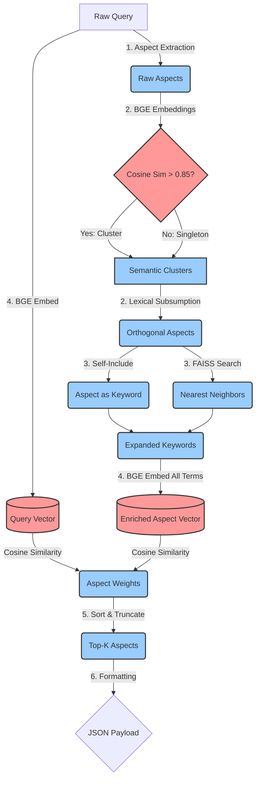

# Pathway B: The Unified Vector Route (BGE + FAISS)

This pathway achieves state-of-the-art semantic reasoning by leveraging a single, lightweight dense embedding model (BGE-Micro) and a pre-computed FAISS dictionary index in RAM.

## 1. Step-by-Step Description

1.  **Aspect Extraction:** The raw user query is parsed by the YAKE statistical algorithm to extract a list of candidate phrases (Aspects).
2.  **Orthogonalization:** 
    *   *Semantic:* The extracted Aspects are embedded using BGE. Pairwise cosine similarity is calculated. If two aspects have a similarity > 0.85, they are clustered together. Aspects that are not similar to anything pass through as singleton clusters.
    *   *Lexical:* Within each distinct semantic cluster, lexical subsumption is applied to delete redundant substrings. The longest phrase survives as the cluster representative.
3.  **Keyword Exploration:** For each orthogonal Aspect, we query its vector against a pre-computed FAISS index (loaded in RAM during warm-up). The aspect's own term is always included as the first keyword with weight `1.0`. The FAISS index returns the top 3 nearest semantic neighbors as additional Keywords, weighted by their cosine distance.
4.  **Weight Assignment:** The *entire* original query is embedded by BGE to produce a query vector. Each Aspect is re-embedded as a richer composite: the aspect name combined with all its expanded keywords from step 3 (e.g., `"renal failure kidney nephritis hepatic"`). The `aspect_weight` is set to the cosine similarity between this enriched aspect vector and the query vector. Each keyword's weight was already assigned during expansion (step 3) via FAISS cosine distance.
5.  **Top-K Pruning:** The Aspects are sorted by their Semantic Projection weight. Only the top `K` (e.g., 5) aspects are retained to eliminate semantic noise.
6.  **Formatting:** The data is packed into the standard Edge-RAG JSON schema (matching `QUERY_EXPANSION_SCHEMA` from `query_expansion_llm.py`) and returned.

---

## 2. Pseudo-Algorithm

```python
def expand_query_vector(raw_query: str, K=5) -> dict:
    # Pre-computation (Done in warm-up)
    # faiss_index = load_faiss_into_ram()
    # bge_model = load_bge_micro()
    
    # 1. Aspect Extraction
    raw_aspects = yake_extract(raw_query)
    
    # 2. Orthogonalization
    aspect_vectors = {asp: bge_model.embed(asp) for asp in raw_aspects}
    semantic_clusters = cluster_vectors(raw_aspects, aspect_vectors, threshold=0.85)
    # Note: aspects not similar to anything form singleton clusters
    
    orthogonal_aspects = []
    for cluster in semantic_clusters:
        # Lexical subsumption ONLY inside the semantic cluster
        # Keep the longest phrase as the cluster representative
        best_aspect = apply_lexical_subsumption(cluster)
        orthogonal_aspects.append(best_aspect)
    
    # 3. Keyword Exploration (BEFORE weight assignment)
    aspect_data = []
    for aspect in orthogonal_aspects:
        aspect_vec = aspect_vectors.get(aspect, bge_model.embed(aspect))
        
        # The aspect's own term is always the first keyword
        expanded_keywords = [{"term": aspect, "weight": 1.0}]
        
        # Query FAISS index using the aspect's vector
        neighbors = faiss_index.search(aspect_vec, top_n=3)
        for word, sim_score in neighbors:
            expanded_keywords.append({"term": word, "weight": sim_score})
        
        aspect_data.append({
            "term": aspect,
            "keywords": expanded_keywords
        })
    
    # 4. Weight Assignment (AFTER expansion — uses enriched vector)
    query_vector = bge_model.embed(raw_query)
    for item in aspect_data:
        # Build enriched text: aspect name + all expanded keyword terms
        all_terms = " ".join([kw["term"] for kw in item["keywords"]])
        enriched_vector = bge_model.embed(all_terms)
        item["aspect_weight"] = cosine_similarity(query_vector, enriched_vector)
        
    # 5. Top-K Pruning
    aspect_data.sort(key=lambda x: x["aspect_weight"], reverse=True)
    top_k = aspect_data[:K]
    
    # 6. Formatting
    final_payload = {"aspects": []}
    for item in top_k:
        final_payload["aspects"].append({
            "name": item["term"],
            "aspect_weight": item["aspect_weight"],
            "keywords": item["keywords"]
        })
    return final_payload
```

---

## 3. Architecture Diagram


