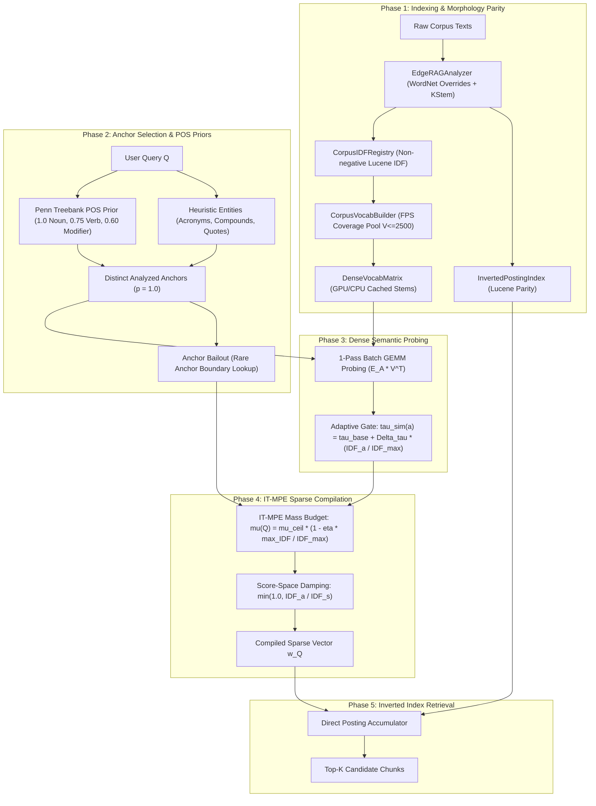

# Pathway Specification: V7 5-Phase Anchored Lexical-Semantic Retriever (`pathway_v7_anchored_retriever.md`)

## 1. Overview
`V7AspectExtractor` implements the 5-Phase production retrieval architecture of Edge-RAG. It unifies Lucene morphology, fast index-time FPS vocabulary sampling, batch GEMM semantic probing, and Information-Theoretic Mass-Preserving Expansion (IT-MPE).

Unlike legacy string-repetition schemas (1, 5a, 5b, 6a, 6b), V7 compiles directly to a sparse term-weight dictionary $\vec{w}_Q$, which is evaluated via `BM25LuceneIndexer(mode="parity")` / `InvertedPostingIndex.retrieve_weighted()`.

---

## 2. Five-Phase Architecture



---

## 3. Mathematical Formulations

### 3.1 Non-Negative Lucene IDF & Morphology Parity
The shared IDF registry calculates Lucene IDF over all analyzed corpus terms:
$$\text{IDF}(t) = \ln\left(1.0 + \frac{N_{\text{docs}} - \text{DF}(t) + 0.5}{\text{DF}(t) + 0.5}\right)$$
- **WordNet Suppletion Overrides:** Irregular inflections (`went` $\to$ `go`, `children` $\to$ `child`, `better` $\to$ `good`) are mapped before KStem.
- **Technical Exemption:** Technical compound terms containing hyphens/dots/digits (`qwen2.5-7b`, `fp16`) bypass stemming.
- **OOV Clamping:** Unseen query terms receive $\text{IDF}_{\text{max}} = \ln(1.0 + \frac{N_{\text{docs}} - 0.5}{0.5})$.

### 3.2 Greedy Farthest-Point Sampling (FPS) Vocabulary Pool
To avoid $V \times V$ matrix materialization when sampling $V_{\text{target}} = 2500$ hubs from $N_{\text{corpus}}$ stems:
1. Embed all analyzed candidate stems using their canonical surface forms.
2. Initialize with point $x_0$, distance vector $d_i = 1.0 - \mathbf{e}_i \cdot \mathbf{e}_0$.
3. Iteratively select $x_{k} = \arg\max_i d_i$ and update $d_i \leftarrow \min(d_i, 1.0 - \mathbf{e}_i \cdot \mathbf{e}_k)$.

### 3.3 Phase 2 Anchor Prior Weighting
Anchors are initialized with POS prior weights:
$$w_{\text{base}}(a) = \begin{cases} 1.0 & \text{if } a \text{ is Noun / Acronym / Quoted Entity} \\ 0.75 & \text{if } a \text{ is Verb} \\ 0.60 & \text{if } a \text{ is Modifier / Other} \end{cases}$$

### 3.4 Adaptive Semantic Similarity Gating
For each anchor $a$, candidate similarity is evaluated against the coverage pool $\mathbf{V}$:
$$\tau_{\text{sim}}(a) = \tau_{\text{base}} + \Delta\tau \cdot \min\left(1.0, \frac{\text{IDF}(a)}{\text{IDF}_{\text{max}}}\right)$$
where default $\tau_{\text{base}} = 0.55$, $\Delta\tau = 0.0$.

### 3.5 IT-MPE Mass Allocation & Score-Space Damping
The query-level expansion mass budget $\mu(Q)$ is bounded by:
$$\mu(Q) = \mu_{\text{ceil}} \cdot \left(1.0 - \eta \cdot \frac{\max_{a \in Q} \text{IDF}(a)}{\text{IDF}_{\text{max}}}\right)$$
Each qualifying synonym $s_k$ receiving conditional probability mass $p(s_k \mid a) = \frac{\text{CosSim}(a, s_k)}{\sum_m \text{CosSim}(a, s_m)}$ has weight:
$$w(s_k) = w_{\text{base}}(a) \cdot \min\left(1.0, \frac{\text{IDF}(a)}{\text{IDF}(s_k)}\right) \cdot \left(\mu(Q) \cdot p(s_k \mid a)\right)$$

---

## 4. Parameter Defaults & Configuration Contracts

All parameters are configured in [`configs/pipeline_v2.yaml`](file:///home/donghv/Projects/Edge-RAG/configs/pipeline_v2.yaml):

```yaml
pipeline_v2:
  schema: "BM25Dense_V7"
  indexer:
    stemmer: "kstem"
    use_wordnet_override: true
    mode: "parity"
    vocab_selection: "coverage"
    max_vocab_pool_size: 2500
  expansion:
    pos_ratios:
      noun: 1.0
      verb: 0.75
      modifier: 0.60
    tau_base: 0.55
    delta_tau: 0.0
    beta: 1.0
    mu_ceil: 0.50
    eta: 0.0
    bailout_tau_idf: 3.0
    min_len_rescue: 3
    bge_model_name: "BAAI/bge-small-en-v1.5"
```
