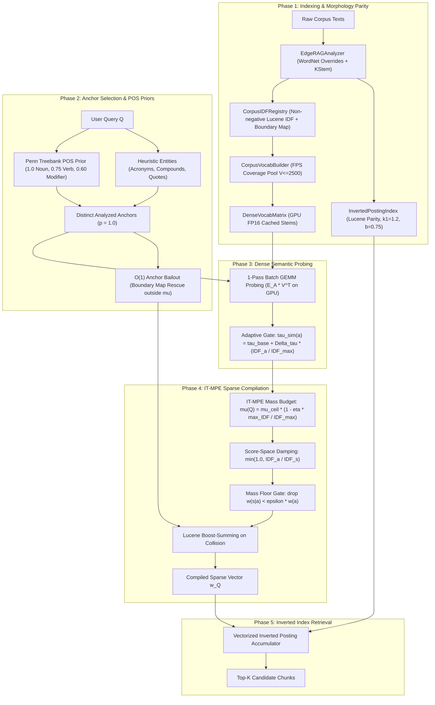

# Pathway Specification: V7 5-Phase Anchored Lexical-Semantic Retriever (`pathway_v7_anchored_retriever.md`)

## 1. Overview
`V7AspectExtractor` implements the 5-Phase production retrieval architecture of Edge-RAG. It unifies Lucene morphology, fast index-time FPS vocabulary sampling, batch GEMM semantic probing, and Information-Theoretic Mass-Preserving Expansion (IT-MPE).

Unlike legacy string-repetition schemas (1, 5a, 5b, 6a, 6b), V7 compiles directly to a sparse term-weight dictionary $\vec{w}_Q$, which is evaluated via `BM25LuceneIndexer(mode="parity")` / `InvertedPostingIndex.retrieve_weighted()`.

---

## 2. Five-Phase Architecture



---

## 3. Mathematical Formulations

### 3.1 Non-Negative Lucene IDF & Morphology Parity
The shared IDF registry calculates Lucene IDF over all analyzed corpus terms:
$$\text{IDF}(t) = \ln\left(1.0 + \frac{N_{\text{docs}} - \text{DF}(t) + 0.5}{\text{DF}(t) + 0.5}\right)$$
- **WordNet Suppletion Overrides:** Irregular inflections (`went` $\to$ `go`, `children` $\to$ `child`, `better` $\to$ `good`, `ran` $\to$ `run`, `saw` $\to$ `see`) are mapped before KStem.
- **Technical Compound Exemption:** Technical compound terms containing hyphens/dots/digits (`qwen2.5-7b`, `fp16`) bypass destructive stemming.
- **OOV Clamping:** Unseen query terms receive $\text{IDF}_{\text{max}} = \ln(1.0 + \frac{N_{\text{docs}} - 0.5}{0.5})$.
- **Pre-Indexed Compound Boundary Map:** Sub-tokens delimited by punctuation or digits are indexed at startup for $O(1)$ query-time bailout.

### 3.2 Greedy Farthest-Point Sampling (FPS) Vocabulary Pool
To avoid $V \times V$ matrix materialization when sampling $V_{\text{target}} = 2500$ hubs from $N_{\text{corpus}}$ stems:
1. Embed all analyzed candidate stems using their canonical surface forms.
2. Initialize with point $x_0$, distance vector $d_i = 1.0 - \mathbf{e}_i \cdot \mathbf{e}_0$.
3. Iteratively select $x_{k} = \arg\max_i d_i$ and update $d_i \leftarrow \min(d_i, 1.0 - \mathbf{e}_i \cdot \mathbf{e}_k)$ via GPU FP16 tensors.

### 3.3 Phase 2 Anchor Prior Weighting
Anchors are initialized with POS prior weights:
$$w_{\text{base}}(a) = \begin{cases} 1.0 & \text{if } a \text{ is Noun / Acronym / Quoted Entity} \\ 0.75 & \text{if } a \text{ is Verb} \\ 0.60 & \text{if } a \text{ is Modifier / Other} \end{cases}$$

### 3.4 Adaptive Semantic Similarity Gating
For each anchor $a$, candidate similarity is evaluated against the coverage pool $\mathbf{V}$:
$$\tau_{\text{sim}}(a) = \tau_{\text{base}} + \Delta\tau \cdot \min\left(1.0, \frac{\text{IDF}(a)}{\text{IDF}_{\text{max}}}\right)$$
where default $\tau_{\text{base}} = 0.55$, $\Delta\tau = 0.0$.

### 3.5 IT-MPE Mass Allocation, Score-Space Damping & Mass Floor
1. **Expansion Mass Budget:**
   $$\mu(Q) = \mu_{\text{ceil}} \cdot \left(1.0 - \eta \cdot \frac{\max_{a \in Q} \text{IDF}(a)}{\text{IDF}_{\text{max}}}\right)$$
2. **Conditional Mass Allocation:**
   $$p(s_k \mid a) = \frac{\text{CosSim}(a, s_k)}{\sum_{m} \text{CosSim}(a, s_m)}$$
   $$w(s_k \mid a) = w_{\text{base}}(a) \cdot \min\left(1.0, \frac{\text{IDF}(a)}{\text{IDF}(s_k)}\right) \cdot \left(\mu(Q) \cdot p(s_k \mid a)\right)$$
3. **Mass Floor Sparsity Control:**
   Drop synonyms with:
   $$w(s_k \mid a) < \varepsilon \cdot w_{\text{base}}(a)$$
   *(Default: $\varepsilon = 0.0$ for pure gate-only expansion)*.
4. **Lucene Boost-Summing on Collision:**
   When multiple distinct anchors expand to the same vocabulary term $t$:
   $$w_{\text{final}}(t) = \sum_{a \in Q} w(t \mid a)$$
5. **Anchor Bailout Rescue (Outside $\mu(Q)$):**
   Out-of-pool technical compounds retrieved via `boundary_prefix_map` receive:
   $$w(b \mid a) = w_{\text{base}}(a) \cdot \min\left(1.0, \frac{\text{IDF}(a)}{\text{IDF}(b)}\right)$$

---

## 4. Parameter Defaults & Configuration Contracts

All parameters are configured in [`configs/pipeline_v2.yaml`](file:///home/donghv/Projects/Edge-RAG/configs/pipeline_v2.yaml):

```yaml
pipeline_v2:
  schema: "BM25Dense_V7"
  indexer:
    stemmer: "kstem"
    use_wordnet_override: true
    mode: "parity"
    vocab_selection: "coverage"
    max_vocab_pool_size: 2500
  expansion:
    pos_ratios:
      noun: 1.0
      verb: 0.75
      modifier: 0.60
    tau_base: 0.55
    delta_tau: 0.0
    beta: 1.0
    mu_ceil: 0.50
    eta: 0.0
    mass_floor: 0.0                  # Mass floor epsilon fraction of w(a) (default: 0.0)
    bailout_tau_idf: 3.0
    min_len_rescue: 3
    bge_model_name: "BAAI/bge-small-en-v1.5"
```

---

## 5. Empirical Performance Benchmarks (10 Document-Level Corpora)

*Evaluated across 10 official document-level benchmark datasets with un-chunked full documents ($\varepsilon = 0.0$):*

### 5.1 Primary Accuracy & Latency Summary
| Benchmark Dataset | Total Docs | TTI Setup (s) | Strict@10 | DocRec@10 | Mean Query Latency | Postings Retrieval |
| :--- | :---: | :---: | :---: | :---: | :---: | :---: |
| `enterpriserag_doc_level` | 1,722 | **13.12 s** | **0.8000** | **0.8000** | **75.67 ms** | 13.26 ms |
| `liverag_doc_level` | 970 | **8.18 s** | **1.0000** | **1.0000** | **34.95 ms** | 8.59 ms |
| `beir_scifact_doc_level` | 5,183 | **8.05 s** | **0.8000** | **0.8000** | **36.67 ms** | 10.56 ms |
| `beir_nfcorpus_doc_level` | 3,633 | **5.60 s** | **0.6000** | **0.2283** | **26.08 ms** | 5.93 ms |
| `beir_fiqa_doc_level` | 57,600 | **23.76 s** | **0.8000** | **0.4167** | **30.81 ms** | 8.26 ms |
| `multihop_rag_doc_level` | 609 | **6.77 s** | **0.4000** | **0.3333** | **54.81 ms** | 11.05 ms |
| `financebench_doc_level` | 2,168 | **3.36 s** | **0.4000** | **0.2667** | **57.97 ms** | 12.82 ms |
| `bright_economics_doc_level` | 50,220 | **19.11 s** | **0.0000** | **0.0000** | **71.72 ms** | 19.91 ms |
| `bright_stackoverflow_doc_level` | 107,081 | **40.08 s** | **0.2000** | **0.1000** | **102.27 ms** | 25.52 ms |
| `bright_robotics_doc_level` | 61,961 | **17.30 s** | **0.4000** | **0.2500** | **241.30 ms** | 38.89 ms |
| **Global Macro Average** | — | **`14.54 s`** | **`0.5400`** | **`0.4195`** | **`73.22 ms`** | **`15.48 ms`** |

### 5.2 Detailed Index-Time (TTI) Breakdown
| Benchmark Dataset | BM25 Index Build | Surface-Form Scan | BGE FPS Hub Embedding | Total TTI Setup |
| :--- | :---: | :---: | :---: | :---: |
| `enterpriserag_doc_level` | 2.195 s | 2.952 s | 7.971 s | **13.119 s** |
| `liverag_doc_level` | 1.784 s | 2.226 s | 4.168 s | **8.179 s** |
| `beir_scifact_doc_level` | 1.901 s | 2.270 s | 3.885 s | **8.055 s** |
| `beir_nfcorpus_doc_level` | 1.455 s | 1.734 s | 2.415 s | **5.604 s** |
| `beir_fiqa_doc_level` | 11.603 s | 1.278 s | 10.880 s | **23.762 s** |
| `multihop_rag_doc_level` | 1.683 s | 2.087 s | 3.004 s | **6.774 s** |
| `financebench_doc_level` | 0.949 s | 1.294 s | 1.116 s | **3.359 s** |
| `bright_economics_doc_level` | 4.580 s | 0.629 s | 13.903 s | **19.113 s** |
| `bright_stackoverflow_doc_level` | 20.241 s | 1.435 s | 18.408 s | **40.084 s** |
| `bright_robotics_doc_level` | 3.137 s | 0.419 s | 13.749 s | **17.305 s** |
| **Macro Average** | **4.953 s** | **1.632 s** | **7.950 s** | **14.535 s** |

### 5.3 Detailed Query-Time Latency Breakdown
| Benchmark Dataset | Anchor Encoding | Boundary Bailout | Batch GEMM Probing | IT-MPE Mass Alloc | Postings Retrieval | Total Latency |
| :--- | :---: | :---: | :---: | :---: | :---: | :---: |
| `enterpriserag_doc_level` | 29.57 ms | 0.82 ms | 1.55 ms | 29.15 ms | 13.26 ms | **75.67 ms** |
| `liverag_doc_level` | 16.38 ms | 0.06 ms | 0.46 ms | 8.89 ms | 8.59 ms | **34.95 ms** |
| `beir_scifact_doc_level` | 16.08 ms | 0.14 ms | 0.29 ms | 9.01 ms | 10.56 ms | **36.67 ms** |
| `beir_nfcorpus_doc_level` | 16.59 ms | 0.09 ms | 0.29 ms | 2.81 ms | 5.93 ms | **26.08 ms** |
| `beir_fiqa_doc_level` | 15.15 ms | 0.80 ms | 0.20 ms | 6.09 ms | 8.26 ms | **30.81 ms** |
| `multihop_rag_doc_level` | 17.12 ms | 0.06 ms | 0.50 ms | 24.64 ms | 11.05 ms | **54.81 ms** |
| `financebench_doc_level` | 16.81 ms | 0.08 ms | 0.33 ms | 26.24 ms | 12.82 ms | **57.97 ms** |
| `bright_economics_doc_level` | 18.49 ms | 6.56 ms | 0.48 ms | 24.52 ms | 19.91 ms | **71.72 ms** |
| `bright_stackoverflow_doc_level` | 20.43 ms | 7.39 ms | 0.49 ms | 45.22 ms | 25.52 ms | **102.27 ms** |
| `bright_robotics_doc_level` | 35.24 ms | 19.98 ms | 0.95 ms | 131.99 ms | 38.89 ms | **241.30 ms** |
| **Macro Average** | **20.19 ms** | **3.60 ms** | **0.55 ms** | **30.86 ms** | **15.48 ms** | **73.22 ms** |
