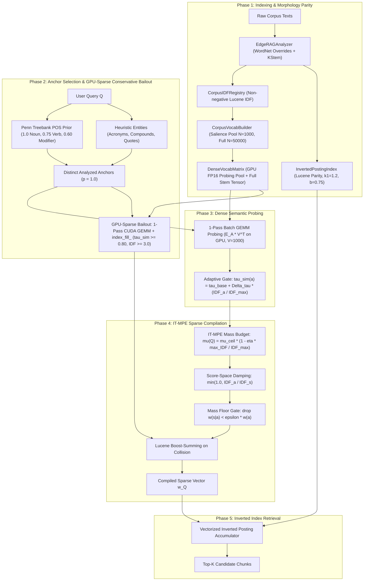

# Pathway Specification: V7 5-Phase Anchored Lexical-Semantic Retriever (`pathway_v7_anchored_retriever.md`)

## 1. Overview
`V7AspectExtractor` implements the production-grade 5-Phase retrieval architecture of Edge-RAG. It combines exact Lucene morphology parity, sublinear salience vocabulary pool selection ($N=1,000$), full candidate vocabulary storage ($N_{\text{full}}=50,000$), batch GEMM dense semantic probing on GPU, GPU-Sparse Conservative Bailout, and Information-Theoretic Mass-Preserving Expansion (IT-MPE).

Unlike legacy string-repetition schemas (1, 5a, 5b, 6a, 6b), V7 compiles directly to a sparse term-weight dictionary $\vec{w}_Q$, evaluated via `BM25LuceneIndexer(mode="parity")` / `InvertedPostingIndex.retrieve_weighted()`.

---

## 2. Five-Phase Architecture



---

## 3. Mathematical Formulations

### 3.1 Non-Negative Lucene IDF & Morphology Parity
The shared IDF registry calculates Lucene IDF over all analyzed corpus terms:
$$\text{IDF}(t) = \ln\left(1.0 + \frac{N_{\text{docs}} - \text{DF}(t) + 0.5}{\text{DF}(t) + 0.5}\right)$$
- **WordNet Suppletion Overrides:** Irregular inflections (`went` $\to$ `go`, `children` $\to$ `child`, `better` $\to$ `good`, `ran` $\to$ `run`, `saw` $\to$ `see`) are mapped before KStem.
- **Technical Compound Exemption:** Technical compound terms containing hyphens/dots/digits (`qwen2.5-7b`, `fp16`) bypass destructive stemming.
- **OOV Clamping:** Unseen query terms receive $\text{IDF}_{\text{max}} = \ln(1.0 + \frac{N_{\text{docs}} - 0.5}{0.5})$.

### 3.2 Decoupled Vocabulary Architecture
1. **Phase-3 Semantic Probing Pool ($N=1,000$):**
   Selected via sublinear salience ranking:
   $$\text{Salience}(t) = \text{IDF}(t) \times \ln(1 + \text{DF}(t))$$
   Mapped to canonical surface forms and stored in `vocab_embeddings` $\in \mathbb{R}^{1000 \times 384}$ on CUDA FP16 for ultra-fast probing ($<0.12\text{ ms}$).
2. **Full Candidate Storage ($N_{\text{full}}=50,000$):**
   Top 50,000 corpus stems embedded in `full_stem_tensor` $\in \mathbb{R}^{50000 \times 384}$ on CUDA FP16 for Phase-2 Conservative Bailout.

### 3.3 Phase 2 Anchor Prior Weighting & GPU-Sparse Bailout
1. **Base Anchor Weights:**
   $$w_{\text{base}}(a) = \begin{cases} 1.0 & \text{if } a \text{ is Noun / Acronym / Quoted Entity} \\ 0.75 & \text{if } a \text{ is Verb} \\ 0.60 & \text{if } a \text{ is Modifier / Other} \end{cases}$$
2. **GPU-Sparse Conservative Bailout:**
   For rare qualifying anchors ($\text{IDF}(a) \ge 3.0$, out-of-pool, length $\ge 3$):
   - Computes $\mathbf{S}_{\text{bail}} = \mathbf{E}_{A_{\text{qual}}} \cdot \mathbf{V}_{\text{full}}^\top$ on GPU.
   - In-place masks in-pool columns via `sims.index_fill_(1, pool_indices, 0.0)` and self-anchor diagonal entries.
   - Computes conditional mass denominator on GPU: $\text{sum\_sims}(a) = \sum_{c \in \mathcal{C}} \text{Sim}(a, c) \cdot \mathbb{I}(\text{Sim} \ge \tau_{\text{sim}})$.
   - Transfers only surviving sparse coordinates ($\sim 30$ elements) to CPU.
   - Computes damped mass-preserving weights:
     $$p(c \mid a) = \frac{\text{CosSim}(a, c)}{\text{sum\_sims}(a)}$$
     $$w(c \mid a) = w_{\text{base}}(a) \cdot \min\left(1.0, \frac{\text{IDF}(a)}{\text{IDF}(c)}\right) \cdot \left(\mu(Q) \cdot p(c \mid a)\right)$$

### 3.4 Phase 3 Semantic Probing & Adaptive Similarity Gating
For each anchor $a$, candidate similarity is evaluated against the coverage pool $\mathbf{V}$:
$$\tau_{\text{sim}}(a) = \tau_{\text{base}} + \Delta\tau \cdot \min\left(1.0, \frac{\text{IDF}(a)}{\text{IDF}_{\text{max}}}\right)$$
where default $\tau_{\text{base}} = 0.55$, $\Delta\tau = 0.0$.

### 3.5 Phase 4 IT-MPE Mass Allocation & Collision Summing
1. **Expansion Mass Budget:**
   $$\mu(Q) = \mu_{\text{ceil}} \cdot \left(1.0 - \eta \cdot \frac{\max_{a \in Q} \text{IDF}(a)}{\text{IDF}_{\text{max}}}\right)$$
2. **Conditional Mass Allocation:**
   $$p(s_k \mid a) = \frac{\text{CosSim}(a, s_k)}{\sum_{m} \text{CosSim}(a, s_m)}$$
   $$w(s_k \mid a) = w_{\text{base}}(a) \cdot \min\left(1.0, \frac{\text{IDF}(a)}{\text{IDF}(s_k)}\right) \cdot \left(\mu(Q) \cdot p(s_k \mid a)\right)$$
3. **Lucene Boost-Summing on Collision:**
   When multiple distinct anchors expand to the same vocabulary term $t$:
   $$w_{\text{final}}(t) = \sum_{a \in Q} w(t \mid a)$$

---

## 4. Parameter Defaults & Configuration Contracts

Configured in [`configs/pipeline_v2.yaml`](file:///home/donghv/Projects/Edge-RAG/configs/pipeline_v2.yaml):

```yaml
pipeline_v2:
  schema: "BM25Dense_V7"
  indexer:
    stemmer: "kstem"
    use_wordnet_override: true
    mode: "parity"
    vocab_selection: "salience"
    max_vocab_pool_size: 1000        # Phase 3 probing pool size
    full_vocab_size: 50000           # Phase 2 bailout full storage size
  expansion:
    pos_ratios:
      noun: 1.0
      verb: 0.75
      modifier: 0.60
    tau_base: 0.55
    delta_tau: 0.0
    beta: 1.0
    mu_ceil: 0.50
    eta: 0.0
    mass_floor: 0.0
    bailout_tau_sim: 0.80            # Conservative bailout similarity gate
    bailout_tau_idf: 3.0             # Conservative bailout anchor IDF gate
    bailout_out_of_pool_only: true
    min_len_rescue: 3
    bge_model_name: "BAAI/bge-small-en-v1.5"
```

---

## 5. Authoritative Empirical Benchmarks (10 Document-Level Corpora, 3,237 Queries)

*Evaluated across all 10 standard document-level benchmark datasets:*

### 5.1 Global Macro Comparison
| Model / Architecture | Strict@10 | DocRec@10 | Strict@50 | DocRec@50 | MRR@10 | Latency (Mean) | Setup TTI | Peak VRAM |
| :--- | :---: | :---: | :---: | :---: | :---: | :---: | :---: | :---: |
| **BM25 (Blank Baseline)** | 52.34% | 39.87% | 62.29% | 49.84% | 0.3888 | **1.64 ms** | **5.23 s** | **0.00 GB** |
| **BM25 (Analyzed Baseline)** | 59.80% | 47.02% | 71.95% | 58.41% | 0.4620 | **1.22 ms** | **10.12 s** | **0.00 GB** |
| **Dense (bge-small-en-v1.5)** | 64.62% | 48.92% | 76.59% | 62.19% | 0.4718 | 53.38 ms | 23.01 s | 2.07 GB |
| **Edge-RAG V7 (GPU-Sparse Bailout)** | **62.82%** | **49.35%** | **74.18%** | **60.54%** | **0.4731** | **15.61 ms** | **14.56 s** | **1.06 GB** |
| **SPLADE-v3 (DistilBERT)** | 66.40% | 50.68% | 77.47% | 63.04% | 0.4985 | 46.50 ms | 197.84 s | 5.00 GB |
